# 04. 아키텍처

# MySQL 엔진 아키텍처

---

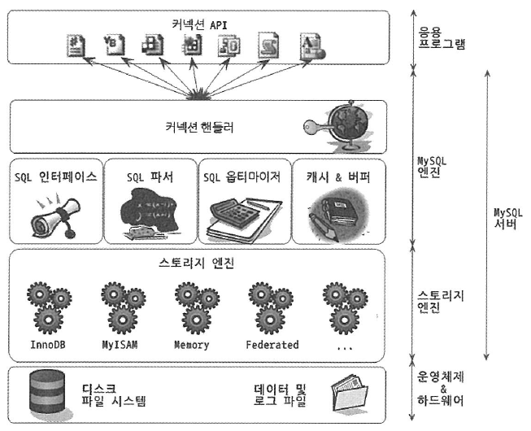

- MySQL 서버는 MySQL 엔진과 스토리지 엔진으로 구분할 수 있다
    - MySQL 엔진
        - 커넥션 핸들러 (클라이언트로부터 접속 및 쿼리 요청을 처리)
        - SQL 파서
        - 전처리기
        - 옵티마이저 (쿼리의 최적화된 실행을 위함)
        - :
        - 요청된 SQL 문장을 분석하거나 최적화한다 (DBMS의 두뇌에 해당하는 처리를 수행)
    - 스토리지 엔진
        - 실제 데이터를 디스크에 저장하거나 디스크로부터 데이터를 읽어온다
        - MySQL 엔진은 하나지만 스토리지 엔진은 여러 개를 동시에 사용할 수 있다
        - 다음과 같이 테이블이 사용할 스토리지 엔진을 지정하면, 이후 해당 테이블의 모든 읽기 작업이나 변경 작업은 정의된 스토리지 엔진이 처리한다
            
            ```java
            CREATE TABLE test_table(..) ENGINE=INNODB;
            ```
            
        - 각 스토리지 엔진은 성능 향상을 위한 기능을 내장한다
            - 키 캐시(MyISAM 스토리지 엔진)
            - InnoDB 버퍼 풀(InnoDB 스토리지 엔진)
- MySQL 엔진의 쿼리 실행기에서 데이터를 쓰거나 읽어야 할 때는, 각 스토리지 엔진에 쓰기 또는 읽기를 요청한다
- → 이러한 요청을 핸들러 요청이라 하고, 여기서 사용되는 API를 **핸들러 API**라고 한다

### MySQL 스레딩 구조

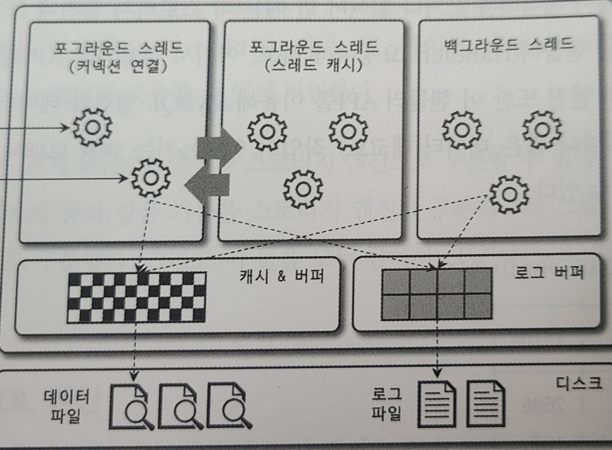

- MySQL 서버는 스레드 기반으로 작동한다
- 포그라운드와 백그라운드 스레드로 구분할 수 있다
    - 포그라운드 스레드
        - 주로 각 클라이언트 사용자가 요청하는 쿼리 문장을 처리한다
            - 데이터 버퍼나 캐시로부터 데이터를 가져온다
            - 버퍼나 캐시에 없는 경우에는, 직접 디스크나 인덱스 파일로부터 데이터를 읽어온다
        - 디스크 쓰기 작업은,
            - InnoDB 테이블의 경우는, 데이터 버퍼나 캐시까지만 포그라운드 스레드가 처리한다
            나머지 버퍼로부터 디스크까지 기록하는 작업은 백그라운드 스레드가 처리한다
            - MyISAM 테이블의 경우는, 디스크 쓰기 작업까지 포그라운드 스레드가 처리한다
            (지연된 쓰기가 있긴 하지만, 일반적인 방법은 아니다)
        - 사용자 스레드
            - 클라이언트가 MySQL 서버에 접속하게 되면, MySQL 서버는 그 클라이언트의 요청을 처리해줄 스레드를 생성해 그 클라이언트에게 할당한다
            - 사용자가 요청한 작업을 처리하기 때문에 사용자 스레드라고도 한다
            - 포그라운드 스레드는 최소한 MySQL서버에 접속된 클라이언트 수만큼 존재한다
        - 클라이언트 사용자가 작업을 마치고 커넥션을 종료하면 해당 커넥션을 담당하던 스레드는 다시 스레드 캐시로 되돌아간다
            - 이 때, 이미 스레드 캐시에 일정 개수 이상의 스레드가 대기중이면, 스레드를 종료시킨다 (스레드 캐시에 다시 넣지 않는다)
            - 스레드 캐시에 유지할 수 있는 최대 스레드 개수는 thread_cache_size 시스템 변수로 설정한다
    - 백그라운드 스레드
        - InnoDB는 다음과 같이 여러 가지 작업을 백그라운드로 처리한다
            - 인서트 버퍼를 병합하는 스레드
            - 로그를 디스크로 기록하는 스레드
            - InnoDB 버퍼 풀의 데이터를 디스크에 기록하는 스레드
            - 데이터를 버퍼로 읽어오는 스레드
            - 잠금이나 데드락을 모니터링하는 스레드
            - :
        - 쓰기 지연
            - 사용자의 요청을 처리하는 도중 데이터의 쓰기 작업은 지연되어 처리될 수 있다
            - 일반적인 상용 DBMS에는 대부분 쓰기 작업을 버퍼링해서 일괄 처리하는 기능이 탑재되어있다

### 메모리 할당 및 사용 구조

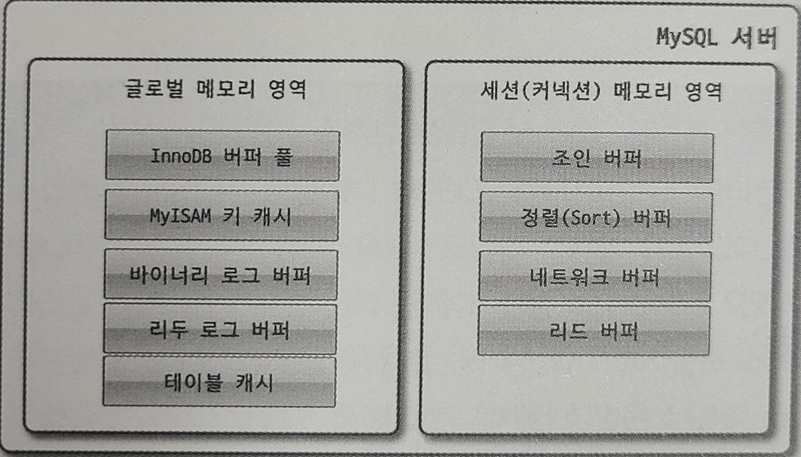

- MySQL에서 사용되는 메모리 공간은 크게 글로벌 메모리 영역, 로컬 메모리 영역으로 구분할 수 있다
    - 글로벌 메모리 영역
        - 클라이언트 스레드의 수와 무관하게 일반적으로 하나의 메모리 공간만 할당된다
        - 생성된 클로벌 영역이 N개라 하더라도 모든 스레드에 의해 공유된다
        - 글로벌 메모리 영역
            - 테이블 캐시
            - InnoDB 버퍼 풀
            - InnoDB 어댑티브 해시 인덱스
            - InnoDB 리두 로그 버퍼
    - 로컬 메모리 영역
        - 세션 메모리 영역이라고도 한다
        - 클라이언트 스레드가 쿼리를 처리하는데 사용하는 메모리 영역이다
        (따라서 클라이어트 메모리 영역이라고도 한다)
        - 각 클라이언트 스레드별로 독립적으로 할당된다 (절대 공유되어 사용되지 않는다)
        - 로컬 메모리 영역
            - 소트 버퍼
            - 조인 버퍼
            - 바이너리 로그 캐시
            - 네트워크 버퍼
            - :
        - 각 쿼리의 용도별로 필요할 때만 공간이 할당되고, 필요하지 않은 경우에는 MySQL이 메모리 공간을 할당조차도 하지 않을수도 있다
            - 로컬 메모리 공간은 커넥션이 열려있는 동안 계속 할당된 상태로 남아있는 공간도 있고, (커넥션 버퍼나 결과 버퍼)
            쿼리를 실행하는 순간에만 할당했다가 다시 해제하는 공간도 있다 (소트 버퍼나 조인 버퍼)

### 플러그인 스토리지 엔진 모델

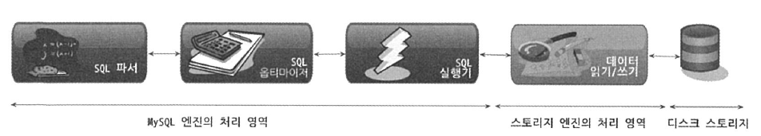

- 거의 대부분의 작업이 MySQL 엔진에서 처리되고, 마지막 ‘데이터 읽기/쓰기’ 작업만 스토리지 엔진에 의해 처리된다
- MySQL 서버(mysqld)에서 지원되는 스토리지 엔진
    
    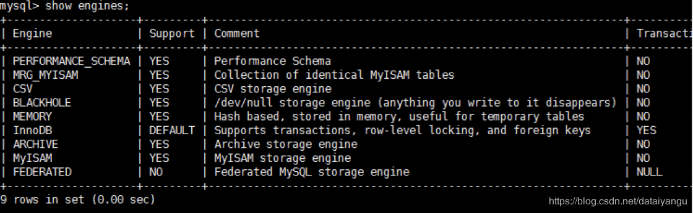
    
- MySQL 서버에 포함되지 않은 스토리지 엔진을 사용하려면(Support가 NO인 엔진), MySQL 서버를 다시 빌드해야 한다
    - 플러그인 형태로 빌드된 스토리지 엔진 라이브러리를 다운로드해서 끼워넣기만 하면 사용할 수 있다
    - SHOW PLUGINS 명령으로 스토리지 엔진 뿐 아니라, 인증 및 전문검색용 파서 같은 플러그인도 확인할 수 있다
- MySQL 서버에서는 스토리지 엔진 뿐만 아니라 다양한 기능을 플러그인 형태로 지원한다
    - 인증이나 전문검색 파서 또는 쿼리 재작성 플러그인
    - 비밀번호 검증과 커넥션 제어와 관련된 플러그인
    - :
    - 등등 다양한 플러그인이 제공된다
- 또한, MySQL 서버의 기능을 커스텀하게 확장할 수 있게 플러그인 API가 메뉴얼에 공개되어 있다
    - 기존 MySQL 서버에 제공하던 기능들을 확장할 수 있다
    - 완전히 새로운 기능들을 플러그인을 이용해 구현할 수 있다

### 컴포넌트

- 플러그인 단점
    - 플러그인은 오직 MySQL 서버와 인터페이스 할 수 있고, 플러그인끼리는 통신할 수 없다
    - 플러그인은 MySQL 서버의 변수나 함수를 직접 호출하기 때문에 안전하지 않다
    - 플러그인은 상호 의존관계를 설정할 수 없어서 초기화가 어려움
- MySQL 8.0부터는 기존의 플러그인 아키텍처를 대체하기 위해 컴포넌트 아키텍처가 지원된다
- 컴포넌트는 이러한 단점들을 보완해서 구현됐다
- 컴포넌트와 플러그인 둘 다, 사용자 입장에서는 **서버의 기능을 동적으로 확장하는 방법**이다
(하지만 구현된 아키텍처 측면에서 많이 차이가 난다)
- 특징
    - 컴포넌트는 기능을 확장하기 위해 실행 중인 서버에 컴포넌트를 추가할 수 있다
        - 컴포넌트는 동적으로 또는 정적으로 연결할 수 있다
    - 각 컴포넌트는 다른 컴포넌트가 사용할 수 있는 광범위한 명명된 API 와 서비스의 구현을 제공한다
    - 컴포넌트는 서비스 API를 통해 다른 구성 컴포넌트와 통신할 수 있다
        - 다른 컴포넌트가 사용할 서비스 API 구현을 제공할 수 있습니다
    - 컴포넌트 인프라를 통해 컴포넌트는 관련 서비스 API를 재구현해서 다른 컴포넌트로 재정의하고 보완할 수 있다
- MySQL 5.7 버전까지는 비밀번호 검증 기능이 플러그인 형태로 제공됐지만 MySQL 8.0의 비밀번호검증 기능은 컴포넌트로 개선됐다
    
    ```java
    INSTALL COMPNENT 'file://component_validate_password';
    SELECT * FROm mysql.component;
    ```
    

### 쿼리 실행 구조

쿼리를 실행하는 관점에서의 MySQL의 구조

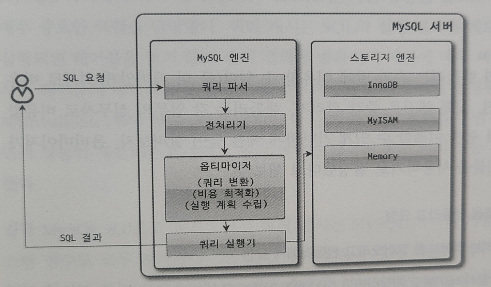

- 쿼리 파서
    - 사용자 요청으로 들어온 쿼리 문장을 토큰으로 분리하여 트리 형태의 구조를 만든다
    - 쿼리 문장의 기본 문법 오류가 여기서 발견된다
- 전처리기
    - 파서 과정에서 만들어진 파서 트리를 기반으로, 쿼리 문장에 구조적인 문제를 확인한다
    - 테이블 이름, 칼럼 이름, 내장 함수같은 개체를 매핑하여 해당 객체의 존재 여부와 객체의 접근권한 등을 확인한다
    - 실제 존재하지 않거나, 권한상 사용할 수 없다면 여기서 걸러진다
- 옵티마이저
    - 사용자의 요청으로 들어온 쿼리 문장을 저렴한 비용으로 가장 빠르게 처리할지를 결정하는 역할을 담당한다
- 실행 엔진
    - 실행 엔진은 만들어진 계획대로 각 핸들러에게 요청한다
    - 그리고 받은 결과를 또다른 핸들러 요청의 입력으로 연결한다
- 핸들러(스토리지 엔진)
    - 핸들러는 MySQL 서버의 가장 밑단에서 MySQL 실행 엔진의 요청에 따라 데이터를 디스크로 저장하고 디스크로부터 읽어오는 역할을 담당한다
    - 핸들러는 결국 스토리지 엔진이다
    - MyISAM 테이블을 조작하는 경우에는 핸들러가 MyISAM 스토리지 엔진이 되고,
    InnoDB 테이블을 조작하는 경우에는 핸들러는 InnoDB 스토리지 엔진이 된다

### 쿼리 캐시

- 쿼리 캐시는 SQL의 실행 결과를 메모리에 캐시하고, 동일 SQL 쿼리가 실행되면 테이블을 읽지 않고 즉시 결과를 반환하기 때문에 빠른 성능을 보였다
- 하지만 쿼리 캐시는 테이블의 데이터가 변경되면 캐시에 저장된 결과 중에서 변경된 테이블과 관련된 것들을 모두 삭제해야 했다
→ 심각한 동시처리 성능 저하
하지만, 데이터 변경은 거의 없고 읽기만 하는 서비스에는 매우 훌륭한 기능
- MySQL 8.0으로 올라오면서 쿼리 캐시는 MySQL 서버의 기능에서 완전히 제거됐다 (관련된 시스템 변수도 모두 제거됨)

### 스레드 풀

- 커뮤니티 에디션은 미지원
    - 엔터프라이즈 에디션은 스레드 풀을 제공하지만, 커뮤니티 에디션은 지원하지 않는다
    - 커뮤니티 에디션 서버에 스레드풀 기능을 사용하고자 한다면, Percona Server에서 스레드풀 플러그인 라이브러리를 설치해서 사용하면 된다
- 사용 목적
    - 사용자의 요청을 처리하는 스레드 개수를 줄여서 동시 처리되는 요청이 많다 하더라도
    **MySQL 서버의 CPU가 제한된 개수의 스레드 처리에만 집중할 수 있게** 해서 서버의 자원 소모를 줄인다
    - 실제로 스레드 풀이 실제 서비스에서 눈에 띄는 성능 향상을 보여준 경우는 드물었다
    - 스레드 풀은 스레드들을 CPU가 최대한 잘 처리해낼 수 있는 수준으로 줄여서 빨리 처리하게 하는 기능이다
    - 따라서, 스케줄링 과정에서 CPU 시간을 제대로 확보하지 못하는 경우에는, 쿼리 처리가 더 느려질 수 있다
- 스레드 그룹의 모든 스레드가 일을 처리하고 있다면,
새로운 작업 스레드를 추가할지, 기존 작업 스레드가 처리를 완료할 때까지 기다릴지 여부를 판단해야 한다
    - thread_pool_stall_limit 시스템 변수
        - 타이머 스레드는 주기적으로 스레드 그룹의 상태를 체크한다
        - 이 시스템 변수에 정의된 시간만큼 작업 스레드가 처리중인 작업을 끝내지 못하면, 새로운 스레드를 생성해서 스레드 그룹에 추가한다
        - 응답 시간에 아주 민감한 서비스라면 이 설정값을 적절히 낮춰서 설정해야 한다
        - 그렇다고 해서 0에 가까운 값으로 설정한다면, 스레드 풀을 사용하지 않는 편이 더 낫다
- Percona의 스레드 풀 플러그인은 선순위 큐와 후순위 큐를 이용해 특정 트랜잭션이나 쿼리를 우선적으로 처리할 수 있는 기능을 제공한다
    - Percona Server의 스레드 풀에서 지원하는 선순위 큐와 후순위 큐를 이용해 재배치한 작업의 순서를 보여준다
    - 작업 순서를 재배치함으로써 트랜잭션들이 최대한 빨리 종료될 수 있게 한다
        
        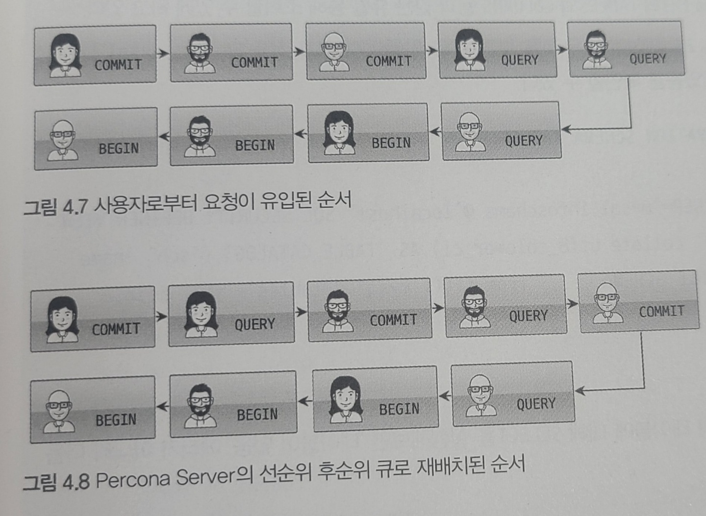
        

### 트랜잭션 지원 메타데이터

- 메타데이터
    - 테이블의 구조 정보와 스토어드 프로그램 등의 정보
- MySQL 5.7 vs MySQL 8.0
    - MySQL 5.7까지는 테이블의 구조를 FRM 파일에 저장하고 일부 스토어드 프로그램 또한 파일 기반으로 관리했다
        - 파일 기반의 메타데이터는 생성/변경 작업에 트랜잭션을 지원하지 않는다
        - 따라서, 테이블의 생성 또는 변경 도중에 MySQL 서버가 비정상적으로 종료하게 되면 일관성이 깨진 상태로 남는 문제가 있었다
    - MySQL 8.0부터는 시스템 테이블들을 모두 InnoDB 스토리지 엔진을 사용하도록 개선했다
        - 시스템 테이블 : MySQL 서버가 동작하는데 기본적으로 필요한 테이블들
            - 예 : 사용자의 인증과 권한에 관련된 테이블들
- 트랜잭션 지원
    - 시스템 테이블과 데이터 딕셔너리 정보를 모두 모아서 mysql DB에 저장하고 있다
    - 이제 스키마 변경 작업 중간에 MySQL 서버가 비정상적으로 종료하게 되더라도 스키마 변경은 완전한 성공이거나 완전한 실패를 하게 된다
- 테이블과 컬럼 정보 뷰
    - 실제 mysql DB에서 테이블의 목록을 살펴보면 실제 테이블의 구조가 저장된 테이블은 보이지 않는다
    - 데이터 딕셔너리 테이블의 데이터를 사용자가 임의로 수정하지 못하게 사용자의 화면에 보여주지만 않을 뿐 실제로는 존재한다
        - mysql DB에서 tables라는 이름의 테이블에 대해 SELECT를 실행해보면 ‘테이블이 없음’ 에러가 아니라 ‘접근이 거절됨’이 표시된다
    - 대신 MySQL 서버는 데이터 딕셔너리 정보를 information_schema DB의 TABLES와 COLUMNS 등과 같은 뷰를 통해서 조회할 수 있게 하고 있다

# InnoDB 스토리지 엔진 아키텍처

---

- InnoDB는 스토리지 엔진 중 거의 유일하게 레코드 기반의 잠금을 제공한다
- 따라서, 높은 동시성 처리가 가능하고, 안정적이며 성능이 뛰어나다


### 프라이머리 키에 의한 클러스터링

- 기본적으로 프라이머리 키를 기준으로 클러스터링되어 저장된다
    - 즉, 프라이머리 키 값의 순서대로 디스크에 저장된다
    - 모든 세컨더리 인덱스는 레코드의 주소 대신 프라이머리 키의 값을 논리적인 주소로 사용한다
    - 프라이머리 키가 클러스터링 인덱스이기 때문에, 기본적으로 쿼리 실행계획에서 다른 보조 인덱스에 비해 프라이머리 키의 비중이 높게 설정된다
- MyISAM 스토리지 엔진에서는 클러스터링 키를 지원하지 않는다
    - 그래서 MyISAM 테이블에서는 프라이머리 키와 세컨더리 인덱스는 구조적으로 아무런 차이가 없다
    - 프라이머리 키는 유니크 제약을 가진 세컨더리 인덱스일 뿐이다

### 외래키 지원

- 외래 키에 대한 지원은 InnoDB 스토리지 엔진 레벨에서 지원하는 기능으로 MyISAM이나 MEMORY 테이블에서는 사용할 수 없다
- [https://jsonobject.tistory.com/515](https://jsonobject.tistory.com/515)

### MVCC(Multi Version Concurrency Control)

- 일반적으로 레코드 레벨의 트랜잭션을 지원하는 DBMS가 제공하는 기능이다
- MVCC의 가장 큰 **목적**은 잠금을 사용하지 않는 일관된 읽기를 제공하는 데 있다
- 멀티 버전이라 함은, 하나의 레코드에 대해 여러 개의 버전이 동시에 관리된다는 의미다
    - 예시
        
        ```sql
        UPDATE member SET m_area='경기' WHERE m_id=12;
        ```
        
        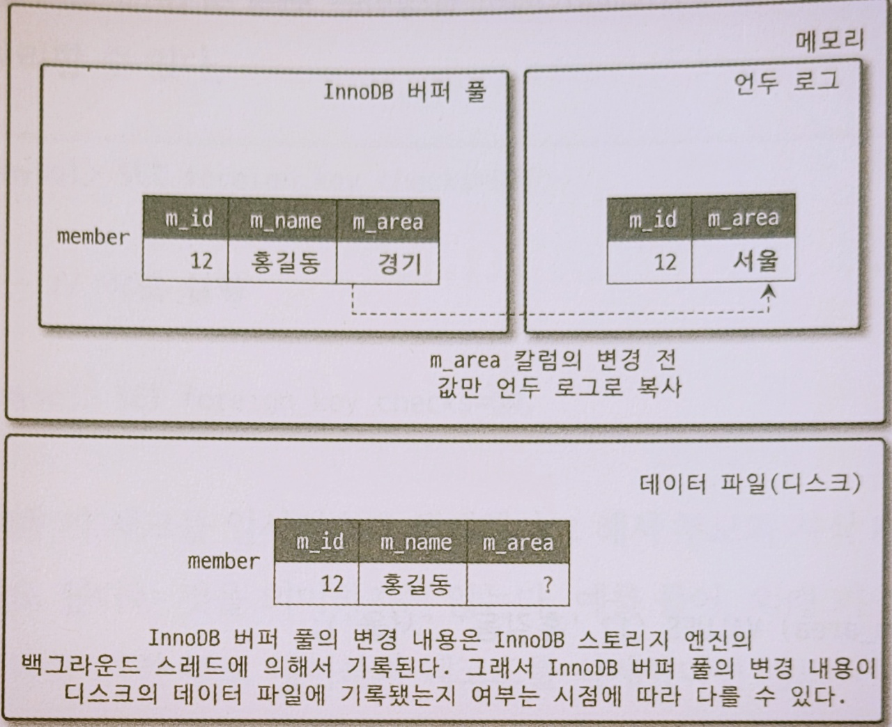
        
        - Q. 아직 COMMIT이나  ROLLBACK이 되지 않은 상태에서 다른 사용자가 레코드를 조회하면 어디에 있는 데이터를 조회할까?
        - A. 격리 수준에 따라 다르다
            - 격리 수준이 READ_UNCOMMITTED라면, InnoDB 버퍼 풀이나 데이터 파일로부터 변경되지 않은 데이터를 읽어서 반환한다
            - 격리 수준이 READ_COMMITTED 이상이라면, 변경되기 이전의 내용을 보관하고 있는 언두 영역의 데이터를 반환한다
        - 즉, 하나의 레코드에 대해 2개의 버전이 유지되고, 필요에 따라 어느 데이터가 보여지는지 여러 상황에 따라 달라진다
        - 위 상태에서..
            - COMMIT을 실행하면
                - InnoDB는 더이상의 변경작업 없이 지금의 상태를 영구적 데이터로 만든다
                - 커밋이 된다고해서, 언두 영역의 백업 데이터가 항상 바로 삭제되는 것은 아니다
                - 이 언두 영역을 필요로 하는 트랜잭션이 더 없을 때 비로소 삭제된다
            - ROLLBACK을 실행하면
                - InnoDB는 언두 영역에 있는 백업된 데이터를 InnoDB 버퍼 풀로 다시 복구하고, 언두 영역의 내용을 삭제한다

### 잠금 없는 일관된 읽기(Non-Locking Consistent Read)

- 잠금 없는 일관된 읽기
    - InnoDB 스토리지 엔진은 MVCC 기술을 이용해 잠금을 걸지 않고 읽기 작업을 수행한다
    - 잠금을 걸지 않기 때문에 InnoDB에서 읽기 작업은 다른 트랜잭션이 가지고 있는 잠금을 기다리지 않고, 읽기 작업이 가능하다
- long trasaction은 해롭다
    - 일관된 읽기를 위해 언두 로그를 삭제하지 못하고, 계속 유지해야 한다
    - 장기간 활성 상태인 트랜잭션으로 인해 MySQL 서버가 느려지거나 문제가 발생할 때가 있을 수 있다
    - 따라서 트랜잭션이 시작됐다면, 가능한 한 빨리 커밋이나 롤백을 하는 것이 좋다

### 자동 데드락 감지

- 데드락 감지 스레드
    - InnoDB 스토리지 엔진은 데드락 감지 스레드를 가지고 있다
    - 데드락 감지 스레드가 주기적으로 잠금 대기 그래프를 검사해 교착 상태에 빠진 트랜잭션들을 찾아서 그 중 하나를 강제 종료한다
    - 강제종료할 트랜잭션 판단기준? ⇒ ‘트랜잭션의 언두로그 양!’
        - 더 적게 가진 트랜잭션이 일반적으로 롤백 대상이 된다
        - 롤백을 해도 언두 처리를 해야 할 내용이 적다 → 강제 롤백으로 인한 MySQL 서버의 부하도 덜 유발한다
- InnoDB 스토리지 엔진은 상위 레이어인 MySQL 엔진에서 관리되는 테이블 잠금은 볼 수가 없어서 데드락 감지가 불확실할 수가 있다
    - innodb_table_locks 시스템 변수를 활성화하면 테이블 레벨의 잠금까지 감지할 수 있게 된다
    - Default: 활성화
- 데드락 감지 스레드 비활성화
    - 동시 처리 스레드가 매우 많아지거나 각 트랜잭션이 가진 잠금의 개수가 많아지면 데드락 감지 스레드가 느려진다
    - 데드락 감지 스레드가 느려지면 서비스 쿼리를 처리중인 스레드는 더는 작업을 진행하지 못하고 대기할 수 있다
    - innodb_deadlock_detect 시스템 변수
        - 이를 OFF로 설정하면 데드락 감지 스레드는 더는 작동하지 않는다
        - 만약 PK 또는 세컨더리 인덱스를 기반으로 매우 높은 동시성 처리를 요구하는 서비스가 있다면 innodb_deadlock_detect를 비활성화할 수 있다

### 자동화된 장애 복구

- 자동 복구
    - InnoDB 데이터 파일은 기본적으로 MySQL 서버가 시작될 때 항상 자동 복구를 수행한다
    - 만약 자동으로 복구될 수 없는 손상이 있다면, 자동 복구를 멈추고 MySQL 서버는 종료돼 버린다
- innodb_force_recovery 시스템 변수
    - 자동 복구할 수 없다면, MySQL 서버의 설정 파일에 innodb_force_recovery 시스템 변수를 설정해서 MySQL 서버를 시작해야 한다
    - 이 설정값은 MySQL 서버가 시작될 때, InnoDB 스토리지 엔진이 데이터 파일이나 로그 파일의 손상 여부 검사 과정을 선별적으로 진행할 수 있게 한다
    - 어떤 부분이 문제인지 안다면, 적절한 설정값으로 서버를 기동한다
        - InnoDB의 로그 파일이 손상됐다면, 6으로 설정하고 MySQL 서버를 기동하고,
        InnoDB 테이블의 데이터 파일이 손상됐다면 1로 설정하고 MySQL 서버를 기동한다
    - 어떤 부분이 문제인지 알 수 없다면, 1부터 6까지 변경하면서 기동한다
        - 값이 계속 커질수록 심각한 상황이라, 데이터 손실 가능성이 커지고 복구 가능성은 적어진다
    - After..
        - MySQL 서버가 기동되고 InnoDB 테이블이 인식된다면,
        mysqldump를 이용해 데이터를 가능한 만큼 백업하고 그 데이터로 MySQL 서버의 DB와 테이블을 다시 생성하는 것이 좋다
- innodb_force_recovery 옵션에 설정 가능한 값과 해결방법
    - 1 (SRV_FORCE_IGNORE_CORRUPT)
        - 에러 로그 파일에 ‘Database page corruption on disk or a failed’ 메시지가 출력될 때 대부분 이 경우다
        - InnoDB의 테이블스페이스의 데이터나 인덱스 페이지에서 손상된 부분이 발견돼도 무시하고 MySQL 서버를 시작한다
    - 2 (SRV_FORCE_NO_BACKGROUND)
        - InnoDB는 트랜잭션의 롤백을 위해 **언두 데이터**를 관리하는데, 트랜잭션이 커밋되어 불필요한 언두 데이터는 InnoDB의 메인 스레드에 의해 주기적으로 삭제된다
        - InnoDB의 메인 스레드가 언두 데이터를 삭제하는 과정에서 장애가 발생했다면 이 모드로 복구한다
        - InnoDB는 쿼리의 처리를 위해 여러 종류의 백그라운드 스레드를 동시에 사용하는데,
        이 복구 모드에서는 이러한 백그라운드 스레드 가운데 메인 스레드를 시작하지 않고 MySQL 서버를 시작한다
    - 3 (SRV_FORCE_NO_TRX_UNDO)
        - **‘커밋되지 않은 트랜잭션을 놔둔다’**
        - 커밋되지 않고 종료된 트랜잭션은 계속 그 상태로 남아있게 MySQL 서버를 시작하는 모드
        - 일반적으로 MySQL 서버는 다시 시작하면서 언두 영역의 데이터를 먼저 데이터 파일에 적용하고,
        그 다음 리두 로그의 내용을 다시 덮어써서 장애 시점의 데이터 상태를 만들어낸다
        - 자동 복구 모드에서는..
            - 정상적인 MySQL 서버의 시작에서는 최종적으로 커밋되지 않은 트랜잭션은 롤백을 수행한다
        - 해당 설정 모드에서는..
            - 커밋되지 않은 트랜잭션의 작업을 롤백하지 않고 그대로 놔둔다
    - 4 (SRV_FORCE_NO_IBUF_MERGE)
        - **‘인서트 버퍼의 내용을 무시한다’**
        - InnoDB는 데이터 변경(DML)으로 인한 인덱스 변경 작업을 상황에 따라 즉시 처리할 수도 있고 인서트 버퍼에 저장해두고 나중에 처리할 수도 있다
        - 인서트 버퍼에 기록된 내용은 언제 데이터 파일에 병합될지 알 수 없다
        - 만약 MySQL이 재시작되면서 인서트 버퍼의 손상을 감지하면 InnoDB는 에러를 발생시키고 MySQL 서버는 시작하지 못한다
        - 4로 설정하면, InnoDB 스토리지 엔진이 인서트 버퍼의 내용을 무시하고 강제로 MySQL이 시작한다
        - 인서트 버퍼는 실제 데이터와 관련된 부분이 아니라 인덱스에 관련된 부분이므로,
        테이블을 덤프한 후 다시 데이터베이스를 구축하면 데이터의 손실 없이 복구할 수 있다
    - 5 (SRV_FORCE_NO_UNDO_LOG_SCAN)
        - **‘언두 로그를 무시한다’**
        - 자동복구 모드에서는..
            - MySQL 서버가 장애나 정상적으로 종료되는 시점에 진행중인 트랜잭션이 있었다면, MySQL은 그냥 단순히 그 커넥션을 강제로 끊어버리고 별도의 정리 작업 없이 종료한다
            - MySQL이 다시 시작하면 InnoDB 엔진은 언두 레코드를 이용해 데이터 페이지를 복구하고 리두 로그를 적용해 종료 시점이나 장애 발생 시점의 상태를 재현해낸다
            - 그리고 InnoDB는 마지막으로 커밋되지 않은 트랜잭션에서 변경한 작업은 모두 롤백 처리한다
        - InnoDB의 언두 로그를 사용할 수 없다면 InnoDB 엔진의 에러로 MySQL 서버를 시작할 수 없다
        - 해당 설정 모드에서는..
            - InnoDB 엔진이 언두 로그를 모두 무시하고 MySQL을 시작한다
            - 이 모드로 복구되면 MySQL 서버가 종료되던 시점에 커밋되지 않았던 작업도 모두 커밋된 것처럼 처리된다
            - 따라서 실제로는 잘못된 데이터가 데이터베이스에 남을 수 있다
    - 6 (SRV_FORCE_NO_LOG_REDO)
        - **‘리두 로그를 무시한다’**
        - 리두 로그가 손상된 경우에 사용한다
        - 해당 설정 모드에서는..
            - 리두 로그를 모두 무시한 채로 MySQL 서버가 시작된다
            - 커맷됐다 하더라도 리두 로그에만 기록되고 데이터 파일에 기록되지 않은 데이터는 모두 무시된다
            - 마지막 체크포인트 시점의 데이터만 남게 되는 것이다
            - 이 때는 기존 InnoDB의 리두 로그는 모두 삭제하고 MySQL 서버를 시작하는 것이 좋다
- 위와 같이 진행했음에도 MySQL 서버가 시작되지 않으면 백업을 이용해 다시 구축하는 방법밖에 없다
- 백업이 있다면, 마지막 백업으로 데이터베이스를 새로 구축하고, 바이너리 로그를 사용해 최대한 장애 시점까지 데이터를 복구한다

### InnoDB 버퍼 풀

- InnoDB 스토리지 엔진에서 가장 핵심적인 부분이다
- 용도
    - 데이터 캐싱
        - 데이터 파일이나 인덱스 정보를 메모리에 캐싱한다
        - 페이지 단위로 테이블 데이터를 관리한다
        - 페이지 교체 알고리즘으로 LRU 알고리즘을 사용한다
    - 쓰기 지연
        - 쓰기 작업을 지연시켜 일괄 작업으로 처리할 수 있게 해준다
        - 더티 페이지(DML로 변경된 페이지)들을 모았다가 주기적으로 이벤트를 발생시켜서 한번에 디스크에 반영한다
        - 변경된 데이터를 모아서 처리하면 랜덤한 디스크 작업을 줄일 수 있다

**버퍼 풀의 구조**

- 페이지
    - 대량의 읽기 요청을 효율적으로 처리하기 위해서, 버퍼 풀은 데이터를 ’페이지’ 단위로 나누어 관리한다
        - (한 페이지에는 여러 레코드가 속할 수 있다)
    - 버퍼풀 내의 페이지는 링크드 리스트로 관리한다
        - 리스트 자료구조
            - 버퍼 풀의 페이지 크기 조각을 관리하기 위해서 크게 3개의 자료 구조를 관리한다
                
                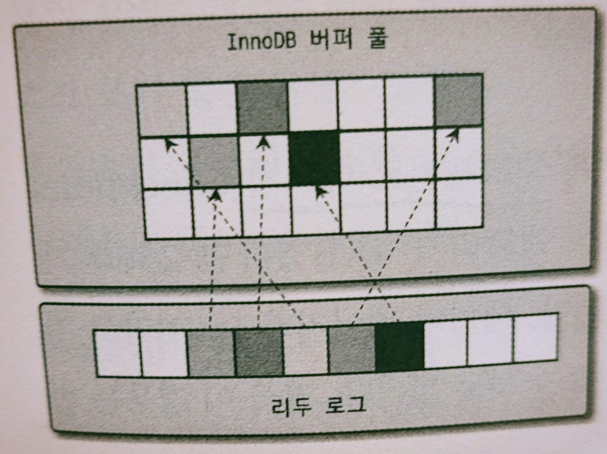
                
            - LRU 리스트
                - 데이터로 채워져있는 페이지들의 목록
            - 플러시 리스트
                - **변경이 가해진 페이지들의 목록**
                - 더티 페이지의 변경 시점 기준의 페이지 목록을 관리한다
                    - 더티 페이지? 디스크로 동기화되지 않은 데이터를 가진 데이터페이지
                - 일단 한번 데이터 변경이 가해진 데이터 페이지는 플러시 리스트에 관리되고 특정 시점이 되면 디스크로 기록돼야 한다
                - 데이터가 변경되면 변경 내용을 리두 로그에 기록하고 버퍼 풀의 데이터 페이지에도 변경 내용을 반영한다
                    - 리두 로그가 디스크로 기록됐다고 해서 데이터 페이지가 디스크로 기록됐다는 것을 항상 보장하지는 않는다
                    - 체크포인트
                        - InnoDB 스토리지 엔진은 체크포인트를 발생시켜 디스크의 리두 로그와 데이터 페이지의 상태를 동기화한다
                        - 체크 포인트는 MySQL 서버거 시작될 때 InnoDB 스토리지 엔진이 리두 로그의 어느 부분부터 복구를 실행해야 할지 판단하는 기준점을 만드는 역할을 한다
            - 프리 리스트
                - **비어있는 페이지들의 목록**
                - 사용자의 쿼리가 새롭게 디스크의 데이터 페이지를 읽어와야 하는 경우 사용된다
    - LRU 알고리즘에 따라 잘 접근되지 않는 데이터 페이지는 캐시에서 제거된다
- LRU 알고리즘
    - Least Recently Used
    - 목적
        - 디스크로부터 읽어온 페이지를 최대한 오랫동안 InnoDB 버퍼풀의 메모리에 유지해서 디스크 읽기를 최소화하는 것이다
    - midpoint insertion (중간지점 삽입 전략)
        - 새로운 페이지를 버퍼풀에 추가하기 위한 페이지 공간이 필요한 경우,
        접근이 가장 오래된 페이지를 선정하여 버퍼풀에서 제거하고, 새로운 페이지를 리스트의 중간지점에 삽입한다
    - 엄밀하게는 LRU 리스트 + MRU 리스트 (결합된 상태)
        - 버퍼풀 전체 리스트를 아래에서 설명할 두가지 리스트로 나누어 관리한다
            
            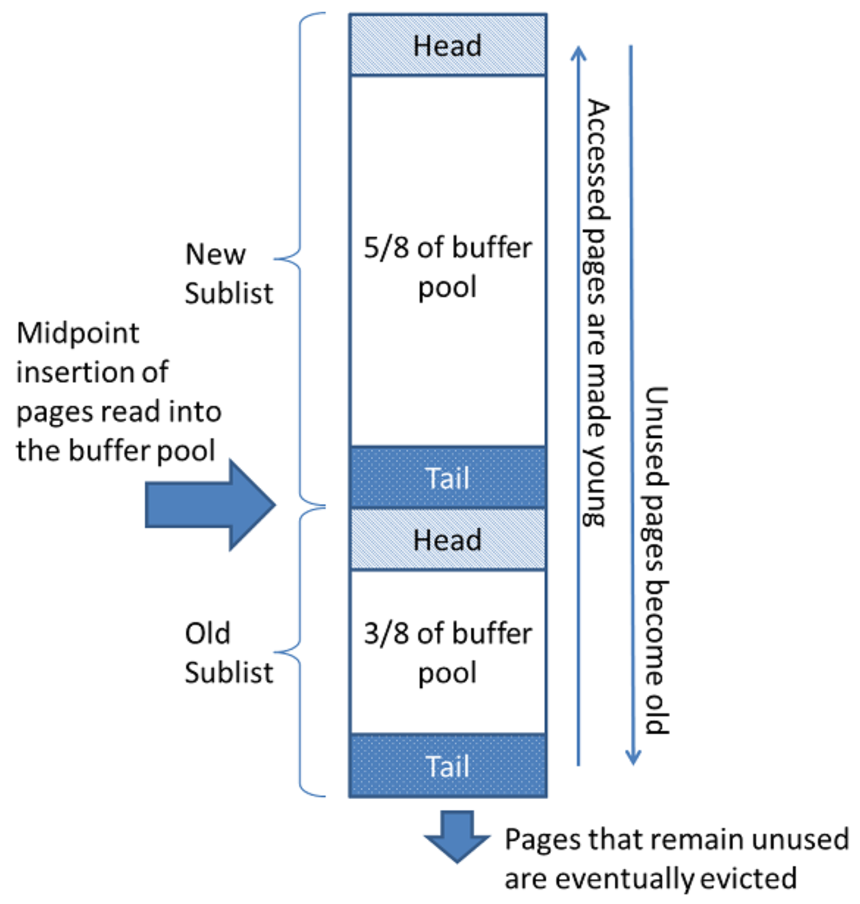
            
        
        
        
        - New Sublist가 MRU, Old Sublist가 LRU
        - InnoDB 스토리지 엔진에서 데이터를 찾는 과정
            1. 필요한 레코드가 저장된 데이터 페이지가 버퍼 풀에 있는지를 검사한다
                1. InnoDB 어댑티브 해시 인덱스를 이용해 페이지를 검색한다
                2. 해당 테이블의 인덱스를 이용해 버퍼 풀에서 페이지를 검색한다
                3. 버퍼 풀에 이미 데이터 페이지가 있었다면 해당 페이지의 포인터를 MRU 방향으로 승급한다
            2. 필요한 데이터 페이지를 버퍼 풀에 적재하고, 적재된 페이지에 대한 포인터를 LRU 헤더 부분에 추가한다
                1. 버퍼 풀의 3/8 은 *old sublist*로 사용된다
            3. 버퍼 풀의 LRU 헤더 부분에 적재된 데이터 페이지가 실제로 읽히면 MRU 헤더 부분으로 이동한다
                - Read Ahead에 의해 접근된 페이지의 경우, 디스크의 데이터 페이지가 버퍼 풀로 적재는 되지만 MRU로 이동되지 않는다
                - Read Ahead
                    - 미리읽기
                    - 캐시에서 찾지 못한 페이지를 다음에 읽어야 한다고 예측될 때,이들 페이지도 곧 읽혀질거라는 가정하에 모두 버퍼에 올린다
                    - 현재 읽는 스레드와 다른 별도의 스레드에서 다음에 읽어야 할 페이지들을 미리 캐시에 올려놓아, 캐시 적중률을 높이는 방법이다
                    - table scan 쿼리에 대량의 데이터가 한번에 버퍼 풀에 삽입되는 경우, midpoint 삽입에 의해 *old sublist*의 대량 데이터들이 모두 버퍼풀에서 삭제되게 된다
                        - 이와 유사하게, read-ahead 작업에 의해 midpoint에 삽입 되었던 데이터가, 단 1번만 접근되더라도 *new sublist*의 head로 이동하게 되어, 실제 자주 접근되는 데이터가 old tail에 가까워지는 일이 발생할 수도 있다
                        - 이러한 현상을 최적화 하기 위해서는 [https://dev.mysql.com/doc/refman/8.0/en/innodb-performance-midpoint_insertion.html](https://dev.mysql.com/doc/refman/8.0/en/innodb-performance-midpoint_insertion.html)
            4. 버퍼 풀에 상주한 데이터 페이지는 사용자 쿼리가 얼마나 최근에 접근했었는지에 따라 나이가 부여된다
                - 버퍼 풀에 상주하는 동안 쿼리에서 오랫동안 사용되지 않으면 데이터 페이지에 부여된 나이가 오래되고, 결국 해당 페이지는 버퍼 풀에서 제거된다
                - 버퍼 풀의 데이터 페이지가 쿼리에 의해 사용되면 나이가 초기화되어 다시 젊어지고 MRU의 헤더 부분으로 옮겨진다
                - 즉, 버퍼 풀 내부에서 최근 접근 여부에 따라서 데이터 페이지는 서로 경쟁하면서 MRU 또는 LRU로 이동한다
                - 그리고 LRU 끝으로 밀려난 데이터 페이지들을 버퍼 풀에서 제거해서 새로운 데이터 페이지를 적재할 수 있는 빈 공간을 준비한다
                - 버퍼 풀에서 데이터 페이지를 삭제해 추가 공간을 확보하는 작업을 Eviction이라고 한다
            5. 필요한 데이터가 자주 접근됐다면 해당 페이지의 인덱스 키를 어댑티브 해시 인덱스에 추가한다

**버퍼 풀과 리두 로그**

- InnoDB 버퍼 풀의 데이터베이스 서버의 성능 향상을 위한 2가지 용도
    - 데이터 캐시
        - 버퍼 풀의 메모리 공간을 늘리면 데이터 캐시 기능이 향상된다
    - 쓰기 지연
        - 버퍼 풀은 다음 두 가지 페이지를 가지고 있다
            - 클린 페이지 : 디스크에서 읽은 상태로 전혀 변경되지 않음
            - 더티 페이지 : 변경된 데이터를 가짐
        - 더티 페이지는 언젠가 디스크로 기록돼야 한다
            - 더티 페이지는 버퍼 풀에 무한정 머무를 수 없다
            - 데이터의 변경이 계속 발생하면 리두 로그파일에 기록됐던 로그 엔트리는 어느 순간 다시 새로운 로그 엔트리로 덮어쓰이기 때문에,
            따라서 전체 리두 로그파일에서 재사용 가능한 공간과 당장 재사용 불가능한 공간을 구분해서 관리하는데,
            재사용 불가능한 공간을 **활성 리두 로그 공간**라고 한다
        - LSN (Log Sequence Number)
            - 리두 로그 파일의 공간은 계속 순환되어 재사용된다
            - 매번 기록될 때마다 로그 포지션은 계속 증가하는데 이를 LSN이라 한다
        - 체크포인트
            - 체크포인트에서 리두 로그와 버퍼 풀의 더티 페이지를 디스크로 동기화한다
            - 이 체크포인트 중 가장 최근 체크포인트 지점의 LSN이 활성 리두 로그 공간의 시작점이 된다
            - 체크 포인트가 발생하면 체크 포인트 LSN보다 작은 리두 로그 엔트리와 관련된 더티 페이지는 모두 디스크로 동기화돼야 한다
                
                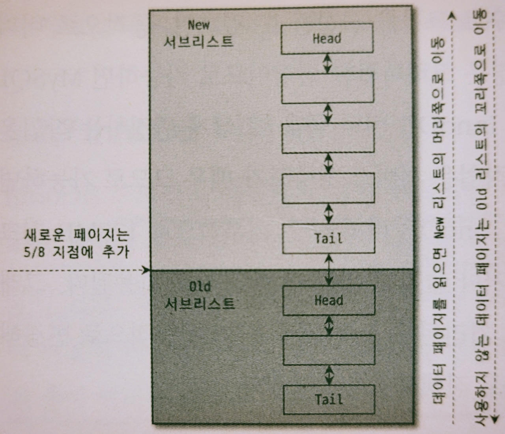
                

**버퍼 풀 플러시**

- 더티 페이지들을 디스크에 동기화하기 위해 다음과 같은 2가지 플러시 기능을 백그라운드로 실행한다
    - **플러시 리스트 플러시**
        - 주기적으로 플러시 리스트 플러시 함수를 호출한다
        - 함수가 호출되면, 플러시 리스트에서 오래전에 변경된 데이터 페이지 순서대로 디스크에 동기화한다
        - 관련 시스템 변수
            - innodb_page_cleaners
                - 클리너 스레드의 개수
                - 클리너 스레드 : 더티 페이지를 디스크로 동기화하는 스레드
            - innodb_max_dirty_pages_pct
                - 더티 페이지 비율
                - 즉, 전체 버퍼풀이 가진 페이지의 몇 퍼센트까지 더티 페이지를 가질 수 있는가?
                - Default: 90%
            - innodb_io_capacity
                - 더티 페이지 쓰기를 실행하는 기준
                - 일반적인 상황에서 디스크가 적절히 처리할 수 있는 수준으로 값을 설정한다
            - innodb_io_capacity_max
                - innodb_io_capacity와 달리, 디스크가 최대의 성능을 발휘할 때 어느 정도의 디스크 읽고 쓰기가 가능한지를 설정함
            - innodb_max_dirty_pages_pct_lwm
                - 더티 페이지가 많으면 디스크 쓰기 폭발 현상이 발생할 수 있다
                - 일정 수준 이상의 더티 페이지가 발생하면 조금씩 더티 페이지를 디스크로 기록하게 한다
                - 급작스럽게 디스크 쓰기가 폭증하는 현상을 완화시키기 위함이다
                - Default: 약 10%
            - innodb_adpative_flushing
                - 어댑티브 플러시 기능 사용 여부
                - 어댑티브 플러시? innodb_io_capacity, innodb_io_capcity_max가 아니라, 리두 로그의 증가 속도를 분석해서 적절한 수준의 더티페이지가 버퍼풀에 유지될 수 있도록 한다
                - Default: 사용
            - innodb_adpative_flushing_lwm
                - 전체 리두 공간에서의 활성 리두 로그 공간이 해당 설정보다 미만이면 어댑티브 플러시가 작동하지 않는다
                - 활성 리두 로그 공간의 비율이 해당 설정 비율을 넘어서야 그 때부터 어댑티브 플러시 알고리즘이 작동된다
            - innodb_flus_neighbors
                - 인접한 더티 페이지 함께 플러시하는 기능의 사용 여부
                - 더티 페이지를 디스크에 기록할 때 디스크에서 근접한 페이지 중에서 더티 페이지가 있다면 InnoDB 스토리지 엔진이 함께 묶어서 디스크로 기록하게 해준다
    - **LRU 리스트 플러시**
        - LRU 리스트에서 사용 빈도가 낮은 데이터 페이지들을 제거해서 새로운 페이지들을 읽어올 공간을 만들어야 한다
        - 이를 위해 LRU 리스트 플러시 함수가 사용된다
        - 관련 시스템 변수
            - innodb_lru_scan_depth
                - LRU 리스트의 끝부분부터 시작해서 최대 해당 설정 개수만큼의 페이지들을 스캔한다
                - 이 때, 스캔하면서 더티 페이지는 디스크에 동기화하게 하며, 클린 페이지는 즉시 프리리스트로 페이지를 옮긴다
                - 버퍼풀 인스턴스별로 최대 해당 개수만큼 스캔하기 때문에, 실질적으로는 (버퍼풀 인스턴스 수 * innodb_lru_scan_depth) 만큼 수행한다
- MySQL 5.6 버전까지는 InnoDB 스토리지 더티 페이지 플러시 기능이 그다지 부드럽게 처리되지 않았지만,
MySQL 6.7 버전을 거쳐서 MySQL 8.0 버전으로 업그레이드되면서 대부분의 서비스에서는 더티 페이지 플러시에서 예전과 같은 디스크 쓰기 폭증 현상은 발생하지 않았다
- 따라서, 서비스를 운영하면서 성능 문제가 발생하지 않는 상태라면 굳이 위 시스템 변수들을 조정할 필요는 없다

**버퍼풀 상태 백업 및 복구**

- 버퍼풀 워밍업 : 디스크의 데이터가 버퍼 풀에 적재돼있는 상태
- 버퍼풀이 잘 워밍업이 된 상태라면, 그렇지 않을 때보다 몇십 배의 쿼리 처리 속도를 보인다
- MySQL 5.6 버전부터는 버퍼 풀 덤프 및 적재 기능이 도입됐다
- MySQL 서버를 재시작해야 하는 경우, MySQL 서버를 셧다운하기 전에 다음과 같이 innodb_buffer_pool_dump_now 시스템 변수를 이용해 현재 InnoDB 버퍼 풀의 상태를 백업할 수 있다
- 버퍼풀 백업
    - 데이터 디렉터리에 ib_buffer_pool이라는 이름의 파일로 생성된다
    - 버퍼풀의 백업은 매우 빠르다
        - InnoDB 스토리지 엔진이 버퍼 풀의 LRU 리스트에서 적재된 데이터 페이지의 메타 정보만 가져와서 저장하기 때문
- 버퍼풀 복구
    - InnoDB 버퍼 풀의 크기에 따라 상당한 시간이 걸릴 수 있다
    - 버퍼풀 적재 작업에 너무 시간이 오래 걸려서 중간에 멈추고자 한다면 innodb_buffer_bool_load_abort 시스템 변수를 사용한다
    - 복구 시, 백업 파일이 반드시 셧다운하기 직전의 파일일 필요는 없다
        - InnoDB 스토리지 엔진은 ib_buffer_pool 파일에서 데이터 페이지의 목록을 가져온 후, 실제 존재하는 데이터 페이지면 InnoDB 버퍼 풀로 적재하지만 그렇지 않은 경우에는 조용히 무시한다
- 백업/복구 자동화
    - InnoDB 스토리지 엔진은, MySQL 서버가 셧다운되기 직전에 버퍼풀의 백업을 실행하고, 서버가 시작되면 자동으로 백업된 버퍼풀의 상태를 복구하는 기능을 제공한다
    - innodb_buffer_pool_dump_at_shutdown, innodb_buffer_pool_load_at_startup 설정을 설정 파일에 넣어두면 된다

### Double Write Buffer

- 리두 로그는 리두 로그 공간의 낭비를 막기 위해 **페이지의 변경된 내용만 기록**한다
- 따라서 만약 하드웨어의 오작동이나 시스템 비정상 종료를 하게 되어 파셜 페이지가 발생하면, 그 페이지의 내용은 복구할 수 없을 수도 있다
    - 파셜 페이지? 더티 페이지를 디스크 파일로 플러시할 때 일부만 기록되는 문제
- 이 같은 문제를 막기위해서, InnoDB 스토리지 엔진에서는 Double-Write 기법을 이용한다
    - 예를 들어
        
        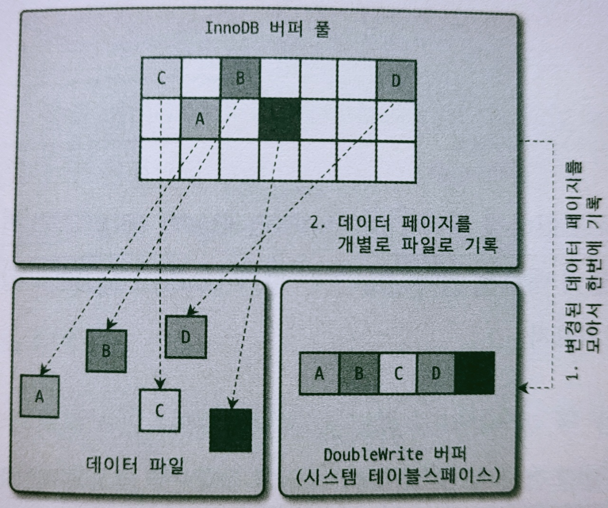
        
        A~E까지의 더티 페이지를 디스크로 플러시한다고 해보자
        
        1. InnoDB 스토리지 엔진은 실제 데이터 파일에 변경 내용을 기록하기 전에,
        A~E까지의 더티 페이지를 우선 묶어서 한 번의 디스크 쓰기로 시스템 테이블스페이스의 DoubleWrite 버퍼에 기록한다
        2. InnoDB 스토리지 엔진은 각 더티 페이지를 파일의 적당한 위치에 하나씩 랜덤으로 쓰기를 실행한다
- DoubleWrite 버퍼의 내용은 실제 데이터 파일의 쓰기가 중간에 실패할 때만 원래의 목적으로 사용된다
- 만약 기록되는 도중에 운영체제가 비정상적으로 종료됐다면
    - InnoDB 스토리지 엔진은 재시작될 때 항상 DoubleWrite 버퍼의 내용과 데이터 파일의 페이지들을 모두 비교한다
    - 그리고 다른 내용을 담고 있는 페이지가 있으면 DoubleWrite 버퍼의 내용을 데이터 파일의 페이지로 복사한다
- innodb_doublewrite 시스템 변수로 DoubleWrite기능을 사용할지 결정한다

### 언두 로그

- InnoDB 스토리지 엔진은 트랜잭션과 격리 수준을 보장하기 위해 DML로 변경되기 이전 버전의 데이터를 별도로 백업한다
- 언두 로그가 어떻게 사용되는가?
    - 트랜잭션 보장
        - 업데이트 문장이 실행됐다면, 트랜잭션을 커밋하지 않아도 실제 데이터파일 내용은 변경된다
        - 그리고 변경되기 전의 값이 언두 영역에 백업된다
        - 커밋하면 현재 상태가 그대로 유지되고, 롤백하면 언두 영역의 백업된 데이터를 다시 데이터 파일로 복구한다
    - 격리수준 보장
        - 특정 커넥션에서 데이터를 변경하는 도중에 다른 커넥션에서 데이터를 조회하면,
        트랜잭션 격리 수준에 맞게 변경중인 레코드를 읽지 않고 언두 로그에 백업해둔 데이터를 읽어서 반환할 수 있다
- 트랜잭션이 완료됐다고 해서 해당 트랜잭션이 생성한 언두 로그를 즉시 삭제할 수 있는 것이 아니다
    
    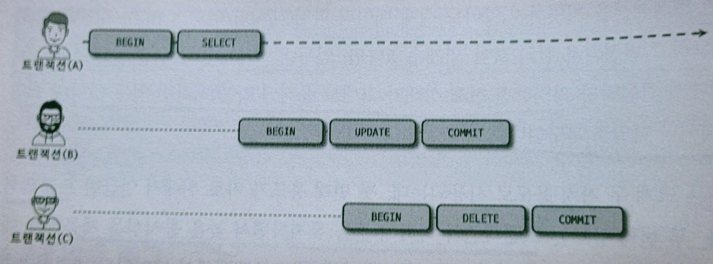
    
    - B 트랜잭션과 C 트랜잭션이 완료됐다 하더라도 A 트랜잭션이 아직 활성 상태이기 때문에 B와 C 트랜잭션의 완료 여부와 관계없이 B와 C 트랜잭션이 만들어낸 언두 로그는 삭제되지 않는다
    - 활성 상태의 트랜잭션이 장시간 유지되면, 언두 로그에는 더 레코드가 쌓이게 된다
- 언두 로그의 문제점
    - MySQL 5.5 버전까지는 언두 로그의 사용 공간이 한 번 늘어나면 MySQL 서버를 새로 구축하지 않는 한 줄일 수 없었다
    - 언두 로그가 늘어나면 디스크 사용량 뿐 아니라 매번 백업할 때도 그만큼 더 복사를 해야하는 문제점이 발생한다
    - MySQL 5.7과 MySQL 8.0 으로 업그레이드되면서 언두 로그 공간의 문제점은 완전히 해결됐다
        - MySQL 8.0에서는 언두 로그를 돌아가면서 순차적으로 사용해 디스크 공간을 줄이는 것이 가능하다
        - 때로는 MySQL 서버가 필요한 시점에 사용 공간을 자동으로 줄여주기도 한다
    - 하지만 여전히, 활성상태의 트랜잭션이 장시간 유지되는 것은 성능상 좋지 않다

**언두 테이블스페이스 관리**

- 언두 테이블스페이스 : 언두 로그가 저장되는 공간
- MySQL 5.6 이전 버전의 문제점
    - 언두 로그가 모두 시스템 테이블스페이스에 저장됐다
    - 시스템 테이블스페이스의 언두 로그는 MySQL 서버가 초기화될 때 생성되기 때문에 확장의 한계가 있었다
    - innodb_undo_tablespaces 시스템 변수
        - MySQL 5.6 버전에서, 2보다 큰 값을 설정하면 InnoDB 스토리지 엔진은 더이상 언두 로그를 시스템 테이블스페이스에 저장하지 않고 별도의 언두 로그 파일을 사용한다
        - MySQL 8.0에서는 deprecated됐다
- MySQL 8.0 이전까지는 한번 생성된 언두 로그는 변경이 허용되지 않고 정적으로 사용됐다
- 동적 추가/삭제 기능
    - MySQL 8.0 버전부터는 새로운 언두 테이블스페이스를 동적으로 추가하고 삭제할 수 있게 개선됐다
    - Undo tablespace truncate
        - 언두 테이블스페이스 공간을 필요한 만큼만 남기고 불필요하거나 과도하게 할당된 공간을 운영체제로 반납하는 것
        - 언두 퍼지 : 퍼지 스레드가 주기적으로 깨어나서 언두 로그 공간에서 불필요해진 언두 로그를 삭제하는 작업을 수행한다
        - 자동 모드
            - innodb_undo_log_truncate 시스템 변수를 ON으로 설정한다
            - 퍼지 스레드는 주기적으로 언두 로그 파일에서 사용되지 않는 공간을 잘라내고 운영체제로 반납한다
        - 수동 모드
            - 언두 테이블스페이스를 비활성화해서 언두 테이블스페이스가 더이상 사용되지 않도록 설정한다
            - 퍼지 스레드는 비활성 상태의 언두 테이블스페이스를 찾아서 불필요한 공간을 잘라내고 운영체제로 해당 공간을 반납한다
            - 반납이 완료되면 언두 테이블스페이스를 다시 활성화하면 된다

### 체인지 버퍼

- 인덱스 업데이트 작업
    - 레코드가 INSERT/UPDATE될 때, 데이터 파일을 변경하는 작업뿐 아니라 해당 테이블에 포함된 인덱스를 업데이트하는 작업도 필요하다
    - 테이블에 인덱스가 많다면 상당히 많은 자원을 소모한다
    - InnoDB는 변경해야 할 인덱스 페이지가 버퍼 풀에 있으면 바로 업데이트를 수행하고,
    그렇지 않다면, 디스크로부터 읽어와서 업데이트를 해야하는데, 이를 즉시 실행하지 않고 ****‘체인지 버퍼’**라는 임시 공간에 저장해둔다
- 체인지 버퍼 머지 스레드
    - 백그라운드 스레드
    - 체인지 버퍼에 임시로 저장된 인덱스 레코드 조각을 병합한다
- Before MySQL 5.5..
    - MySQL 5.5 이전 버전까지는 INSERT 작업에 대해서만 이러한 버퍼링이 가능했다
- After MySQL 8.0!
    - MySQL 5.5 버전부터 조금씩 개선되면서 마침내 MySQL 8.0에서는 DML로 인해 키를 추가하거나 삭제하는 작업에도 버퍼링을 할 수 있게 개선했다
- 관련 시스템 변수들
    - innodb_change_buffering 시스템 변수
        - none: 버퍼링하지 않는다
        - inserts : 인덱스에 새로운 아이템을 추가하는 작업만 버퍼링한다
        - deletes :인덱스에서 기존 아이템을 삭제하는 작업(삭제됐다는 마킹 작업)만 버퍼링한다
        - changes : 인덱스에 추가하고 삭제하는 작업만 버퍼링한다
        - purges : 인덱스 아이템을 영구적으로 삭제하는 작업만 버퍼링한다 (백그라운드)
        - all : 모든 인덱스 관련 작업을 버퍼링한다
    - innodb_change_buffer_max_size 시스템 변수
        - 체인지 버퍼는 기본적으로 InnoDB 버퍼 풀로 설정된 메모리 공간까지 사용할 수 있게 설정돼있다
        - 체인지 버퍼가 너무 많은 버퍼 풀 공간을 사용하지 못하도록 한다거나, 체인지 버퍼가 더 많은 버퍼 풀을 사용할 수 있게 하고자 한다면 이 비율을 조정하면 된다

### 리두 로그

- MySQL 서버가 비정상적으로 종료됐을 때, 데이터 파일에 기록되지 못한 데이터를 잃지 않게 해주는 안전장치
- MySQL 서버를 포함한 대부분 데이터베이스 서버는 데이터 변경 내용을 로그로 먼저 기록한다
- 변경된 데이터를 데이터 파일에 기록하려면 상대적으로 큰 비용이 필요하다
- 성능 저하를 막기 위해 데이터베이스 서버는 쓰기 비용이 낮은 자료 구조를 가진 리두 로그를 가지고 있다
- 비정상 종료가 발생하면 리두 로그의 내용을 이용해 데이터 파일을 다시 서버가 종료되기 직전의 상태로 복구한다
- 리두 로그는 트랜잭션이 커밋되면 즉시 디스크로 기록되도록 시스템 변수를 설정하는 것을 권장한다
    - 그리고 당연히 그렇게 돼야만 서버가 비정상적으로 종료됐을 때 직전까지의 트랜잭션 커밋 내용이 리두 로그에 기록될 수 있고, 이 리두 로그를 이용해 장애 직전 시점까지의 복구가 가능해진다
    - innodb_flush_log_at_trx_commit : 리두 로그를 어느 주기로 디스크에 동기화할지를 결정하는 시스템 변수

### 어댑티브 해시 인덱스

- InnoDB 스토리지 엔진에서 사용자가 자주 요청하는 데이터에 대해 자동으로 생성하는 인덱스
    - 사용자가 수동으로 생성하는 인덱스가 아니다
- 어댑티브 해시 인덱스는 B-Tree 검색 시간을 줄여주기 위해 도입된기능이다
    - 자주 읽히는 데이터 페이지의 키 값을 이용해 해시 인덱스를 만든다
    - 필요할 때마다 어댑티브 해시 인덱스를 검색해서 레코드가 저장된 데이터 페이지를 즉시 찾아갈 수 있다
- 어댑티브 해시 인덱스 기능 사용 여부는 innodb_adaptive_hash_index 시스템 변수를 사용한다
- 해시 인덱스는 **‘인덱스 키 값**’ + ‘인덱스 키 값이 저장된 **데이터 페이지 주소**’의 쌍으로 관리된다
    - **인덱스 키 값**
        - ‘B-Tree 인덱스의 고유번호’ + ‘B-Tree 인덱스의 실제 키 값’ (조합)
    - ‘데이터 페이지 주소’는 실제 키 값이 저장된 **데이터 페이지의 메모리 주소**를 가진다
        - → 즉, **InnoDB 버퍼풀에 로딩된 페이지의 주소**이다
        - 따라서 어댑티브 해시 인덱스는 버퍼 풀에 올려진 데이터 페이지에 대해서만 관리된다
        - 버퍼 풀에서 해당 데이터 페이지가 없어지면, 어댑티브 해시 인덱스에서도 해당 페이지의 정보는 사라진다
- 해시 인덱스의 경합과 파티셔닝
    - 예전 버전까지는 어댑티브 해시 인덱스는 하나의 메모리 객체인 이유로 어댑티브 해시 인덱스의 경합이 상당히 심했다
    - MySQL 8.0부터는 내부 잠금 경합을 줄이기 위해 파티션 기능을 제공한다
    - innodb_adaptive_hash_index_parts 시스템 변수 : 파티션 개수 변경 (기본값 8개)
- 어댑티브 해시 인덱스가 도움이 되는가?
    - 어댑티브 해시 인덱스가 도움이 될지 아닐지 판단하기 쉽지 않다
    - 실제로는 어댑티브 해시 인덱스를 의도적으로 비활성화하는 경우도 많다
    - 성능 향상에 크게 도움되지 않는 경우
        - 디스크 읽기가 많은 경우
        - 특정 패턴의 쿼리가 많은 경우(조인이나 LIKE 패턴 검색)
        - 매우 큰 데이터를 가진 테이블의 레코드를 폭넓게 읽는 경우
    - 성능 향상에 도움이 되는 경우
        - 디스크 읽기가 많지 않은 경우
        - 동등 조건 검색이 많은 경우
        - 쿼리가 데이터 중에서 일부 데이터에만 집중되는 경우

# MyISAM 스토리지 엔진 아키텍처

---

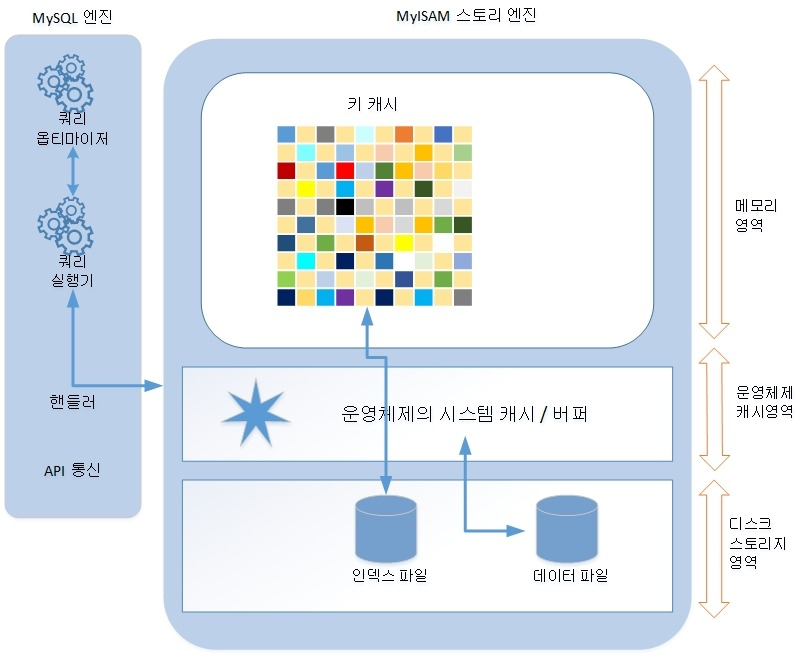

### 키 캐시

- InnoDB의 버퍼 풀과 비슷한 역할을 한다
- 인덱스만을 대상으로 작동하며, 인덱스의 디스크 쓰기 작업에 대해서만 부분적으로 버퍼링 역할을 한다
- 키 캐시를 얼마나 설정해야 하는가?
    - 키 캐시 히트율 = 100 - (Key_reads / Key_read_requests * 100)
        - Key_reads : 인덱스를 디스크에서 읽어들인 횟수
        - Key_read_requests : 키 캐시로부터 인덱스를 읽은 횟수
        - SHOW GLOBAL STATUS LIKE ‘Key&’를 통해 조회할 수 있다
    - 히트율이 99% 미만이라면, 키 캐시를 조금 더 크게 설정하는 것이 좋다
        - 32비트 운영체제에서는 하나의 키 캐시에 4GB 이상의 메모리 공간을 설정할 수 없다
        - 64비트 운영체제에서는 OS_PER_PROCESS_LIMIT 값에 설정된 크기만큼 메모리를 할당할 수 있다
        - 제한 값 이상의 키 캐시를 할당하고 싶다면 Default 키 캐시 이외에 별도의 명명된 키 캐시 공간을 설정해야 한다
        - 명명된 키 캐시 영역은 아무런 설정을 하지 않으면 메모리 할당만 해두고 사용하지 않는다
        - 명명된 추가 키 캐시는 어떤 인덱스를 캐시할지 MyISAM 스토리지 엔진에게 알려줘야 한다
            
            ```java
            mysql> CACHE INDEX db1.board, db2.board IN kbuf_board;
            mysql> CACHE INDEX db1.comment, db2.comment IN kbuf_Comment;
            ```
            

### 운영체제의 캐시 및 버퍼

- MyISAM 테이블의 **인덱스는** 키 캐시를 이용해 디스크를 검색하지 않고도 충분히 빠르게 검색할 수 있다
- 허나 MyISAM 테이블의 **데이터에 대해서는** 디스크로부터 I/O를 해결해줄 만한 어떠한 캐시나 버퍼링 기능도 가지고 있지 않다
- 그래서 MyISAM 테이블의 데이터 읽기나 쓰기 작업은 항상 운영체제의 디스크 읽기 또는 쓰기 작업으로 요청될 수밖에 없다
- 운영체제의 캐싱과 메모리 확보
    - 물론 대부분의 운영체제에는 디스크로부터 읽고 쓰는 파일에 대한 캐시나 버퍼링 메커니즘을 탑재하고 있다
    - 따라서 MySQL 서버가 요청하는 디스크 읽기 작업을 위해 매번 디스크의 파일을 읽지는 않는다
    - 운영체제의 캐시 공간은 남는 메모리를 사용하는 것이 기본 원칙이다
    - 데이터베이스에서 MyISAM 테이블을 주로 사용한다면,
    운영체제가 사용할 수 있는 캐시 공간을 위한 충분한 메모리를 비워둬야 이러한 문제를 방지할 수 있다

### 데이터 파일과 프라이머리 키(인덱스) 구조

- InnoDB 스토리지 엔진을 사용하는 테이블을 프라이머리 키에 의해서 클러스터링되어 저장된다
- 하지만 MyISAM 테이블은 프러이머리 키에 의한 클러스터링 없이 데이터 파일이 힙 공간처럼 활용된다
- 즉, 레코드는 프라이머리 키 값과 무관하게 INSERT되는 순서대로 데이터 파일에 저장된다
- 그리고 MyISAM 테이블에 저장되는 레코드는 모두 ROWID라는 물리적인 주솟값을 가지는데, 프라이머리 키와 세컨더리 인덱스는 모두 데이터 파일에 저장된 레코드의 ROWID 값을 포인터로 가진다
    - ROWID는 가변 길이와 고정 길이의 두 가지 방법으로 저장될 수 있다
    - 고정길이 ROWID
        - MyISAM 테이블을 생성할 때 MAX_ROWS 옵션을 명시하면, 최대로 가질 수 있는 레코드가 한정된 테이블을 생성하게 된다
    - 가변길이 ROWID
        - MAX_ROWS 옵션을 설정하지 않으면, ROWID는 최대 myisam_data_pointer_size 시스템 변수(기본값 7)에 설정된 바이트 수만큼의 공간을 사용할 수 있다
        - myisam_data_pointer_size가 n이라면 2바이트부터 n바이트까지 가변적인 ROWID를 가지게 된다
        - 첫 번째 바이트는 ROWID의 길이를 저장하고, 나머지 공간은 실제 ROWID를 저장한다

# MySQL 로그 파일

---

### 에러 로그 파일

- MySQL 실행 도중 발생하는 에러나 경고 메시지가 출력되는 로그 파일
- MySQL 설정 파일에서 log_error 파라미터에 정의된 경로로 생성되지만, 별도로 정의하지 않은 경우, 데이터 디렉토리에 .err라는 확장자가 붙은 파일로 생성된다
- 자주 보게되는 메시지 종류들
    - MySQL이 시작하는 과정과 관련된 정보성/에러 메시지
    - 마지막으로 종료할 때 비정상적으로 종료된 경우 나타나는 InnoDB 트랜잭션 복구 메시지
    - 쿼리 처리 도중에 발생하는 문제에 대한 에러 메시지
    - 비정상으로 종료된 커넥션 메시지
    - InnoDB의 모니터링 또는 상태조회 명령의 결과 메시지
    - MySQL의 종료 메시지

### 제너럴 쿼리 로그 파일(제너럴 로그 파일, General Log)

- 서버에서 실행되는 쿼리로 어떤것들이 있는지 검토하고 싶으면, 쿼리로그를 활성화해서 쿼리로그파일로 기록하게 하면 된다
- 슬로우 쿼리로그와는 조금 다르게 제너럴 쿼리 로그는 실행되기 전에 MySQL이 쿼리 요청을 받으면 바로 기록한다
    - 따라서 쿼리 실행 중에 에러가 발생해도 일단 로그 파일에 기록된다
- 쿼리 로그 파일의 경로는 general_log_file이라는 파라미터에 설정한다
- 파일이 아니라 테이블에 저장하도록 설정할 수도 있다

### 슬로우 쿼리 로그

- 슬로우 쿼리 로그 파일에는 long_query_time 시스템 변수에 설정한 시간 이상의 시간이 소요된 쿼리가 모두 기록된다
- 슬로우 쿼리 로그는 MySQL이 쿼리를 실행한 후, 실제 소요된 시간을 기준으로 슬로우 쿼리 로그에 기록할지 여부를 판단하기 때문에,
반드시 쿼리가 정상적으로 실행이 완료돼야 슬로우 쿼리 로그에 기록될 수 있다
- log_ouput 옵션 : 로그를 파일로 기록할지 테이블로 기록할지 선택한다

**Percona Toolkit의 pt-query-digest 스크립트**

- 쉽게 쿼리들의 빈도나 처리 성능별로 정렬해서 살펴볼 수 있다

```bash
linux> pt-query-digest --type='genlog' general.log > parsed_general.log
linux> pt-query-digest --type='slowlog' mysql-slow.log > parsed_mysql-slog.log
```

- 로그 파일의 분석이 완료되면 결과는 3개의 그룹으로 나뉘어 저장된다
    - 슬로우 쿼리 통계
        - 모든 쿼리를 대상으로 슬로우 쿼리 로그의 실행시간, 잠금 대기 시간 등에 대해 평균/최소/최대 값을 표시한다
    - 실행빈도 및 누적실행시간순 랭킹
        - 각 쿼리별로 응답시간과 실행 횟수를 보여준다
    - 쿼리별 실행횟수 및 누적실행시간 상세정보
        - QueryID 별 쿼리를 쿼리 랭킹에 표시된 순서대로 자세한 내용을 보여준다
        - 쿼리가 얼마나 실행됐는지, 쿼리의 응답시간에 대한 히스토그램같은 상세한 내용을 보여준다

# Reference

---

버퍼풀

- [https://flashsql.github.io/innodb-doc-kr/blog/innodb/5.1.buffer-pool.html](https://flashsql.github.io/innodb-doc-kr/blog/innodb/5.1.buffer-pool.html)

Read Ahead

- [https://dev.mysql.com/doc/refman/8.0/en/innodb-performance-read_ahead.html](https://dev.mysql.com/doc/refman/8.0/en/innodb-performance-read_ahead.html)