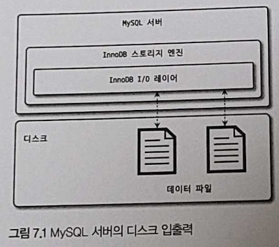

# Chapter 7. 데이터 암호화

- MySQL 8.0 으로 업그레이드되면서 데이터 파일뿐만 아니라 리두 로그나 언두 로그, 복제를 위한 바이너리 로그 등도 모두 암호화 기능을 지원하기 시작했다.
    - 5.7 버전부터 지원되기 시작한 데이터 암호화 기능은 처음에는 데이터 파일(테이블스페이스)에 대해서만 암호화 기능이 제공됐다.
- 응용프로그램의 암호화는 주로 중요 정보를 가진 컬럼 단위로 암호화를 수행하며, 데이터베이스 수준에서는 테이블 단위로 암호화를 적용한다.


## 1. MySQL 서버의 데이터 암호화

- MySQL 서버의 암호화 기능은 데이터베이스 서버와 디스크 사이의 데이터 읽고 쓰기 지점에서 암호화 또는 복호화를 수행한다.
    - 그 외의 부분에서는 암호화 처리가 전혀 필요치 않다.
    - 즉, MySQL 서버(InnoDB 스토리지 엔진)의 I/O 레이어에서만 데이터의 암호화 및 복호화 과정이 실행되는 것이다.



- TDE(Transparent Data Encryption): 데이터 암호화 기능이 활성화돼 있다고 하더라도 MySQL 내부와 사용자 입장에서는 아무런 차이가 없는 암호화 방식
    - "Data at Rest Encryption"라고도 하는데, 여기서 "Data at Rest"는 메모리(In-Process)나 네트워크 전송(InTransit) 단계가 아닌 디스크에 저장(At Rest)된 단계에서만 암호화된다는 의미로 사용되는 표현이다.

### 1-1. 2단계 키 관리

---

- MySQL 서버의 TDE 에서 암호화는 키링 플러그인에 의해 관리된다.
- MySQL 8.0 버전에서 지원되는 키링 플러그인
    1. `keyring_file` File-Based 플러그인 (커뮤니티 에디션 사용가능)
    2. `keyring_encrypted_file` Keyring 플러그인
    3. `keyring_okv` KMIP 플러그인
    4. `keyring_aws` Amazon Web Services Keyring 플러그인

👉 다양한 플러그인이 제공되지만 마스터 키를 관리하는 방법만 다를 뿐 MySQL 서버 내부적으로 작동하는 방식은 모두 동일하다.

- 키링 플러그인은 2단계 키 관리 방식을 사용한다.
    
    
    
    - 마스터 키와 테이블스페이스 키(프라이빗 키)라는 두 가지 종류의 키
        - HashiCorp Vault 같은 외부 키 관리 솔루션 또는 디스크의 파일에서 마스터 키를 가져오고,
        - 암호화된 테이블이 생성될 때마다 해당 테이블을 위한 임의의 테이블스페이스 키를 발급한다.
    - MySQL 서버는 마스터 키를 이용해 테이블스페이스키를 암호화해서 각 테이블의 데이터 파일 헤더에 저장한다.
    - 생성된 테이블스페이스 키는 테이블이 삭제되지 않는 이상 절대 변경되지 않는다. 하지만 테이블스페이스 키는 절대 MySQL 서버 외부로 노출되지 않기에 주기적으로 변경하지 않아도 보안상 취약점이 되지 않는다.
    - 하지만 마스터 키는 외부 파일을 이용하기 때문에 노출 가능성이 있어 주기적으로 변경해야 한다.
        
        ```bash
        mysql> ALTER INSTANCE ROTATE INNODB MASTER KEY;
        ```
        
        - 마스터 키를 변경하면 MySQL 서버는 기존의 마스터 키를 이용해 각 테이블의 테이블스페이스 키를 복호화한 다음 새로운 마스터 키로 다시 암호화한다. 마스터 키가 변경되는 동안 MySQL 서버의 테이블스페이스 키 자체와 데이터 파일의 데이터는 전혀 변경되지 않는다.
- 👉 MySQL 서버에서 이렇게 2단계 암호화 방식을 사용하는 이유는 암호화 키 변경으로 인한 과도한 시스템 부하를 피하기 위해서다.
    - 만약 테이블스페이스 키가 변경된다면 데이터 파일의 모든 데이터를 다시 복호화했다가 다시 암호화해야 하는 부하를 갖게 된다.
- TDE 에서 지원되는 암호화 알고리즘은 AES 256 비트이며, 이외의 알고리즘은 지원되지 않는다.
    - 테이블 스페이스 키는 AES-256 ECB 알고리즘을 이용해 암호화되고,
    - 실제 데이터 파일은 AES-256 CBC 알고리즘을 이용해 암호화된다.

### 1-2. 암호화와 성능

---

- MySQL 서버의 암호화는 TDE 방식이기 때문에 디스크로부터 한 번 읽은 데이터 페이지는 복호화되어 InnoDB 의 버퍼 풀에 적재된다.
    - 그래서 데이터 페이지가 한 번 메모리에 적재되면 암호화되지 않은 테이블과 동일한 성능을 보인다.
- 하지만 쿼리가 InnoDB 버퍼 풀에 존재하지 않는 데이터 페이지를 읽어야 하는 경우에는 복호화 과정을 거치기 때문에 복호화 시간 동안 쿼리 처리가 지연될 것이다. 그리고 암호화된 테이블이 변경되면 다시 디스크로 동기화될 때 암호화돼야 하기 때문에 디스크에 저장할 때도 추가로 시간이 더 걸린다.
    - 하지만 데이터 페이지 저장은 사용자의 쿼리를 처리하는 쓰레드가 아닌 MySQL 서버 백그라운드 쓰레드가 수행하기 때문에 실제 사용자 쿼리가 지연되는 것은 아니다.

- 암호화한다고 해서 InnoDB 버퍼 풀의 효율이 달라지거나 메모리 사용 효율이 떨어지는 현상은 발생하지 않는다.
    - AES 암호화 알고리즘은 암호화 결과가 평문의 결과와 동일한 크기의 암호문을 반환한다.
        - 암호화하고자 하는 평문의 길이가 짧은 경우 암호화 키의 크기에 따라 암호화된 결과의 용량이 더 커질 수도 있지만, 이미 데이터 페이지는 암호화 키보다 훨씬 크다.
    
    👉 데이터 파일의 크기는 암호화되지 않은 테이블과 동일한 크기를 가진다.
    
- 같은 테이블에 대해 암호화와 압축이 동시에 적용되면 MySQL 서버는 압축을 먼저 실행하고 암호화를 적용한다.
    - 암호화된 결과문은 아주 랜덤한 바이트 배열을 가지게 되는데, 이는 압축률을 상당히 떨어뜨린다. 그래서 최대한 압축 효율을 높이기 위해 사용자의 데이터를 그대로 압축해서 용량을 최소화한 후 암호화를 적용한다.
    - 암호화된 테이블의 데이터 페이지는 복호화된 상태로 InnoDB 버퍼 풀에 저장되지만, 압축된 데이터 페이지는 압축 또는 압축 해제의 모든 상태로 InnoDB 버퍼 풀에 존재할 수 있다.
        - 그래서 암호화가 먼저 실행되고 압축이 적용된다면 MySQL 서버는 InnoDB 버퍼 풀에 존재하는 데이터 페이지에 대해서도 매번 암복호화 작업을 수행해야 된다.

- 암호화된 테이블과 그렇지 않은 테이블의 디스크 읽고 쓰기에 걸리는 평균 시간
    - 암호화된 테이블의 경우 읽기는 3~5배 정도, 쓰기는 5~6배 느린 것을 확인할 수 있다.
    
    ```bash
    mysql> SELECT (sum(sum_timer_read)/sum(count_read)) / 1000000000 AS avg_read_latency_ms
                , (sum(sum_timer_write)/sum(count_write)) / 1000000000 AS avg_write_latency_ms
             FROM performance_schema.file_summary_by_instance
            WHERE file_name LIKE '%DB_NAME/TABLE_NAME%';
    +---------------------+----------------------+
    | avg_read_latency_ms | avg_write_latency_ms |
    +---------------------+----------------------+
    |          0.14210064 |           0.03603301 |
    +---------------------+----------------------+
    ```
    
    | 암호화 | 테이블명 | 테이블 크기(GB) | Read Latency(ms) | Write Latency(ms) |
    | --- | --- | --- | --- | --- |
    | No | table_1 | 1.3 | 0.56 | 0.02 |
    | “ | table_2 | 2.7 | 0.16 | 0.02 |
    | “ | table_3 | 3.7 | 0.49 | 0.02 |
    | “ | table_4 | 106.6 | 0.34 | 0.02 |
    | “ | table_5 | 141.0 | 0.25 | 0.02 |
    | Yes | table_6 | 2.0 | 1.19 | 0.11 |
    | “ | table_7 | 4.8 | 1.50 | 0.13 |
    | “ | table_8 | 206.5 | 1.44 | 0.12 |

### 1-3. 암호화와 복제

---

- MySQL 서버의 복제에서 레플리카 서버는 소스 서버의 모든 사용자 데이터를 동기화하기 때문에 실제 데이터 파일도 동일할 것이라 생각할 수 있다. 하지만 TDE 를 이용한 암호화 사용 시 마스터 키와 테이블스페이스 키는 그렇지 않다.
    - 마스터 키 자체가 복제되지 않기 때문에 테이블스페이스 키 또한 레플리카로 복제되지 않는다.
    - 실제 암호화된 데이터가 저장된 데이터 파일의 내용은 완전히 달라진다.

- 복제 소스 서버의 마스터 키를 변경할 때
    
    ```bash
    mysql> ALTER INSTANCE **ROTATE** INNODB MASTER KEY;
    ```
    
    - 명령 자체는 레플리카 서버로 복제되지만 실제 소스 서버의 마스터 키 자체가 레플리카로 전달되는 것은 아니다. 그래서 마스터 키 로테이션을 실행하면 소스 서버와 레플리카 서버가 각각 서로 다른 마스터 키를 새로 발급받는다.
- MySQL 서버의 백업에서 TDE 의 키링 파일을 백업하지 않는 경우가 있는데, 이 경우 키링 파일을 찾지 못하면 데이터 복구를 할 수 없게 된다.
    - 백업마다 키링 파일의 백업도 함께 고려하자.
        - 키링 파일을 데이터 백업과 별도로 백업한다면 마스터 키 로테이션 명령으로 TDE 의 마스터 키가 언제 변경됐는지까지 기억하고 있어야 한다.
        - ✔️ 보안을 위해 키링 파일을 데이터 파일과 별도로 보관하는 것을 권장
            - 복구를 감안하고 백업 방식을 선택해야 한다.


## 2. keyring_file 플러그인 설치

- TDE 의 암호화 키 관리는 플러그인 방식으로 제공된다.
    
    → MySQL 커뮤니티 에디션은 `keyring_file` 플러그인만 가능
    

- `keyring_file` 플러그인은 테이블스페이스 키를 암호화하기 위한 마스터 키를 디스크의 파일로 관리하는데, 이때 마스터 키는 평문으로 디스크에 저장된다.
    - 마스터 키가 저장된 파일이 외부에 노출된다면 데이터 암호화는 무용지물이 된다.
- MySQL 서버가 시작될 때만 키링 파일을 다른 서버로부터 다운로드해서 로컬 디스크에 저장한 후 MySQL 서버를 시작하는 방법을 고려해보자.
    - 일단 MySQL 서버가 시작되면 MySQL 서버가 마스터 키를 메모리에 캐시하기 때문에 로컬 디스크의 키링 파일을 삭제해도 MySQL 서버가 작동하는 데는 아무런 문제가 없다.
    - 마스터 키를 로테이션하는 경우에는 로컬의 키링 파일이 최신이 되므로 다시 외부 서버에 복사해 둬야 한다.
    - Percona Server 는 HashiCorp Vault 를 연동하는 키 관리 플러그인을 오픈소스로 제공한다.
        - MySQL 커뮤니티 에디션에서도 문제없이 사용할 수 있으므로 Percona Server 의 `keyring_vault` 플러그인도 함께 검토해볼 것을 권장한다.

- TDE 플러그인의 경우 MySQL 서버가 시작되는 단계에서도 가장 빨리 초기화돼야 한다.
    - MySQL 서버의 설정 파일(`my.cnf`)에서 `early-plugin-load`에 `keyring_file`플러그인을 위한 라이브러리("`kering_file.so`")를 명시하면 된다.
    - 그리고 `keyring_file`플러그인이 마스터 키를 저장할 키링 파일의 경로를 `kering_file_data` 설정에 명시하면 된다.
        - 경로는 오직 하나의 MySQL 서버만 참조해야 한다.
    
    ```bash
    # /etc/my.cnf
    early-plugin-load = keyring_file.so
    keyring_file_data = ~/pempem/tde_master.key
    ```
    
- `keyring_file` 플러그인의 초기화 여부는 `SHOW PLUGINS` 명령으로 확인 가능
    - `keyring_file` 플러그인이 초기화되면 MySQL 서버는 플러그인의 초기화와 동시에 `keyring_file_data`시스템 변수의 경로에 빈 파일을 생성한다.
    
    ```bash
    mysql> SHOW PLUGINS;
    +---------------------------------+----------+--------------------+-----------------+---------+
    | Name                            | Status   | Type               | Library         | License |
    +---------------------------------+----------+--------------------+-----------------+---------+
    | **keyring_file                    | ACTIVE   | KEYRING            | keyring_file.so | GPL**     |
    | binlog                          | ACTIVE   | STORAGE ENGINE     | NULL            | GPL     |
    | mysql_native_password           | ACTIVE   | AUTHENTICATION     | NULL            | GPL     |
    | sha256_password                 | ACTIVE   | AUTHENTICATION     | NULL            | GPL     |
    | caching_sha2_password           | ACTIVE   | AUTHENTICATION     | NULL            | GPL     |
    | sha2_cache_cleaner              | ACTIVE   | AUDIT              | NULL            | GPL     |
    | daemon_keyring_proxy_plugin     | ACTIVE   | DAEMON             | NULL            | GPL     |
    | CSV                             | ACTIVE   | STORAGE ENGINE     | NULL            | GPL     |
    | MEMORY                          | ACTIVE   | STORAGE ENGINE     | NULL            | GPL     |
    | InnoDB                          | ACTIVE   | STORAGE ENGINE     | NULL            | GPL     |
    | INNODB_TRX                      | ACTIVE   | INFORMATION SCHEMA | NULL            | GPL     |
    | INNODB_CMP                      | ACTIVE   | INFORMATION SCHEMA | NULL            | GPL     |
    | INNODB_CMP_RESET                | ACTIVE   | INFORMATION SCHEMA | NULL            | GPL     |
    | INNODB_CMPMEM                   | ACTIVE   | INFORMATION SCHEMA | NULL            | GPL     |
    | INNODB_CMPMEM_RESET             | ACTIVE   | INFORMATION SCHEMA | NULL            | GPL     |
    | INNODB_CMP_PER_INDEX            | ACTIVE   | INFORMATION SCHEMA | NULL            | GPL     |
    | INNODB_CMP_PER_INDEX_RESET      | ACTIVE   | INFORMATION SCHEMA | NULL            | GPL     |
    | INNODB_BUFFER_PAGE              | ACTIVE   | INFORMATION SCHEMA | NULL            | GPL     |
    | INNODB_BUFFER_PAGE_LRU          | ACTIVE   | INFORMATION SCHEMA | NULL            | GPL     |
    | INNODB_BUFFER_POOL_STATS        | ACTIVE   | INFORMATION SCHEMA | NULL            | GPL     |
    | INNODB_TEMP_TABLE_INFO          | ACTIVE   | INFORMATION SCHEMA | NULL            | GPL     |
    | INNODB_METRICS                  | ACTIVE   | INFORMATION SCHEMA | NULL            | GPL     |
    | INNODB_FT_DEFAULT_STOPWORD      | ACTIVE   | INFORMATION SCHEMA | NULL            | GPL     |
    | INNODB_FT_DELETED               | ACTIVE   | INFORMATION SCHEMA | NULL            | GPL     |
    | INNODB_FT_BEING_DELETED         | ACTIVE   | INFORMATION SCHEMA | NULL            | GPL     |
    | INNODB_FT_CONFIG                | ACTIVE   | INFORMATION SCHEMA | NULL            | GPL     |
    | INNODB_FT_INDEX_CACHE           | ACTIVE   | INFORMATION SCHEMA | NULL            | GPL     |
    | INNODB_FT_INDEX_TABLE           | ACTIVE   | INFORMATION SCHEMA | NULL            | GPL     |
    | INNODB_TABLES                   | ACTIVE   | INFORMATION SCHEMA | NULL            | GPL     |
    | INNODB_TABLESTATS               | ACTIVE   | INFORMATION SCHEMA | NULL            | GPL     |
    | INNODB_INDEXES                  | ACTIVE   | INFORMATION SCHEMA | NULL            | GPL     |
    | INNODB_TABLESPACES              | ACTIVE   | INFORMATION SCHEMA | NULL            | GPL     |
    | INNODB_COLUMNS                  | ACTIVE   | INFORMATION SCHEMA | NULL            | GPL     |
    | INNODB_VIRTUAL                  | ACTIVE   | INFORMATION SCHEMA | NULL            | GPL     |
    | INNODB_CACHED_INDEXES           | ACTIVE   | INFORMATION SCHEMA | NULL            | GPL     |
    | INNODB_SESSION_TEMP_TABLESPACES | ACTIVE   | INFORMATION SCHEMA | NULL            | GPL     |
    | MyISAM                          | ACTIVE   | STORAGE ENGINE     | NULL            | GPL     |
    | MRG_MYISAM                      | ACTIVE   | STORAGE ENGINE     | NULL            | GPL     |
    | PERFORMANCE_SCHEMA              | ACTIVE   | STORAGE ENGINE     | NULL            | GPL     |
    | TempTable                       | ACTIVE   | STORAGE ENGINE     | NULL            | GPL     |
    | ARCHIVE                         | ACTIVE   | STORAGE ENGINE     | NULL            | GPL     |
    | BLACKHOLE                       | ACTIVE   | STORAGE ENGINE     | NULL            | GPL     |
    | FEDERATED                       | DISABLED | STORAGE ENGINE     | NULL            | GPL     |
    | ngram                           | ACTIVE   | FTPARSER           | NULL            | GPL     |
    | mysqlx_cache_cleaner            | ACTIVE   | AUDIT              | NULL            | GPL     |
    | mysqlx                          | ACTIVE   | DAEMON             | NULL            | GPL     |
    +---------------------------------+----------+--------------------+-----------------+---------+
    ```
    
- 데이터 암호화 기능을 사용하는 테이블을 생성하거나 마스터 로테이션을 실행하면 키링 파일의 마스터 키가 초기화된다.
    
    ```bash
    mysql> ALTER INSTANCE ROTATE INNODB MASTER KEY;
    Query OK, 0 rows affected (0.00 sec)
    
    jenny@gim-yunhuiui-MacBookPro ~ % cat pempem/tde_master.key
    Keyring file version:2.0�0 INNODBKey-f80b57aa-c754-11eb-ba99-835a380a8991-1AESl���6]��/�/�
    B                                                                                         ��AvER�R�3@0e�EOF��K%3M�
     ���vs�DIE.�q��`�%
    ```
    

## 3. 테이블 암호화

---

- 키링 플러그인은 마스터 키를 생성하고 관리하는 부분까지만 담당하기 때문에 어떤 키링 플러그인을 사용하든 관계없이 암호화된 테이블을 생성하고 활용하는 방법은 모두 동일하다.

### 3-1. 테이블 생성

---

- TDE 를 이용하는 테이블 생성: 일반적인 테이블 생성 구문과 동일하며, 마지막에 `ENCRYPTION='Y'` 옵션만 추가로 넣으면 된다.
    
    ```bash
    mysql> CREATE TABLE tab_encrypted (
             id INT,
             data varchar(100),
             PRIMARY KEY(id)
           ) ENCRYPTION = 'Y';
    
    mysql> INSERT INTO tab_encrypted VALUES (1, 'test_data');
    mysql> SELECT * FROM tab_encrypted;
    +----+-----------+
    | id | data      |
    +----+-----------+
    |  1 | test_data |
    +----+-----------+
    ```
    
    - 이제부터 이 테이블의 데이터가 디스크에 기록될 때는 데이터가 자동으로 암호화되어 저장되고, 다시 디스크에서 메모리로 읽어올 때 복호화된다.
- 암호화된 테이블만 검색할 때는 `information_schema`의 `TABLES`뷰를 이용하면 된다.
    
    ```bash
    mysql> SELECT table_schema, table_name, create_options
             FROM information_schema.tables
            WHERE table_name = 'tab_encrypted';
    +--------------+---------------+----------------+
    | TABLE_SCHEMA | TABLE_NAME    | CREATE_OPTIONS |
    +--------------+---------------+----------------+
    | test         | tab_encrypted | ENCRYPTION='Y' |
    +--------------+---------------+----------------+
    ```
    

- MySQL 서버의 모든 테이블에 대해 암호화를 적용하고자 한다면 `default_table_encryption` 시스템 변수를 ON 으로 설정하면 `ENCRYPTION`옵션을 별도로 설정하지 않아도 암호화된 테이블로 생성된다.
    
    ```bash
    mysql> SHOW VARIABLES LIKE '%default_table_encryption%';
    +--------------------------+-------+
    | Variable_name            | Value |
    +--------------------------+-------+
    | default_table_encryption | OFF   |
    +--------------------------+-------+
    ```
    

### 3-2. 응용 프로그램 암호화와의 비교

---

- 응용 프로그램에서 직접 암호화해서 MySQL 서버에 저장하는 경우도 있는데, 이 경우 저장되는 컬럼의 값이 이미 암호화된 것인지 여부를 MySQL 서버는 이를 인지하지 못한다. → 인덱스를 생성하더라도 인덱스의 기능을 100% 활용할 수 없다.
    
    👉 응용 프로그램의 암호화와 MySQL 서버의 암호화 기능 중 선택해야 하는 상황이라면 고민할 필요 없이 MySQL 서버의 암호화 기능을 선택할 것을 권장한다.
    
- 응용 프로그램의 암호화와 MySQL 서버의 암호화는 목적과 용도가 다르다.
    - MySQL 서버의 TDE 기능으로 암호화한다면 MySQL 서버에 로그인만 할 수 있다면 모든 데이터를 평문으로 확인할 수 있다.
    - 하지만 응용프로그램 암호화는 MySQL 서버에 로그인할 수 있다고 하더라도 평문의 내용을 확인할 수 없다.
- 응용 프로그램에서의 암호화 기능은 서비스의 요건과 성능을 고려해서 선택해야 하고, MySQL 서버의 암호화 기능과 혼합해서 사용한다면 더 안전한 서비스를 구축할 수 있을 것이다.

### 3-3. 테이블스페이스 이동

---

- 테이블을 다른 서버로 복사해야 하는 경우 또는 특정 테이블의 데이터 파일만 백업했다가 복구하는 경우라면 테이블스페이스 이동(Export & Import) 기능이 레코드를 덤프했다가 복구하는 방식보다 훨씬 효율적이고 빠르다.
- 그런데 TDE 가 적용되어 암호화된 테이블의 경우 원본 MySQL 서버와 목적지 MySQL 서버의 암호화 키(마스터 키)가 다르기 때문에 하나 더 신경써야 할 부분이 있다.

- 암호화되지 않은 테이블의 테이블스페이스 복사 과정
    - `FLUSH TABLES` 명령으로 테이블스페이스를 익스포트할 수 있다.
        
        ```sql
        FLUSH TABLES source_table FOR EXPORT;
        ```
        
    - 이 명령이 실행되면 MySQL 서버는 source_table 의 저장되지 않은 변경 사항을 모두 디스크로 기록하고, 더이상 source_table 에 접근할 수 없게 잠금을 건다.
        
        ```sql
        mysql> FLUSH TABLES tab_encrypted FOR EXPORT;
        Query OK, 0 rows affected (0.00 sec)
        
        mysql> INSERT INTO tab_encrypted VALUES (2, 'test_data2');
        ERROR 1099 (HY000): Table 'tab_encrypted' was locked with a READ lock and can't be updated
        ```
        
    - 그와 동시에 source_table 의 구조를 `source_table.cfg` 파일로 기록해 둔다.
    - 그러면 `source_table.ibd` 파일과 `source_table.cfg` 파일을 목적지 서버로 복사한다.
    - 복사가 모두 완료되면 `UNLOCK TABLES` 명령을 실행해 source_table 을 사용할 수 있게 하면 된다.
        
        ```sql
        mysql> UNLOCK TABLES;
        Query OK, 0 rows affected (0.00 sec)
        
        mysql> INSERT INTO tab_encrypted VALUES (2, 'test_data2');
        Query OK, 1 row affected (0.00 sec)
        ```
        
- 암호화된 테이블 복사과정 👉 `*.cfg` 파일은 단순히 테이블의 구조만 가지고 있기 때문에 파일이 없어져도 경고만 발생하고 테이블스페이스를 복구할 수 있지만 `*.cfp` 파일이 없어지면 복구가 불가능해진다.
    - `FLUSH TABLES source_table FOR EXPORT` 명령 실행 시 MySQL 서버는 임시로 사용할 마스터 키를 발급해서 `source_table.cfp`라는 파일로 기록한다.
    - 그리고 암호화된 테이블의 테이블스페이스 키를 기존 마스터 키로 복호화한 후, 임시로 발급한 마스터 키를 이용해 다시 암호화해서 데이터 파일의 헤더 부분에 저장한다.
    - 테이블스페이스 이동 기능을 사용할 때는 반드시 데이터 파일과 임시 마스터 키가 저장된 `*.cfp` 파일을 함께 복사해야 한다.


## 4. 언두 로그 및 리두 로그 암호화

- MySQL 서버의 메모리에 존재하는 데이터는 복호화된 평문으로 관리되며, 이 평문 데이터가 테이블의 데이터 파일 이외의 디스크 파일로 기록되는 경우에는 여전히 평문으로 저장된다.
- MySQL 8.0.16 버전부터는 `innodb_undo_log_encrypt`, `innodb_redo_log_encrypt` 시스템 변수를 이용해 InnoDB 스토리지 엔진의 리두 로그와 언두 로그를 암호화된 상태로 저장할 수 있게 개선됐다.
    
    ```sql
    mysql> SHOW VARIABLES LIKE '%innodb_undo_log_encrypt%';
    +-------------------------+-------+
    | Variable_name           | Value |
    +-------------------------+-------+
    | innodb_undo_log_encrypt | OFF   |
    +-------------------------+-------+
    
    mysql> SHOW VARIABLES LIKE '%innodb_redo_log_encrypt%';
    +-------------------------+-------+
    | Variable_name           | Value |
    +-------------------------+-------+
    | innodb_redo_log_encrypt | OFF   |
    +-------------------------+-------+
    ```
    

- 리두 로그와 언두 로그 암호화 활성화 비활성화
    - 활성화 시점에 저장된 리두 로그와 언두 로그는 그 시점의 암호화 키가 필요하다. (키 보관 필요)
- 리두 로그와 언두 로그 데이터 모두 각각의 테이블스페이스 키로 암호화되고, 테이블스페이스 키는 다시 마스터 키로 암호화된다.
    - 여기서 이야기한 테이블스페이스 키는 실제 테이블의 암호화에 사용된 테이블스페이스 키가 아니라 리두 로그와 언두 로그 파일을 위한 프라이빗 키를 의미한다.
    - 리두 로그와 언두 로그를 위한 각각의 프라이빗 키가 발급되고, 해당 프라이빗 키는 마스터 키로 암호화되어 리두 로그 파일과 언두 로그 파일의 헤더에 저장되는 것이다.
- InnoDB 리두 로그가 암호화됐는지
    
    ```bash
    mysql> SHOW VARIABLES LIKE '%innodb_redo_log_encrypt%';
    +-------------------------+-------+
    | Variable_name           | Value |
    +-------------------------+-------+
    | innodb_redo_log_encrypt | OFF   |
    +-------------------------+-------+
    
    mysql> SET GLOBAL innodb_redo_log_encrypt=ON;
    Query OK, 0 rows affected (0.00 sec)
    
    mysql> INSERT INTO tab_encrypted VALUES (3, 'test_data3');
    Query OK, 1 row affected (0.00 sec)
    ```
    
    - `INSERT`된 레코드의 문자열이 InnoDB 의 리두 로그에 보이는지만 확인해보면 된다.
        - `grep` 명령을 이용한 단순한 검색 결과에서 암호화되기 전에 `INSERT`한 문자열은 검색되지만 암호화 이후 `INSERT`된 문자열은 검색되지 않는 것을 확인할 수 있다.
        
        ```bash
        jenny@gim-yunhuiui-MacBookPro ~ % cd /usr/local/var/mysql
        jenny@gim-yunhuiui-MacBookPro mysql % ll
        #ib_16384_0.dblwr			binlog.000106				binlog.000118				fn_products				mysqld-auto.cnf
        #ib_16384_1.dblwr			binlog.000107				binlog.000119				fs_invoicing				performance_schema
        #innodb_temp				binlog.000108				binlog.000120				fs_nosnos_module			private_key.pem
        auto.cnf				binlog.000109				binlog.000121				gim-yunhuiui-MacBookPro.local.err	public_key.pem
        binlog.000098				binlog.000110				binlog.000122				gim-yunhuiui-MacBookPro.local.pid	server-cert.pem
        binlog.000099				binlog.000111				binlog.index				ib_buffer_pool				server-key.pem
        binlog.000100				binlog.000112				ca-key.pem				ib_logfile0				sys
        binlog.000101				binlog.000113				ca.pem					ib_logfile1				test
        binlog.000102				binlog.000114				client-cert.pem				ibdata1					undo_001
        binlog.000103				binlog.000115				client-key.pem				ibtmp1					undo_002
        binlog.000104				binlog.000116				dev_datalytics				mysql
        binlog.000105				binlog.000117				fn_partners				mysql.ibd
        
        ## grep 명령의 결과, 문자열이 존재하면 "matches"라는 메시지를 보여준다.
        ## 그리고 검색한 문자열이 존재한다면 grep 명령은 반환 값으로 "0"을 리턴한다.
        jenny@gim-yunhuiui-MacBookPro mysql % grep 'test_data2' ib_logfile0 ib_logfile1
        Binary file ib_logfile0 matches
        
        ## grep 명령의 결과, 문자열이 존재하지 않으면 아무런 메시지 출력이 없다.
        ## 그리고 검색한 문자열이 존재하지 않으면 grep 명령은 반환 값으로 "1"을 리턴한다.
        jenny@gim-yunhuiui-MacBookPro mysql % grep 'test_data3' ib_logfile0 ib_logfile1
        ```
        

## 5. 바이너리 로그 암호화

- 테이블 암호화가 적용돼도 바이너리 로그와 릴레이 로그 파일 또한 리두 로그나 언두 로그처럼 평문을 저장한다.
    - 바이너리 로그와 릴레이 로그 파일 암호화 기능은 디스크에 저장된 로그 파일에 대한 암호화만 담당하고, MySQL 서버의 메모리 내부 또는 소스 서버와 레플리카 서버 간의 네트워크 구간에서 로그 데이터를 암호화하지 않는다.

→ 복제 멤버 간의 네트워크 구간에서도 바이너리 로그를 암호화하고자 한다면 MySQL 복제를 위한 계정(slave)이 SSL 을 사용하도록 설정하면 된다.

### 5-1. 바이너리 로그 암호화 키 관리

---

- 바이너리 로그 파일의 암호화 방식
    
    
    
    - 바이너리 로그와 릴레이 로그 파일의 데이터는 파일 키로 암호화해서 디스크로 저장하고, 파일 키는 “바이너리 로그 암호화 키”(마스터 키와 동일한 역할)로 암호화해서 각 바이너리 로그와 릴레이 로그 파일의 헤더에 저장된다.

### 5-2. 바이너리 로그 암호화 키 변경

---

- 바이너리 로그 암호화 키는 다음과 같이 변경(로테이션)할 수 있다.
    
    ```bash
    mysql> ALTER INSTANCE ROTATE BINLOG MASTER KEY;
    ```
    
- 바이너리 로그 암호화 키가 변경 과정
    1. 증가된 시퀀스 번호와 함께 새로운 바이너리 로그 암호화 키 발급 후 키링 파일에 저장
    2. 바이너리 로그 파일과 릴레이 로그 파일 스위치 (새로운 로그 파일로 로테이션)
    3. 새로 생성되는 바이너리 로그와 릴레이 로그 파일의 암호화를 위해 파일 키를 생성하고, 파일 키는 바이너리 로그 파일 키(마스터 키)로 암호화해서 각 로그 파일에 저장
    4. 기존 바이너리 로그와 릴레이 로그 파일의 파일 키를 읽어서 새로운 바이너리 로그 파일 키로 암호화해서 다시 저장(암호화되지 않은 로그 파일은 무시)
    5. 모든 바이너리 로그와 릴레이 로그 파일이 새로운 바이너리 로그 암호화 키로 다시 암호화됐다면 기존 바이너리 로그 암호화 키를 키링 파일에서 제거
- 바이너리 로그 파일 암호화 확인
    
    ```bash
    mysql> SHOW BINARY LOGS;
    +---------------+-----------+-----------+
    | Log_name      | File_size | Encrypted |
    +---------------+-----------+-----------+
    | binlog.000098 |       156 | No        |
    | binlog.000099 |      7513 | No        |
    | binlog.000100 |       156 | No        |
    | binlog.000101 |       156 | No        |
    | binlog.000102 |       179 | No        |
    | binlog.000103 |       179 | No        |
    | binlog.000104 |       179 | No        |
    | binlog.000105 |       179 | No        |
    | binlog.000106 |      2530 | No        |
    | binlog.000107 |       156 | No        |
    | binlog.000108 |      3802 | No        |
    | binlog.000109 |       156 | No        |
    | binlog.000110 |       156 | No        |
    | binlog.000111 |       156 | No        |
    | binlog.000112 |       156 | No        |
    | binlog.000113 |       156 | No        |
    | binlog.000114 |      6288 | No        |
    | binlog.000115 |       156 | No        |
    | binlog.000116 |       156 | No        |
    | binlog.000117 |    446077 | No        |
    | binlog.000118 |       179 | No        |
    | binlog.000119 |       179 | No        |
    | binlog.000120 |       179 | No        |
    | binlog.000121 |       179 | No        |
    | binlog.000122 |      2722 | No        |
    +---------------+-----------+-----------+
    ```
    

### 5-3. `mysqlbinlog` 도구 활용

---

- 트랜잭션의 내용을 추적하거나 백업 복구를 위해 암호화된 바이너리 로그를 평문으로 복호화가 필요할 경우, 바이너리 로그 암호화 키가 없으면 복호화할 수 없다.
- `mysqlbinlog` 도구를 이용해 암호화된 바이너리 로그 파일의 내용을 SQL 문장으로 한번 풀어보면 다음과 같이 암호화된 바이너리 로그 파일을 직접 열어 볼 수는 없다는 에러 메시지를 출력한다.
    
    ```bash
    linux> mysqlbinlog -vvv mysql-bin.000011
    Enter password:
    /*!50530 SET COSESSION.PSEUDO_SLAVE_MODE=1*/;
    /*!50003 SET GOLD_COMPLETION_TYPE=COCOMPLETION_TYPE, COMPLETION_TYPE=0*/;
    DELIMITER /*!*/;
    **ERROR: Reading encrypted log files directly is not supported.**
    SET @ESESSION.GTID_NEXT= 'AUTOMATIC' /* added by mysqlbinlog */ /*!*/;
    DELIMITER;
    End of log file
    /*! 50003 SET COMPLETION_TYPE=COLD_COMPLETION_TYPE*/;
    /*!50530 SET COSESSION.PSEUDO_SLAVE_MODE=0*/;
    ```
    
- `mysqlbinlog` 도구가 MySQL 서버에 요청해서 바이너리 로그를 가져오는 방법밖에 없다.
    - 그래서 `mysqlbinlog` 명령을 실행할 때 `--read-fromremote-server` 파라미터와 함께 MySQL 서버 접속 정보를 입력한다.
    
    ```bash
    linux> mysqlbinlog --read-from-remote-server -uroot -p -vvv mysql-bin.000011
    Enter password:
    ...
    BINLOG
    c4YjXxOBAAAASQAAAH8BAACAADFpbnNlcnQgaw50byBlbmMgdmFsdWVzICgyLCdlbmNyeXBOZWRF
    YmluYXJ5IGxvZycpv4dkcA=
    c4YjXXMBAAAANWAAALYBAAAAAF SAAAAAAAEABHRIC3QAA2VuYWACAwCKAEDAQEAAgEtHm4rfQ==
    c4YjXx4BAAAAPgAAAPQBAAAAAFSAAAAAAAEAAQAC/WACAAAAFABlbmNyeXBOZWRfYmluYXJ5IGXV
    ZzSCia4=
    '/*!*/;
    ### INSERT INTO `test`.`enc`
    ### SET
    ### @1=2 /* INT meta=0 nullable=1 is null=0 */
    ### @2='encrypted_binary log' /* VARSTRING(400) meta=400 nullable=1 is_null=0 */
    ```
