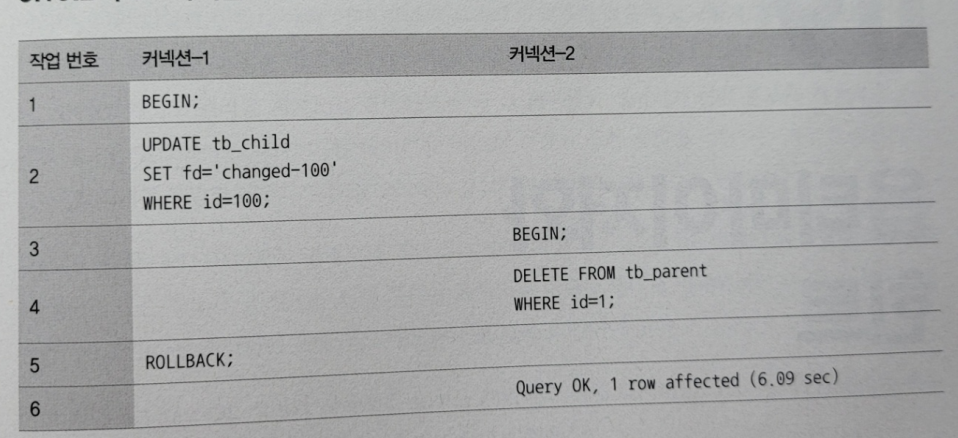

# 08. 인덱스

# 디스크 읽기 방식

---

데이터베이스의 성능 튜닝은 *‘어떻게 디스크 I/O를 줄이느냐’*가 관건일 때가 많다

### 하드 디스크 드라이브(HDD)와 솔리드 스테이트 드라이브(SSD)

- 요즘 DBMS용으로 사용할 서버에는 대부분 SSD를 채택하고있다
    - HDD는 기계식 장치라, 데이터베이스 서버에서 항상 병목이 된다
    - 따라서 전자식 저장 매체인 SSD가 많이 출시되고 있으며,
    기존 하드 디스크 드라이브의 디스크 원판(데이터 저장용 플래터) 대신 플래시 메모리를 장착하고 있어서, 따라서 아주 빨리 데이터를 읽고 쓸 수 있다
- SSD의 순차 I/O, 랜덤 I/O 성능
    - 한 번에 많은 데이터를 읽는 순차 I/O에서는 HDD에 비해 큰 성능 차이는 없지만, 랜덤 I/O에는 강하다
    - 애초에 작은 데이터를 읽고 쓰는 작업이 대부분이기 때문에 DBMS용 스토리지에는 SSD가 최적이다
    - SSD와 HDD의 성능 벤치마크 결과
        
        
        
        - SSD는 초당 436개의 트랜잭션을 처리했지만, HDD는 60개의 트랜잭션을 처리했다
        - 일반적인 웹 서비스 환경의 데이터베이스에서는 SSD가 HDD보다 훨씬 빠르다

### 랜덤 I/O와 순차 I/O

- 랜덤 I/O와 순차 I/O의 비교
    
    
    
    - 3개의 페이지를 디스크에 기록하기 위해 순차 I/O는 1번, 랜덤 I/O는 3번 시스템 콜을 요청했다
    → 디스크에 기록해야 할 위치를 찾기 위해 순차 I/O는 디스크의 헤드를 1번, 랜덤 I/O는 3번 움직인다
    → 여러 번 쓰기/읽기를 요청하는 랜덤 I/O 작업이 작업 부하가 훨씬 더 크다
    - 데이터베이스 대부분의 작업은 이러한 작은 데이터를 빈번히 읽고 쓰다
    → MySQL 서버에는 그룹 커밋이나 바이너리 로그 버퍼 또는 InnoDB 로그 버퍼 등의 기능이 내장돼있다
- 랜덤 I/O 줄이기
    - 일반적으로, 쿼리를 튜닝한다 = 랜덤 I/O 자체를 줄인다
    - 랜덤 I/O를 줄인다? ⇒ 꼭 필요한 데이터만 읽도록 쿼리를 개선한다

# 인덱스란

---

- 책의 ‘찾아보기’처럼 DBMS의 인덱스도 컬럼의 값을 주어진 순서로 미리 정렬해서 보관한다
- 자료구조에 비교해보면..
    - SortedList
        - 항상 정렬된 상태로 유지한다
        - DBMS의 인덱스와 같은 자료구조
        - 컬럼의 값을 이용해 항상 정렬된 상태를 유지한다
        - 장점
            - 이미 정렬돼있어서 원하는 값을 빨리 찾아온다
            - 따라서, 인덱스는 SELECT를 매우 빠르게 처리한다
        - 단점
            - 데이터가 저장될 때마다 항상 값을 정렬해야 한다 = 저장하는 과정이 복잡하고 느리다
            - 따라서, 인덱스도 인덱스가 많은 테이블은 INSERT나, UPDATE, DELETE 문장의 처리가 느려진다
    - ArrayList
        - 저장되는 순서 그대로 유지한다
        - 데이터 파일과 같은 자료구조
        - 저장된 순서대로 별도의 정렬없이 그대로 저장한다
    - 인덱스를 추가한다는 것은..
        - 얼마나 저장 성능을 희생하고 읽기 성능을 높일 것인가?
        - 데이터의 저장속도를 어디까지 희생하여 읽기 속도를 얼마나 더 빠르게 만들 것이냐?
- 인덱스 역할별 구분
    - 프라이머리 키
    - 보조 키 (세컨더리 인덱스)
- 데이터 저장방식별 구분
    - B-Tree 인덱스
        - 가장 일반적으로 사용되는 인덱스 알고리즘
        - 컬럼의 값을 변형하지 않고 원래의 값을 이용해 인덱싱한다
    - Hash 인덱스
        - 컬럼의 값으로 해시값을 계산해서 인덱싱한다
        - 매우 빠른 검색을 지원한다
        - 값을 변형해서 인덱싱하므로 prefix 일치와 같이 값의 일부만 검색하거나 범위를 검색할 때는 해시 인덱스를 사용할 수 없다
        - 주로 메모리 기반의 데이터베이스에서 많이 사용한다
    - Fractal-Tree 인덱스
        - B-Tree 인덱스에서 인덱스 키를 검색하거나 변경하는 과정 중에 발생하는 가장 큰 문제 : 디스크의 랜덤 I/O가 상대적으로 많이 필요하다
        → Fractal-Tree는 이를 순차 I/O로 변환해서 처리할 수 있다
        - Fractal-Tree는 인덱스의 단편화가 발생하지 않도록 구성할 수 있다
            - 에이징 현상 : 오랜 시간 동안 데이터가 변경되면서 단편화가 발생하고, 그 때문에 인덱스의 효율이 떨어지는 현상
            - 이러한 에이징 현상 때문에 테이블이나 인덱스 최적화(옵티마이즈)하는데, Fractal-Tree에서는 이러한 현상이 발생하지 않기 때문에 별도의 최적화 작업이 필요하지 않다
            - B-Tree 인덱스는 일정 수준을 넘어서면 급격한 성능 저하가 발생하는데, Fractal-Tree는 이런 급격한 성능 저하 현상이 없다
        - 또한 인덱스 키값을 클러스터링하기 때문에 B-Tree보다는 대용량 테이블에서 높은 성능을 보장한다
        - 하지만, Fractal-Tree는 인덱스 키가 추가되거나 삭제될 때 B-Tree인덱스보다 더 많은 정렬 작업이 필요하다
        - 또한 동시성이 떨어지기 때문에 웹서비스같은 환경에 적용하기에는 무리가 있다
        - 하지만, 대용량 분석 시스템에서는 상당히 적합할 것으로 보인다
- 중복 허용 여부 구분
    - 허용 : Non-Unique 인덱스
    - 비허용 : Unique 인덱스
    - 실제 DBMS의 쿼리를 실행해야 하는 옵티마이저에게는 상당히 중요한 문제다

# B-Tree 인덱스

---

- Balanced-Tree
- 여러 가지의 변형된 형태가 있다

### 구조 및 특성

- 노드 종류
    - 루트 노드 : 최상위 단 하나의 노드
    - 브랜치 노드 : 루트도 리프도 아닌 노드
    - 리프 노드 : 가장 하위에 있는 노드
        - 리프 노드는 항상 실제 데이터 레코드의 주솟값을 가진다
            
            
            
- 데이터 파일의 레코드는 항상 INSERT된 순서로 저장되는 것이 아니다
    - 레코드가 삭제되어 빈 공간이 생기면 다음의 INSERT는 가능한 한 삭제된 공간을 재활용하도록 DBMS가 설계된다
    즉, 임의의 순서로 저장된다
    - 하지만, InnoDB는 프라이머리 키 순서로 정렬되어 저장된다
        - InnoDB의 레코드는 클러스터되어 디스크에 저장된다
        - InnoDB는 사용자가 별도의 명령이나 옵션을 선택하지 않아도 디폴트로 클러스터링 테이블이 생성된다
- 스토리지 엔진 별 B-Tree 리프노드와 테이블 데이터 레코드
    - MyISAM
        
        
        
        - 레코드 주소는 MyISAM 테이블 생성 옵션에 따라, 레코드가 테이블이 INSERT된 순번이거나 데이터 파일 내의 offset이다
        - 레코드는 모두 ROWID라는 물리적 주솟값을 가진다
        (프라이커리 키와 세컨더리 인덱스는 모두 데이터 파일에 저장된 레코드의 ROWID 값을 포인터로 가진다)
    - InnoDB
        
        
        
        - 인덱스를 통해 레코드를 읽을 때, 데이터 파일을 바로 찾아가지 못한다
        - InnoDB 스토리지 엔진에서는 모든 세컨더리 인덱스 검색에서는, 레코드를 읽기 위해 반드시 프라이머리 키를 저장하고 있는 B-Tree를 다시한번 검색해야 한다
            1. 인덱스에 저장돼있는 프라이머리 키 값을 이용해 프라이머리 키 인덱스를 한번더 검색한다
            2. 프라이머리 키 인덱스의 리프 페이지에 저장돼있는 레코드를 읽는다

### B-Tree 인덱스 키 추가 및 삭제

인덱스 키 추가와 삭제가 어떻게 처리될까?

**인덱스 키 추가**

- B-Tree에 저장될 때는 저장될 키 값을 이용해 B-Tree 의 적절한 위치를 검색해야 한다
- 저장될 위치가 결정되면 레코드의 키 값과 대상 레코드의 주소 정보를 B-Tree의 리프 노드에 저장한다
- 리프 노드가 꽉 차서 더는 저장할 수 없을 때, 리프 노드가 분리돼야 하는데, 이는 상위 브랜치 노드까지 처리의 범위가 넓어진다
- MyISAM, MEMORY : INSERT 문장이 실행되면 즉시 새로운 키 값을 B-Tree 인덱스에 변경한다
- InnoDB : 필요하다면 인덱스 키 추가 작업을 지연시켜 나중에 처리할 수 있다(체인지 버퍼)
(하지만, 프라이머리 키나 유니크 인덱스의 경우는 즉시 추가하거나 삭제한다)

**인덱스 키 삭제**

- 해당 키 값이 저장된 B-Tree의 리프 노드를 찾아서 그냥 삭제 마크만 수행한다
- 삭제 마킹된 인덱스 키 공간은 계속 그대로 방치하거나 재활용할 수 있다
- 어찌됐던 마킹 작업 또한 디스크 I/O가 필요한 작업이다
- MySQL 5.5 이상 버전의 InnoDB에서는 이 작업 또한 버퍼링되어 지연처리할 수 있다

**인덱스 키 변경**

- 먼저 키 값을 삭제한 후에 새로운 키 값을 추가한다

**인덱스 키 검색**

- B-Tree 인덱스를 이용한 검색은 100%일치하거나 앞부분만 일치하는 경우에 사용할 수 있다
    - 키 값의 뒷부분만 검색하는 용도로 인덱스를 사용할 수 없다
    - 인덱스의 키 값에 변형이 가해진 후 비교되는 경우에도 빠른 검색을 사용할 수 없다
    (함수나 연산 수행 결과로 정렬/검색하면 B-Tree의 장점을 이용할 수 없다)

**InnoDB 스토리지 엔진에서의 인덱스란..**

- InnoDB 테이블에서 지원하는 레코드 잠금이나 넥스트 키락은, 검색을 수행한 인덱스를 잠근 후 테이블의 레코드를 잠그는 방식으로 구현돼있다
→ UPDATE나 DELETE 문장이 실행될 때 테이블에 적절히 사용할 수 있는 인덱스가 없으면 불필요하게 많은 레코드를 잠근다
- 따라서, InnoDB 스토리지에 엔진에서는 인덱스의 설계가 굉장히 중요하다

### B-Tree 인덱스 사용에 영향을 미치는 요소

- 인덱스 키 값의 크기
    - 인덱스는 페이지 단위로 관리된다
        - 디스크의 모든 읽기/쓰기 작업의 가장 기본 단위
        - InnoDB 버퍼풀에서 데이터를 버퍼링하는 기본 단위
    - 가변적인 B-Tree 자식 노드의 개수
        - DBMS의 B-Tree는 자식 노드의 개수가 가변적이다
        - 자식 노드는 인덱스의 페이지 크기와 키 값의 크기에 따라 결정된다
        - 인덱스의 페이지 크기는 기본 16KB다 (설정 가능)
        만약 인덱스의 키가 16바이트, 자식 노드의 주소를 12바이트로 구성된다고 가정하면, 계산했을 때 약 585개의 키를 저장할 수 있다
        최종적으로 이 경우, 585개의 자식노드 B-Tree가 된다
        - 인덱스 키 값이 커지게 된다면? 자식 노드의 개수가 줄어든다 → 한번 SELECT할 때, 여러 인덱스 페이지를 읽어야 할수 있다
        - 즉, 키 값의 크기가 커지면 디스크로부터 읽어야 하는 횟수가 늘어나며 그만큼 느려진다
    - 메모리 효율
        - 인덱스를 캐시해두는 InnoDB 버퍼풀이나 MyISAM 키 캐시 영역은 크기가 제한적이다
        - 따라서, 인덱스의 크기가 커지면 커질수록 메모리에 캐시해둘 수 있는 레코드 수는 줄어든다
        - 따라서 메모리의 효율이 떨어진다
- B-Tree 깊이
    - B-Tree의 깊이는 MySQL에서 값을 검색할 때 몇번이나 랜덤하게 디스크를 읽어야 하는지를 결정한다
    - 결론적으로 인덱스 키 값의 크기가 커지면 인덱스 키 값의 개수가 적어지고,
    때문에 B-Tree의 깊이가 깊어져서 디스크 읽기가 더 많이 필요하게 된다
    - 인덱스 키 값의 크기는 가능하면 작게 만드는 것이 좋다
    - 아무리 대용량 데이터베이스라도 B-Tree의 깊이가 5단계 이상 깊어지는 경우는 흔치 않다
- 카디널리티(기수성)
    - 선택도(Selectivity)
    - 기수성은 유니크한 값의 수를 의미한다
    - 중복된 값이 많아지면 많아질수록 기수성은 낮아지면서 선택도 또한 낮아진다
    - 정렬/그루핑을 위한 인덱스
        - 인덱스가 항상 검색에만 사용되는 것은 아니다
        - 선택도가 좋지 않아도, 정렬/그루핑같은 작업을 위해 인덱스를 만드는 것이 나은 경우도 많다
        - 용도를 고려해 적절히 인덱스를 설계한다
- 읽어야 하는 레코드의 건수
    - 인덱스를 통해 레코드를 읽는 것은, 인덱스를 거치지 않고 바로 테이블의 레코드를 읽는 것보다 비용이 많이든다
    - 옵티마이저는 인덱스를 이용한 읽기의 손익분기점을 판단하는데,
    일반적으로는 인덱스를 통한 레코드 1건 읽기가 직접 레코드 1건을 읽는 것보다 4~5배정도 비용이 많이 든다고 예측한다
    - 즉, 옵티마이저는 인덱스를 통해 읽어야 할 레코드의 건수가 전체 테이블 레코드의 20~25%를 넘어서면 인덱스를 이용하지 않고 테이블을 모두 직접 읽어서 필요한 레코드만 가려낸다

### B-Tree 인덱스를 통한 데이터 읽기

MySQL이 어떻게 인덱스를 이용해서 실제 레코드를 읽어내는지 알아보자

- 인덱스 레인지 스캔
    - 검색해야 할 인덱스의 범위가 결정됐을 때 사용하는 방식
        
        
        
        1. 인덱스 탐색 : 인덱스에서 조건을 만족하는 값이 저장된 위치를 찾는다
        2. 인덱스 스캔 : 탐색된 위치부터 필요한만큼 인덱스를 차례대로 쭉 읽는다
        (스캔하다가 리프 노드의 끝까지 읽으면 리프 노드 간의 링크를 이용해 다음 리프 노드를 찾아서 다시 스캔한다)
        3. 인덱스 키와 레코드 주소를 이용해 레코드가 저장된 페이지를 가져오고, 최종 레코드를 읽어온다
        (레코드 한건씩 랜덤 I/O가 일어난다)
    - 인덱스를 통해 데이터 레코드를 읽는 작업은 비용이 많이 든다
- 인덱스 풀 스캔
    - 인덱스의 처음부터 끝까지 모두 읽는 방식
        
        
        
    - 대표적으로 쿼리의 조건절에 사용된 컬럼이 인덱스의 첫 번째 컬럼이 아닌 경우 인덱스 풀 스캔 방식이 사용된다
    - 인덱스 레인지 스캔보다는 빠르지 않지만 테이블 풀 스캔보다는 효율적이다
        - 일반적으로 인덱스의 크기는 테이블의크기보다 작으므로 직접 테이블을 처음부터 끝까지 읽는 것보다는 적은 디스크 I/O로 처리할 수 있다
- 루스 인덱스 스캔
    - 느슨하게 듬성듬성 인덱스를 읽는다!
        
        
        
        ```sql
        SELECT dept_no, MIN(emp_no)
        FROM dept_emp
        WHERE dep_no BETWEEN 'd002' AND 'd004'
        GROUP BY dept_no;
        ```
        
    - 인덱스 레인지 스캔과 비슷하게 작동하지만 중간에 필요치 않은 인덱스 키 값은 무시하고 다음으로 넘어간다
    - 일반적으로 GROUP BY 또는 집합함수 가운데 MAX(), MIN() 함수에 대해 최적화를 하는 경우에 사용된다
- 인덱스 스킵 스캔
    - 인덱스를 구성하는 컬럼의 순서는 매우 중요하다
    
    ```sql
    index : ix_gender_birthdate
    
    SELECT * FROM employess WHERE birth_date>='YYYY-MM-DD';                 // 인덱스를 사용하지 못하는 쿼리
    SELECT * FROM employess WHERE gender='<' and birth_date>='YYYY-MM-DD';  // 인덱스를 사용할 수 있는 쿼리
    ```
    
    - MySQL 8.0부터는 옵티마이저가 gender 컬럼을 건너뛰어서 birth_date 컬럼만으로도 인덱스 검색이 가능하게 해주는 인덱스 스킵 스캔 최적화 기능이 도입됐다
    - MySQL 옵티마이저는 우선 gender 컬럼에서 유니크한 값을 모두 조회해서 주어진 쿼리에 gender 컬럼의 조건을 추가해서 쿼리를 다시 실행하는 형태로 처리한다
        
        ```sql
        SELECT gender, birth_date
        FROM employees
        WHERE birth_date>='1965-02-01';
        ```
        
        
        
    - 선행 컬럼이 가진 유니크한 값의 개수가 소량일 때만 적용 가능한 최적화다
    - 쿼리가 인덱스에 존재하는 컬럼만으로 처리가 가능해야 함 (커버링 인덱스)
        
        ```sql
        SELECT *  // gender, birth_date 컬럼 이외의 나머지 컬럼도 필요하기 때문에 풀 테이블 스캔으로 실행 계획을 수립할 것이다
        FROM employees
        WHERE birth_date>='1965-02-01';
        ```
        

### 다중 칼럼(Multi-column) 인덱스

- 두 개 이상의 컬럼으로 구성된 인덱스
    
    
    

### B-Tree 인덱스의 정렬 및 스캔 방향

- 인덱스 생성 시, 설정한 정렬 규칙(오름차순,내림차순)에 따라서 인덱스의 키 값이 정렬되어 저장된다
- MySQL 5.7 버전까지는 컬럼 단위로 정렬 순서를 혼합해서 생성할 수 없었지만, MySQL 8.0버전부터는 가능하다
    
    ```sql
    CREATE INDEX ix_teamname_userscore ON employees (team_name ASC, user_score DESC);
    ```
    

**인덱스 스캔 방향**

- 오름차순으로 설정했다고 해서, 오름차순으로만 읽을 수 있는 것은 아니며, 인덱스를 어느 방향으로 읽을 지는 옵티마이저의 실행 계획에 따라 결정된다
    
    ```sql
    SELECT * FROM employees WHERE first_name >= 'Anneke' ORDER BY first_name ASC LIMIT 4; // Anneke 레코드를 찾은 후, 4개의 레코드만 가져온다
    SELECT * FROM employees ORDER BY first_name DESC LIMIT 5; // 인덱스를 역으로 읽으면서 처음 다섯 개의 레코드만 가져온다
    ```
    

**내림차순 인덱스**

- 특정 컬럼을 역순으로만 정렬한다면 아래 인덱스 중 어떤 것을 선택해야 할까?
    
    ```sql
    CREATE INDEX ix_firstname_asc ON employees (frst_name ASC);
    CREATE INDEX ix_firstname_desc ON employees (frst_name DESC);  // V (선택)
    ```
    
- 역순 스캔 VS 정순 스캔
    
    
    
    - 오름차순 인덱스 : 작은 값의 인덱스 키가 B-Tree의 왼쪽으로 정렬된 인덱스
    - 내림차순 인덱스 : 큰 값의 인덱스 키가 B-Tree의 왼쪽으로 정렬된 인덱스
    - 인덱스 정순 스캔 : 인덱스 키의 크고 작음에 관계없이, 인덱스 리프 노드의 왼쪽 페이지부터 오른쪽으로 스캔
    - 인덱스 역순 스캔 : 인덱스 키의 크고 작음에 관계없이, 인덱스 리프 노드의 오른쪽 페이지부터 왼쪽으로 스캔
- 인덱스 역순 스캔은 인덱스 정순 스캔에 비해 느리다
    - 왜? 페이지 내에서 인덱스 레코드가 단방향으로만 연결된 구조이기 때문에..
        
        
        
- 따라서, DESC 쿼리가 자주 실행된다면, 오름차순 인덱스보다는 내림차순 인덱스가 더욱 효율적이다

### B-Tree 인덱스의 가용성과 효율성

**가용성**

- B-Tree 인덱스의 특징 : 왼쪽 값에 기준해서 오른쪽 값이 정렬돼있다

```sql
SELECt * FROM employees WHERE first_name LIKE '%mer';
```

- 이 쿼리는 인덱스 레인지 스캔 방식으로 인덱스를 이용할 수는 없다
- first_name 컬럼에 저장된 값의 왼쪽부터 하나글자씩 비교해가면서 일치하는 레코드를 찾아야 하는데, 조건절에 주어진 상숫값에는 왼쪽 부분이 고정되지 않았기 때문이다

**효율성**

- 다중 컬럼 인덱스에서 각 칼럼의 순서와 그 컬럼에 사용된 조건이 동등 비교인지 범위 조건인지에 따라 각 인덱스 컬럼의 활용 형태가 달라진다
- 케이스 A : INDEX (dept_no, emp_no)
- 케이스 B : INDEX (emp_no, dept_no)

```sql
SELECT * FROM dept_emp WHERE dept_no='d002' AND emp_no >= 1011;
```

- 케이스 A 인덱스는 “dept_no='d002' AND emp_no >= 1011”인 레코드를 찾고, 이후에는 dept_no가 ‘d002’가 아닐 떄까지 쭉 읽기만 하면 되지만
케이스 B 인덱스는 “emp_no >= 1011 AND dept_no='d002'”인 레코드를 찾고, 그 이후 모든 레코드에 대해서 dept_no가 ‘d002’인지 비교하는 과정을 거쳐야 한다
- 즉, 케이스 A 인덱스에서 dept_no 컬럼과 empt_no 컬럼은 모두 ‘**작업 범위 결정 조건**’에 해당하지만,
케이스 B에서는 emp_no 컬럼만 ‘작업 범위 결정 조건’이고 dept_no 컬럼은 ‘필터링 조건’으로 사용된다
- 작업 범위를 결정하는 조건은 많으면 많을수록 쿼리의 처리 성능을 높이지만,
체크 조건은 많다고 해서 쿼리의 처리 성능을 높이지는 못한다

**가용성과 효율성 판단**

- B-Tree 인덱스의 특성상 다음 조건에서는 ‘작업 범위 결정 조건’으로 사용할 수 없다
    - NOT-EQUAL로 비교된 경우 (<>, NOT IN, NOT BETWEEN, IS NOT NULL)
    - LIKE ‘%??’ 형태로 문자열 패턴이 비교된 경우
    - 스토어드 함수나 다른 연산자로 인덱스 컬럼이 변형된 후 비교된 경우
    - 데이터 타입이 서로 다른 비교
    - 문자열 데이터 타입의 콜레이션이 다른 경우
- 다른 DBMS에서는 null 값이 인덱스에 저장되지 않지만, MySQL에서는 저장한다
따라서 아래 조건도 작업 범위 결정 조건이 될 수 있다
    
    ```sql
    ... WHERE column IS NULL ...
    ```
    

그 외 여러가지 인덱스 종류들

- **R-Tree 인덱스**
    - 공간 인덱스
        - R-Tree 인덱스 알고리즘을 이용해 2차원의 데이터를 인덱싱하고 검색하는 목적의 인덱스
        - 기본적인 내부 메커니즘은 B-Tree와 흡사하다
        - B-Tree은 인덱스를 구성하는 컬럼의 값이 1차원의 스칼라 값이지만, R-Tree 인덱스는 2차원의 공간 개념 값이다
    
    ### 구조 및 특성
    
    - 여러가지 기하하적 도형 정보를 관리할 수 있는 데이터 타입을 제공한다
        
        
        
    - MBR : Minimum Bounding Rectangle
        - 해당 도형을 감싸는 최소 크기의 사각형
        - 이 사각형들의 포함 관계를 B-Tree 형태로 구현한 인덱스가 R-Tree 인덱스다
    - 아래 공간 데이터들의 MBR을 3개의 레벨로 나눠보면..
        
        
        
        - 최상위 : R1, R2
        - 차상위 : R3, R4, R5, R6
        - 최하위 : R7 ~ R14

        
        
    - 각 도형의 객체는 리프 노드에 저장되며 R-Tree 인덱스의 내부를 아래처럼 표현할 수 있다

        
--

    ### R-Tree 인덱스의 용도
    
    - 일반적으로는 GPS 기준의 위도, 경도 좌표 저장에 주로 사용된다
    - R-Tree는 각 도형의 포함 관계를 이용해 만들어진 인덱스다
    - 따라서 ST_Contains() 또는 ST_Within() 등과 같은 포함 관계를 비교하는 함수로 검색을 수행하는 경우에만 인덱스를 이용할 수 있다
        - 특정 지점을 기준으로 사각 박스 이내의 위치를 검색한다
            
            
            
        
        ```sql
        SELECT * FROM tb_location WHERE ST_Contains(사각 상자, px);
        ```
        
    
- **함수기반 인덱스**
    - 일반적인 인덱스는 컬럼의 값 일부 또는 전체에 대해서만 인덱스 생성이 허용되는데,
    때로는 컬럼의 값을 변형해서 만들어진 값에 대해 인덱스를 구축해야 할 때도 있다
    - MySQL 8.0 부터 함수 기반 인덱스를 지원하기 시작했다
    - 함수 기반 인덱스는 인덱싱할 값을 계산하는 과정의 차이만 있을 뿐, 실제 인덱스의 내부적인 구조 및 유지관리 방법은 B-Tree 인덱스와 동일하다
    - MySQL 서버에서 함수 기반 인덱스를 구현하는 방법
        - 가상 컬럼을 이용한 인덱스
            
            ```sql
            ALTER TABLE user
            			ADD full_name VARCHAR(30) AS (CONCAT(first_name, ' ', last_name)) VIRTUAL,
            			ADD INDEX ix_fullname (full_name);
            ```
            
            - 가상 컬럼이 VIRTUAL나 STORED 옵션 중 어떤 옵션으로 생성됐든 관계없이 해당 가상 컬럼에 인덱스를 생성할 수 있다
            - 가상 컬럼은 테이블에 새로운 컬럼을 추가하는 것과 같은 효과를 내기 때문에 실제 테이블의 구조가 변경된다는 단점이 있다
        - 함수를 이용한 인덱스
            - MySQL 8.0 부터는 테이블의 구조를 변경하지 않고 함수를 직접 사용하는 인덱스를 생성할 수 있게 됐다
            
            ```sql
            CREATE TABLE user (
            		user_id BIGINT,
            		first_name VARCHAR(10),
            		last_name VARCHAR(10),
            		PRIMARY KEY (user_id),
            		INDEX ix_fullname ((CONCAT(first_name, ' ', last_name)))
            )
            ```
            
            - 함수 기반 인덱스를 제대로 활용하려면 반드시 조건절에 함수 기반 인덱스에 명시된 표현식이 그대로 사용돼야 한다
- **멀티 밸류 인덱스**
    - 멀티밸류 인덱스는 하나의 데이터 레코드가 여러 개의 키 값을 가질 수 있는 형태의 인덱스다
    - MySQL 서버는 멀티 밸류 인덱스에 대한 지원 없이 JSON 타입의 컬럼만 지원했다
    - 하지만 배열 형태에 대한 인덱스 생성이 되지 않았다
    - 멀티 밸류 인덱스를 활용하기 위해서는 일반적인 조건 방식을 사용하면 안되고, 반드시 다음 함수들을 이용해서 검색해야 옵티마이저가 인덱스를 활용한 실행계획을 수립한다
        - MEMBER_OF()
        - JSON_CONTAINS()
        - JSON_VERLAPS()

# 클러스터링 인덱스

---

- 클러스터링 : 여러 개를 하나로 묶는다
- MySQL에서 클러스터링 인덱스는 InnoDB 스토리지 엔진에서만 지원된다

### 클러스터링 인덱스

- 프라이머리 키에 대해서만 적용된다
    - 프라이머리 키 값이 비슷한 레코드끼리 묶어서 저장된다
    - 따라서, InnoDB처럼 클러스터링 인덱스로 저장되는 테이블은, 프라이머리 키 기반의 검색이 매우 빠르다
- 저장위치
    - 프라이머리 키 값에 의해 레코드의 저장 위치가 결정된다
    - 프라이머리 키 값이 변경된다면, 레코드의 물리적 저장 위치가 바뀌어야 한다는 것을 의미한다
- 클러스터링 인덱스 구조
    - 구조 자체는 일반 B-Tree 와 비슷해보이지만, 세컨더리 인덱스를 위한 B-Tree의 리프 노드와는 다르게 클러스터링 인덱스의 리프 노드에는 레코드의 모든 컬럼이 같이 저장돼있다
    - 클러스터링 테이블은 그 자체로 하나의 거대한 인덱스 구조로 관리된다
        
        
        
- 프라이머리 키가 없는 InnoDB 테이블
    1. NOT NULL 옵션의 유니크 인덱스 중에서 첫 번째 인덱스를 클러스터링 키로 선택한다
    2. 2번이 될 수 없다면, 자동으로 유니크한 값을 가지도록 증가되는 컬럼을 추가한 후, 클러스터링 키로 선택한다

### 세컨더리 인덱스에 미치는 영향

- 클러스터링되지 않았다면..
    - MyISAM이나 MEMORY 테이블 같은 클러스터링 되지 않은 테이블은 INSERT될 때 처음 저장된 공간에서 절대 이동하지 않는다
    - 프라이머리 키나 세컨더리 인덱스의 각 키는 ROWID를 이용해 실제 레코드를 찾아온다
- InnoDB에서는..
    - 모든 세컨더리 인덱스는 해당 레코드가 저장된 주소가 아니라 프라이머리 키 값을 저장하도록 구현돼있다
    - 클러스터링 키 값이 변경될 때마다 모든 세컨더리 인덱스에 저장된 주솟값을 변경하는 오버헤드를 막기 위함
- MyISAM vs InnoDB
    
    ```sql
    SELECT * FROM employees WHERE first_name='Aamer';
    ```
    
    - MyISAM
        1. ix_firstname 인덱스를 검색해서 레코드 주소를 확인한다
        2. 레코드의 주소를 아용해 최종 레코드를 가져온다
    - InnoDB
        1. ix_firstname 인덱스를 검색해서 레코드의 프라이머리 키 값을 확인한다
        2. 프라이머리 키 인덱스를 검색한다
        3. 최종 레코드를 가져온다
    - InnoDB가 MyISAM보다 조금 더 복잡하게 처리된다
    - 하지만 클러스터링 인덱스는 보다 큰 장점들은 제공하기 때문에 성능저하를 걱정하지 않아도 된다

### 클러스터링 인덱스의 장점과 단점

- 빠른 읽기! But, 느린 쓰기!
- 장점
    - 프라이머리 키로 검색할 때 처리 성능이 매우 빠르다
    - 모든 세컨더리 인덱스가 프라이머리 키를 갖기 때문에 인덱스만으로 처리될 수 있는 경우가 많다 (커버링 인덱스)
- 단점
    - 클러스터링 키 값의 크기가 클 경우, 세컨더리 인덱스의 크기가 전체적으로 커짐
    - 처리 성능이 느려짐
        - 세컨더리 인덱스를 통해 검색할 때 프라이머리 키로 다시 한번 검색해야 함
        - INSERT할 때 프라이머리 키에 의해 레코드의 저장 위치가 결정됨
        - 프라이머리 키를 변경할 때 레코드를 DELETE하고 INSERT함

### 클러스터링 테이블 사용 시 주의사항

- 프라이머리 키의 크기는 신중하게 결정하자
    - 모든 세컨더리 인덱스가 프라이머리 키 값을 포함한다
    - 따라서 프라이머리 키의 크기가 커지면 세컨더리 인덱스도 자동으로 커진다
    - 인덱스가 커질수록 같은 그만큼의 메모리가 더 필요해진다
- 프라이머리 키는 반드시 명시하자
    - 프라이머리 키를 정의하지 않으면, InnoDB가 내부적으로 일련번호 컬럼을 추가한다
    - 프라이머리 키를 정의하지 않은 경우와 설정하는 것이 결국은 똑같다
    - 그렇다면 차라리 사용자가 사용할 수 있도록 프라이머리 키로 설정하는 것이 좋다
- 복합 컬럼으로 프라이머리 키가 길어진다면 AUTO-INCREMENT 컬럼을 사용하자
    - 프라이머리 키의 크기가 길고, 세컨더리 인덱스도 필요하다면 AUTO_INCREMENT 컬럼을 추가하고 프라이머리 키로 설정하는 것이 좋다

# 유니크 인덱스

---

- 유니크는 사실 인덱스라기보다는 제약 조건에 가깝다

### 유니크 인덱스와 일반 세컨더리 인덱스의 비교

- 유니크 인덱스와 Non-유니크 인덱스는 사실 인덱스 구조상 아무런 차이점이 없다
- 유니크 인덱스가 Non-유니크 인덱스보다 빠르다는 것은 사실이 아니다
    - 유니크하지 않은 세컨더리 인덱스는 중복된 값을 허용하므로 읽어야 할 레코드가 많아서 느린 것이지, 인덱스 자체의 특성 때문에 느린 것이 아니다
    - 1개를 읽느냐 2개를 읽느냐의 차이만 있다
    - 읽어야 할 레코드 건수가 같다면 성능 차이가 미미하다
- 인덱스 쓰기 작업은 Non-유니크 인덱스보다 느리다
    - 유니크 인덱스의 키 값을 쓸 때, 중복된 값이 있는지 체크하는 과정이 필요하다
    - 또한 작업 자체를 버퍼링할 수 없다
        - 인덱스의 저장,변경 작업은 체인지 버퍼 덕에 상당히 빨리 처리되지만,
        유니크 인덱스는 반드시 중복 체크를 해야 하기 때문에 버퍼링을 사용할 수 없다
    - 따라서 Non-유니크 인덱스 쓰기보다 느리다

### 유니크 인덱스 사용 시 주의사항

- 성능이 더 좋아질 생각으로 불필요하게 유니크 인덱스를 생성하지 말자
- 유일성이 꼭 보장돼야 하는 컬럼에서는 사용하자

# 외래키

---

- InnoDB 외래키의 두 가지 특징
    - 테이블의 변경이 발생한 경우에만 잠금 경합(잠금 대기)이 발생한다
    - 외래키와 연관되지 않은 컬럼의 변경은 최대한 잠금 경합(잠금 대기)을 발생시키지 않는다
- 자식 테이블의 변경이 대기하는 경우
    
    
    
    - 4번 작업번호에서 부모 테이블의 변경 작업이 완료될 때까지 기다린다
    - 1번 커넥션에서 작업을 완료했을 때 2번 커넥션에서 대기중이던 작업이 즉시 처리된다
    - 즉, 부모 테이블의 해당 레코드가 쓰기 잠금이 걸려있으면, 해당 쓰기 잠금이 해제될 때까지 기다린다
- 부모 테이블의 변경 작업이 대기하는 경우
    
    
    
    - 1 커넥션에서 부모키 1을 참조하는 자식 테이블의 레코드를 변경하면, 자식 테이블의 레코드에 대해 쓰기 잠금을 획득한다
    - 이 상태에서 부모 테이블에서 id가 1인 레코드를 삭제하면, 자식 테이블의 레코드에 대한 쓰기 잠금이 해제될 때까지 기다려야 한다
- 데이터베이스에서 외래 키를 물리적으로 생성하려면 잠금 경합까지 고려해서 모델링을 해야 한다
- 물리적인 외래키의 고려사항은, ‘체크 작업’이 아니라 체크를 위해 연관 테이블에 읽기 잠금을 걸어야 한다는 것이다
- 이러한 잠금이 다른 테이블로 확장되면, 그만큼 전체적으로 쿼리의 동시처리에 영향을 미친다