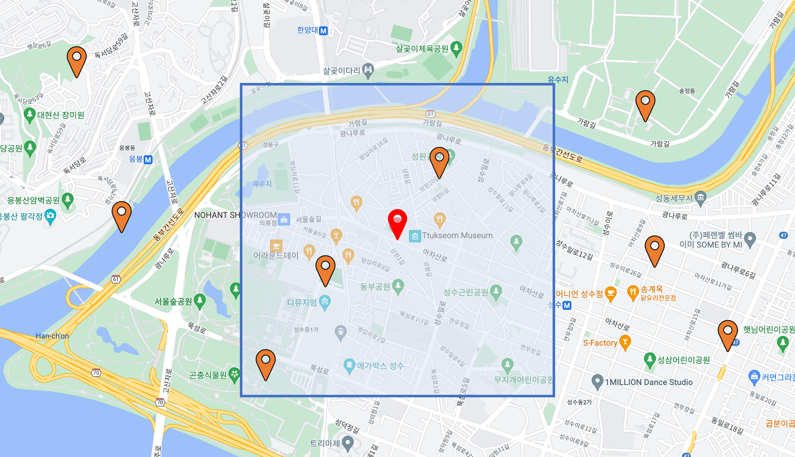
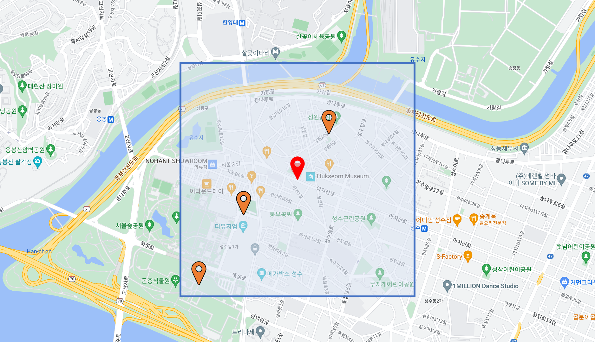
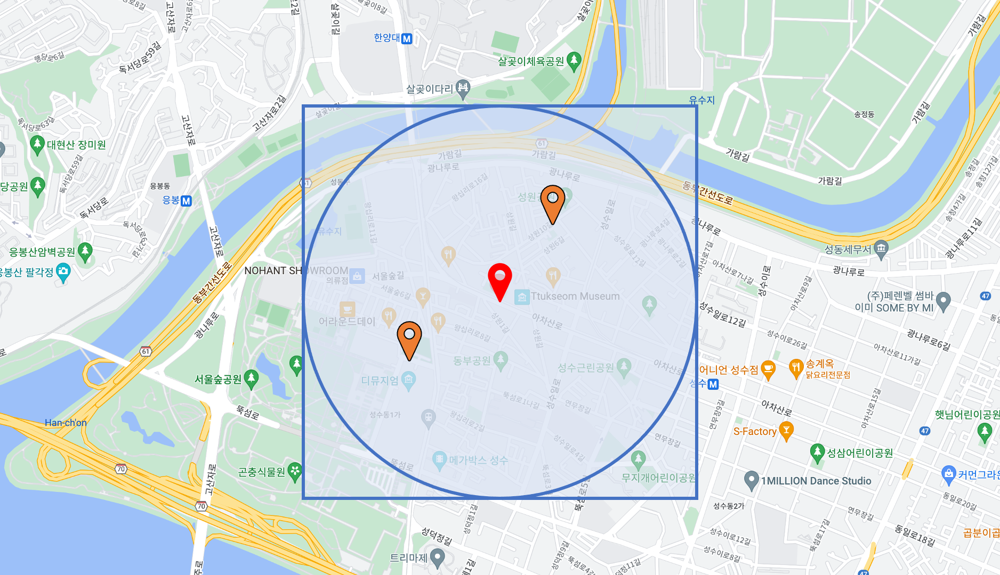

# 12. 확장 검색 (1)

MySQL 서버에서는 확장 검색 기능으로 아래 두 가지 기능을 제공한다

- 전문검색
- 공간검색

---

# 전문 검색

- 단어를 분리해서 형태소를 찾고, 그 형태소를 인덱싱하는 방법은 서구권 언어에 적합하다
- 한글의 경우, 형태소 분석 자체만 해도 엄청난 노력과 시간이 소요된다
- n-gram같이 문자를 특정 길이의 조각(Token)으로 인덱싱하는 방법이 한글 문서 검색에 이용 가치가 매우 높다

### 전문 검색 인덱스의 생성과 검색

- n-gram은 문장 자체에 대한 이해 없이 공백과 같은 띄어쓰기 단위로 단어를 분리하고, 그 단어를 단순히 주어진 길이로 쪼개서 인덱싱한다
    - n은 1~10 사이의 숫자 값이다
    - ngram_token_size 시스템 변수로 변경할 수 있다 (기본값 2)
- 테이블의 전문 검색 인덱스를 생성할 때 `WITH PARSE ngram` 옵션을 추가해야 한다
- 그렇지 않으면 기본 파서를 사용해서 전문 인덱스를 생성한다
    - 기본 파서 : 공백과 같은 구분자 기준으로 단어를 분리해서 인덱싱함
- ngarm 규칙
    - 검색어의 길이가 ngram_token_size에 따라 달라진다
        - 검색어 길이 < ngram_token_size : 검색 불가 (ngram_token_size보다 작은 토큰은 버린다)
        - 검색어 길이 ≥ ngram_token_size : 검색 가능
    - 검색어의 단어가 시작 부분이 아니라 중간이나 마지막 부분이어도 검색할 수 있다
        - “이 넓은 육지에 살고있다”
            - → “이” “넓은" “육지에" “살고있다”
                - “이” →
                - “넓은” → “넓은”
                - “육지에" → “육지" “지에”
                - “살고있다" → “살고" “고있" “있다”
- ngram 파서는 전문 검색 인덱스를 생성할 때만 사용되는 것이 아니라, 쿼리의 전문 검색에서도 사용된다
    
    ```sql
    SELECT COUNT(*)
    FROM tb_bi_gram
    WHERE MATCH(title, body) AGAINST ('살고있다' IN BOOLEAN MODE);
    ```
    
    - 이 같은 이유로 ngram_token_size 시스템 변수는 아래의 케이스 모두 동일한 값으로 유지돼야 한다
        - 테이블을 생성할 때
        - 데이터가 저장될 때
        - 쿼리가 실행될 때

### 전문 검색 쿼리 모드

- 전문 검색 쿼리에는 2가지 모드가 있다
    - 자연어 검색 모드
    - 불리언 검색 모드

**자연어 검색 모드**

- 검색어에 제시된 단어들을 많이 가지고 있는 순서대로 정렬해서 결과를 반환한다
    
    ```sql
    INSERT INTO tb_bi_gram VALUES
    															(NULL, 'Oracle', 'Oracle is database'),
    															(NULL, 'MySQL', 'MySQL is database'),
    															(NULL, 'Oracle article', 'Oracle is best commercial dbms'),
    															(NULL, 'MySQL article', 'MySQL is best open source dbms'),
    															(NULL, 'MySQL Manual', 'MySQL mannual is true guide for MySQL');
    
    SELECT id, title, body, MATCH(title, body) AGAINST ('MySQL manual is true guide' IN NATURAL LANGUAGE MODE) AS score
    FROM tb_bi_gram
    WHERE MATCH(title, body) AGAINST ('MySQL manual is true guide' IN NATURAL LANGUAGE MODE);
    
    +----+---------------+---------------------------------------+--------------------+
    | id | title         | body                                  | score              |
    +----+---------------+---------------------------------------+--------------------+
    |  5 | MySQL Manual  | MySQL mannual is true guide for MySQL |    3.5219566822052 |
    |  2 | MySQL         | MySQL is database                     | 0.3937349319458008 |
    |  4 | MySQL article | MySQL is best open source dbms        | 0.3937349319458008 |
    +----+---------------+---------------------------------------+--------------------+
    3 rows in set (0.00 sec)
    ```
    
- 이 문장을 검색어로 사용하면 MySQL 서버는
    1. 검색어를 구분자로 단어를 분리한다
    2. ngram 파서로 토큰을 생성한 후
    3. 각 토큰에 대해 일치하는 단어의 개수를 확인해서 일치율을 계산한다

**불리언 검색 모드**

- 쿼리에 사용되는 검색어의 존재 여부에 대해 논리적 연산이 가능하다
- 불리언 검색 규칙
    - + 표시를 가진 검색 단어는 전문 검색 인덱스 컬럼에 존재해야 하며,
    - 표시를 가진 검색 단어는 전문 검색 인덱스 컬럼에 포함되어있지 말아야 한다
    두 표시 모두 사용하지 않으면 검색어에 포함된 단어 중 아무거나 하나라도 있으면 일치하는 것으로 판단한다
    - 쌍따옴표로 묶이면 마치 하나의 단어인 것처럼 취급된다
        - 띄어쓰기까지 정확히 일치하는 것을 찾는 것이 아니라, 검색어를 구분자로 분리했을 때 각 단어가 순서대로 있는 레코드가 조회된다
    
    ```sql
    SELECT id, title, body, MATCH(title, body) AGAINST ('+MySQL -manual' IN BOOLEAN MODE) AS score
    FROM tb_bi_gram
    WHERE MATCH(title, body) AGAINST ('+MySQL -manual' IN BOOLEAN MODE);
    +----+---------------+--------------------------------+--------------------+
    | id | title         | body                           | score              |
    +----+---------------+--------------------------------+--------------------+
    |  2 | MySQL         | MySQL is database              | 0.3937349319458008 |
    |  4 | MySQL article | MySQL is best open source dbms | 0.3937349319458008 |
    +----+---------------+--------------------------------+--------------------+
    2 rows in set (0.00 sec)
    
    SELECT id, title, body, MATCH(title, body) AGAINST ('+"MySQL man"' IN BOOLEAN MODE) AS score
    FROM tb_bi_gram
    WHERE MATCH(title, body) AGAINST ('+"MySQL man"' IN BOOLEAN MODE);
    +----+--------------+---------------------------------------+--------------------+
    | id | title        | body                                  | score              |
    +----+--------------+---------------------------------------+--------------------+
    |  5 | MySQL Manual | MySQL mannual is true guide for MySQL | 0.5906023979187012 |
    +----+--------------+---------------------------------------+--------------------+
    1 row in set (0.00 sec)
    ```
    

**검색어 확장**

- 검색어 확장은 사용자가 쿼리에 사용한 검색어로 검색된 결과에서 공통으로 발견되는 단어들을 모아서 다시 한번 더 검색을 수행한다
    
    ```sql
    SELECT *
    FROM tb_bi_gram
    WHERE MATCH(title, bod), AGAINST('database' WITH QUERY EXPANSION);
    ```
    
- MySQL 서버의 검색어 확장 기능은 다음의 과정으로 실행된다
    1. 사용자의 검색어를 이용해 전문 검색을 실행한다
        
        ```sql
        SELECT *
        FROM tb_bi_gram
        WHERE MATCH(title, body) AGAINST('database');
        +----+--------+--------------------+
        | id | title  | body               |
        +----+--------+--------------------+
        |  1 | Oracle | Oracle is database |
        |  2 | MySQL  | MySQL is database  |
        +----+--------+--------------------+
        2 rows in set (0.00 sec)
        ```
        
    2. database라는 검색어와 연관있어 보이는 단어들을 뽑아서 다시 전문 검색 쿼리를 실행한다
        
        ```sql
        SELECT *
        FROM tb_bi_gram
        WHERE MATCH(title, body) AGAINST('database' WITH QUERY EXPANSION);
        +----+----------------+---------------------------------------+
        | id | title          | body                                  |
        +----+----------------+---------------------------------------+
        |  5 | MySQL Manual   | MySQL mannual is true guide for MySQL |
        |  2 | MySQL          | MySQL is database                     |
        |  4 | MySQL article  | MySQL is best open source dbms        |
        |  1 | Oracle         | Oracle is database                    |
        |  3 | Oracle article | Oracle is best commercial dbms        |
        +----+----------------+---------------------------------------+
        5 rows in set (0.00 sec)
        ```
        

---

# 공간 검색

### 용어 설명

- 공간 데이터 관리를 위해 알고있어야 할 몇 가지 용어
    - OGC
        - 위치 기반 데이터에 대한 표준을 수립하는 단체
    - OpenGIS
        - OGC에서 제정한 지리 정보 시스템
    - SRS
        - 좌표계
        - GCS와 PCS로 구분된다
            - GCS
                - 지구 구체상의 특정 위치나 공간을 표현하는 좌표계
                - 지리 좌표계라 명명
                - 목적 : 지구와 같은 구체 표면에서 특정 위치를 정의한다
            - PCS
                - 지구를 종이 지도와 같은 평면으로 투영시킨 좌표계
                - 미터같은 선형적인 단위로 표시된다
                - 투영 좌표계라 명명
                - 목적 : 위치 데이터를 2차원 평면인 종이에 어떻게 표현할지 정의한다
            - GCS vs PCS
                - GCS는 위치가 관심사 (WHERE)
                - PCS는 어떻게 표현할지가 관심사다 (HOW)
        - SRID
            - SRS-ID
            - 특정 SRS를 지칭하는 고유 번호
    - WKT vs WKB
        - OpenGIS에서 명시한 위치 좌표의 표현 방법
        - WKT
            - Well-Known Text 포맷
            - 텍스트 포맷
            - 사람 눈으로 쉽게 확인할 수 있다
        - WKB
            - Well-Known Binary 포맷
            - 이진 포맷
            - 컴퓨터에 저장할 수 있는 형태
    - MBR
        - 어떤 도형을 감싸는 최소의 사각 상자를 의미한다
        - MySQL 서버의 공간 인덱스가 도형의 포함 관계를 이용하기 때문에 중요하다

### SRS(Spatial Reference System)

- MySQL 서버에서 지원하는 SRS는 5,000개가 넘는다
- MySQL에서 지원하는 좌표계들
    
    ```sql
    select * from information_schema.ST_SPATIAL_REFERENCE_SYSTEMS;
    ```
    
- 일반적으로 GPS가 사용하는 좌표계 정보 : WGS_84
    - WGS_84의 지리 좌표계
        - SRID : 4326
        
        ```sql
        SELECT *
        FROM information_schema.ST_SPATIAL_REFERENCE_SYSTEMS
        WHERE SRS_ID=4326;
        
        /*
        	SRS_NAME	SRS_ID	ORGANIZATION	ORGANIZATION_COORDSYS_ID	DEFINITION	DESCRIPTION
        	WGS 84	4326	EPSG	4326	**GEOGCS**["WGS 84",DATUM["World Geodetic System 1984",SPHEROID["WGS 84",6378137,298.257223563,AUTHORITY["EPSG","7030"]],AUTHORITY["EPSG","6326"]],PRIMEM["Greenwich",0,AUTHORITY["EPSG","8901"]],UNIT["**degree**",0.017453292519943278,AUTHORITY["EPSG","9122"]],**AXIS["Lat",NORTH],AXIS["Lon",EAST]**,AUTHORITY["EPSG","4326"]]	NULL
        */
        -- **GEOGCS** *: 지리 좌표계를 의미한다
        -- **degree** : 입력되는 값의 단위는 각도다
        --* **AXIS["Lat",NORTH],AXIS["Lon",EAST]** *: 첫번째 AXIS는 X축, 두번째 AXIS Y축이다 (각각 위도와 경도가 된다)*
        ```
        
    - WGS_84의 투영 좌표계
        - SRID : 3856
        
        ```sql
        SELECT *
        FROM information_schema.ST_SPATIAL_REFERENCE_SYSTEMS
        WHERE SRS_ID=3857;
        
        /*
        	SRS_NAME	SRS_ID	ORGANIZATION	ORGANIZATION_COORDSYS_ID	DEFINITION	DESCRIPTION
        	WGS 84 / Pseudo-Mercator	3857	EPSG	3857	**PROJCS**["WGS 84 / Pseudo-Mercator",GEOGCS["WGS 84",DATUM["World Geodetic System 1984",SPHEROID["WGS 84",6378137,298.257223563,AUTHORITY["EPSG","7030"]],AUTHORITY["EPSG","6326"]],PRIMEM["Greenwich",0,AUTHORITY["EPSG","8901"]],UNIT["degree",0.017453292519943278,AUTHORITY["EPSG","9122"]],AXIS["Lat",NORTH],AXIS["Lon",EAST],AUTHORITY["EPSG","4326"]],PROJECTION["Popular Visualisation Pseudo Mercator",AUTHORITY["EPSG","1024"]],PARAMETER["Latitude of natural origin",0,AUTHORITY["EPSG","8801"]],PARAMETER["Longitude of natural origin",0,AUTHORITY["EPSG","8802"]],PARAMETER["False easting",0,AUTHORITY["EPSG","8806"]],PARAMETER["False northing",0,AUTHORITY["EPSG","8807"]],UNIT["**metre**",1,AUTHORITY["EPSG","9001"]],**AXIS["X",EAST],AXIS["Y",NORTH]**,AUTHORITY["EPSG","3857"]]	NULL
        */
        
        -- **PROJCS** : 투영 좌표계
        ****-- **metre** : 단위는 미터
        -- **AXIS["X",EAST],AXIS["Y",NORTH]** : 지리좌표계와 다르게 경도 위도 순으로 명시해야 한다
        ```
        
- SRID 0
    - 공간 데이터 정의 시에 별도로 SRID를 지정하지 않으면 SRID는 0으로 인식된다
    - SRID가 0인 공간 데이터는 단위를 가지지 않기 때문에 거리 계산 시 실제 지구 구면체 상의 거리 계산을 하는 것이 아니다
- SRID:0 vs SRID:3857 vs SRID:4326
    
    ```sql
    -- **SRID : 0**
    SELECT ST_Distance(ST_PointFromText('POINT(0 0)', 0), ST_PointFromText('POINT(1 1)', 0)) AS distance;
    1.4142135623730951
    
    -- **SRID : 3857**
    SELECT ST_Distance(ST_PointFromText('POINT(0 0)', 3857), ST_PointFromText('POINT(1 1)', 3857)) AS distance;
    1.4142135623730951
    
    -- **SRID : 4326**
    SELECT ST_Distance(ST_PointFromText('POINT(0 0)', 4326), ST_PointFromText('POINT(1 1)', 4326)) AS distance;
    156897.79947260793
    ```
    
    - SRID : 0의 결과는
        - 단순히 피타고라스의 정리에 의한 수식으로 계산된 거리 값이다
        - 인간의 실생활과 연관시킬 수 있는 수치가 아니다
    - SRID : 3857,4326의 결과는
        - 단위를 가지는 거리 값이 된다 (미터)
- 공간 데이터 자체가 SRS에 대한 정보를 가지게 되면 MySQL 서버에서 제공되는 공간 함수들을 이용해 필요한 값을 즉시 계산할 수 있다
- SRID가 0인 경우에는 MySQL 서버의 공간 함수들이 실제 데이터의 SRID를 알 수 없기 때문에 사용자가 기대하는 값을 계산하지 못할 수도 있다

### 투영 좌표계와 평면 좌표계

**투영좌표계와 평면좌표계의 데이터 저장**

- 평면 좌표계 : SRID가 0인 좌표계는 단위를 가지지 않으며 X축과 Y축의 값이 제한을 가지지 않기 때문에 ‘무한 평면 좌표계’ 라고도 불린다
    
    ```sql
    CREATE TABLE plain_coord(
    	id INT NOT NULL AUTO_INCREMENT,
    	localtion POINT SRID 0,
        PRIMARY KEY(id)
    );
    
    INSERT INTO plain_coord VALUES(1, ST_PointFromText('POINT(0 0)'));
    INSERT INTO plain_coord VALUES(2, ST_PointFromText('POINT(5 5)', 0));
    -- SRID가 0이 아닌 다른 좌표계를 참조하는 공간 데이터를 저장하려고 하면 'SRID가 일치하지 않는다'는 에러가 발생한다
    ```
    
- 투영 좌표계 : 지구 구체 전체 또는 일부를 평면으로 투영해서 표현한 좌표계
    
    ```sql
    CREATE TABLE projection_coord(
    	id INT NOT NULL AUTO_INCREMENT,
        location POINT SRID 3857,
        PRIMARY KEY(id)
    );
    
    INSERT INTO projection_coord VALUES(1, ST_PointFromText('POINT(14133791.066622 4509381.876958)', 3857));
    INSERT INTO projection_coord VALUES(2, ST_PointFromText('POINT(14133793.435554 4494917.464846)', 3857));
    ```
    
- 테이블을 생성할 때 SRID를 명시적으로 정의하지 않으면 해당 컬럼은 모든 SRID를 저장할 수 있다
    - 하지만 하나의 컬럼에 저장된 데이터의 SRID가 제각각이라며 MySQL 서버는 인덱스를 이용해 빠른 검색을 수행할 수 없게 된다
- 평면 좌표계와 투영 좌표계에서 거리 계산은 피타고라스 정리 수식에 의해 좌표 간의 거리가 계산된다

**투영좌표계와 평면좌표계의 표현**

- WKB 표현
    
    ```sql
    **-- 평면 좌표계**
    select id, location, ST_AsWKB(location)
    FROM plain_coord;
    
    +----+------------------------------------------------------+----------------------------------------------+
    | id | location                                             | ST_AsWKB(location)                           |
    +----+------------------------------------------------------+----------------------------------------------+
    |  1 | 0x00000000010100000000000000000000000000000000000000 | 0x010100000000000000000000000000000000000000 |
    |  2 | 0x00000000010100000000000000000014400000000000001440 | 0x010100000000000000000014400000000000001440 |
    +----+------------------------------------------------------+----------------------------------------------+
    2 rows in set (0.00 sec)
    
    **-- 투영 좌표계**
    select id, location, ST_AsWKB(location)
    FROM projection_coord;
    +----+------------------------------------------------------+----------------------------------------------+
    | id | location                                             | ST_AsWKB(location)                           |
    +----+------------------------------------------------------+----------------------------------------------+
    |  1 | 0x110F0000010100000076C421E243F56A4172142078B1335141 | 0x010100000076C421E243F56A4172142078B1335141 |
    |  2 | 0x110F00000101000000F10EF02D44F56A417009C05D91255141 | 0x0101000000F10EF02D44F56A417009C05D91255141 |
    +----+------------------------------------------------------+----------------------------------------------+
    2 rows in set (0.00 sec)
    ```
    
- WKT 표현
    
    ```sql
    **-- 평면 좌표계**
    select id,
    			ST_AsText(location) AS location_wkt,
    			ST_X(location) AS location_x,
    			ST_Y(location) AS location_y
    FROM plain_coord;
    
    +----+--------------+------------+------------+
    | id | location_wkt | location_x | location_y |
    +----+--------------+------------+------------+
    |  1 | POINT(0 0)   |          0 |          0 |
    |  2 | POINT(5 5)   |          5 |          5 |
    +----+--------------+------------+------------+
    2 rows in set (0.00 sec)
    
    **-- 투영 좌표계**
    select id,
    			ST_AsText(location) AS location_wkt,
    			ST_X(location) AS location_x,
    			ST_Y(location) AS location_y
    FROM projection_coord;
    
    +----+---------------------------------------+-----------------+----------------+
    | id | location_wkt                          | location_x      | location_y     |
    +----+---------------------------------------+-----------------+----------------+
    |  1 | POINT(14133791.066622 4509381.876958) | 14133791.066622 | 4509381.876958 |
    |  2 | POINT(14133793.435554 4494917.464846) | 14133793.435554 | 4494917.464846 |
    +----+---------------------------------------+-----------------+----------------+
    2 rows in set (0.00 sec)
    ```
    
- MySQL 서버의 내부 이진 포맷이나 WKB 포맷으로 출력된 데이터는 눈으로 식별하기가 쉽지 않다
- 그래서 ST_AsText() 함수를 이용해 이진 데이터를 WKT 포맷으로 변환했다

### 지리 좌표계

- 공간 데이터를 검색하는 일반적인 형태는 특정 위치를 기준으로 반경 몇 km 이내의 데이터를 검색하는 작업이다
- ST_Distance_Shpere()
    - 지리 좌표계에서 두 점의 거리는 ST_Distance_Sphere() 함수를 이용한다
    - 하지만, MySQL 서버에서는 아직 인덱스를 이용한 반경 검색 기능을 제공하지 않는다
    - ST_Distance_Sphere() 함수의 결과를 상수와 비교하는 형태는 인덱스를 사용할수 없는 형태다
    
    ```sql
    CREATE TABLE sphere_coord(
    	id INT NOT NULL AUTO_INCREMENT,
        name VARCHAR(20),
        location POINT NOT NULL SRID 4326,
        PRIMARY KEY(id),
        SPATIAL INDEX sx_location(location)
    );
    
    INSERT INTO sphere_coord VALUES
    		(NULL, '서울숲', ST_PointFromText('POINT(37.544738 127.039074)', 4326)),
    		(NULL, '한양대학교', ST_PointFromText('POINT(37.555363 127.044521)', 4326)),
    		(NULL, '덕수궁', ST_PointFromText('POINT(37.565922 126.975164)', 4326)),
    		(NULL, '남산', ST_PointFromText('POINT(37.548930 126.993945)', 4326));
    ```
    
    ```sql
    SELECT id, name, ST_AsText(location) AS location, ROUND(ST_Distance_Sphere(location, ST_PointFromText('POINT(37.547027 127.047337)', 4326))) AS distance_meters
    FROM sphere_coord
    WHERE ST_Distance_Sphere(location, ST_PointFromText('POINT(37.547027 127.047337)', 4326))<1000;
    
    **-- 쿼리 결과**
    +----+-----------------+-----------------------------+-----------------+
    | id | name            | location                    | distance_meters |
    +----+-----------------+-----------------------------+-----------------+
    |  1 | 서울숲          | POINT(37.544738 127.039074) |             772 |
    |  2 | 한양대학교      | POINT(37.555363 127.044521) |             960 |
    +----+-----------------+-----------------------------+-----------------+
    2 rows in set (0.00 sec)
    
    **-- 실행 계획**
    +----+-------------+--------------+------------+------+---------------+------+---------+------+------+----------+-------------+
    | id | select_type | table        | partitions | type | possible_keys | key  | key_len | ref  | rows | filtered | Extra       |
    +----+-------------+--------------+------------+------+---------------+------+---------+------+------+----------+-------------+
    |  1 | SIMPLE      | sphere_coord | NULL       | ALL  | NULL          | NULL | NULL    | NULL |    4 |   100.00 | Using where |
    +----+-------------+--------------+------------+------+---------------+------+---------+------+------+----------+-------------+
    1 row in set, 1 warning (0.00 sec)
    -- 풀 테이블 스캔을 이용했다
    ```
    
- MBR을 이용한 ST_Within()
    - 어떻게 구하는가?
        1. 1km 반경의 원을 감싸는 MBR 객체를 찾는다
            
            
            
        2. 그 MBR에 해당하는 로우들을 필터링한다

            
            
        3. 2에서 걸러진 로우들 한해서 다시한번 거리계산 조건을 이용한다

            
            
    - 예제
        - 특정 반경의 원을 감싸는 MBR 객체 반환하는 함수를 작성한다
            
            ```sql
            
            ```
            
        - MBR에 해당하는 로우들을 조회한다
            
            ```sql
            SELECT id, name
            FROM sphere_coord
            WHERE ST_Within(location, getDistanceMBR(ST_PointFromText('POINT(37.547027, 127.047337)', 4326), 1));
            ```
            
        - 거리계산 조건을 이용해서 특정 반경에 해당하지 않는 로우들을 제거한다
            
            ```sql
            SELECT id, name
            FROM sphere_coord
            WHERE ST_Within(location, getDistanceMBR(ST_PointFromText('POINT(37.547027, 127.047337)', 4326), 1))
            			**AND ST_Distance_Sphere(location, ST_PointFromText('POINT(37.547027 127.047337)', 4326)) <= 1000**;
            ```
            
- 지리 좌표계 주의사항
    - MySQL 서버의 GIS 기능은 도입된지는 오래됐지만 지리좌표계나 SRS 관리 기능이 도입된 것은 MySQL 8.0이 처음이다
    - 그래서 MySQL 서버를 이용해 지리 좌표계를 활용하고자 한다면 기능의 정확성이나 성능에 대해 조금은 주의가 필요하다
    - 정확성 주의사항
        - 지리 좌표계에서 ST_Contains()함수가 정확하지 않은 결과를 반환하기도 한다
        (MySQL 버그 사이트에 이미 버그로 등록돼있다)
        - 검색된 소수의 결과를 다시 ST_Distance_Sphere() 함수로 걸러내어 결과 데이터의 정확도를 높인다
    - 성능 주의사항
        - 지리 좌표계 데이터의 경우 일반적으로 SRID 4326 좌표계를 많이 사용하는데,
        ST_Contains() 함수 등으로 포함 관계를 비교하는 경우 투영좌표계보다 느린 성능을 보인다
        - 지리 좌표계를 썼을 때 SRID 4326로 설정된 POINT 객체와 POLYCON 객체의 포함 관계를 비교하는 ST_Contains() 함수를 100만번 실행했을 때 SRID 3857인 투영좌표계보다 3배 정도의 차이를 보였다