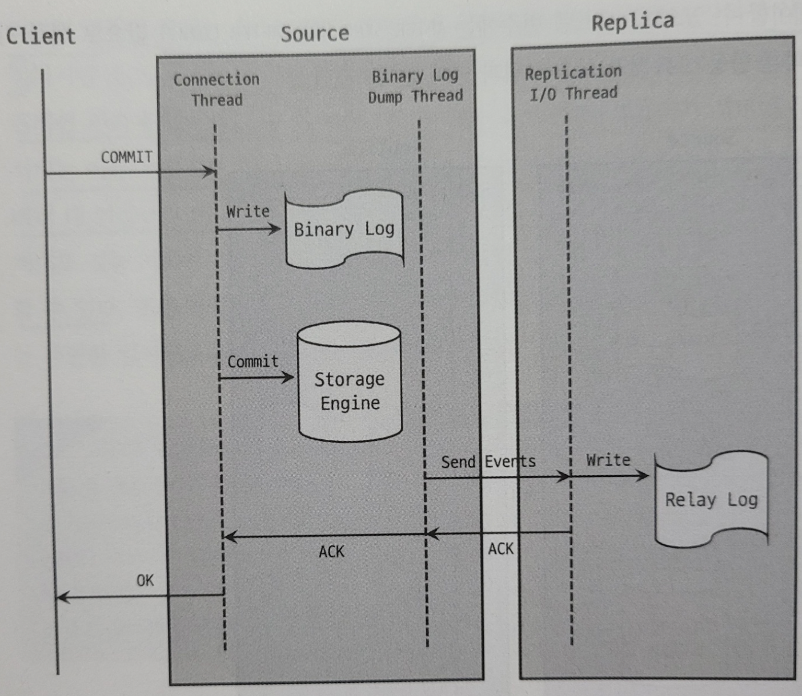
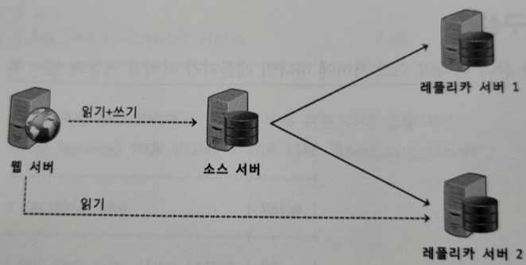

# 16. 복제 - md파일용

# 개요

---

**복제**

- 복제란 한 서버에서 다른 서버로 데이터가 동기화되는 것이다
- ‘소스 서버’는 원본 데이터를 가진 서버이고, ‘레플리카 서버’는 복제된 데이터를 가지는 서버이다
- 레플리카 서버에서는 변경내역을 소스 서버로부터 전달받아서 자신이 가지고 있는 데이터에 반영한다
→ 소스 서버에 저장된 데이터와 동기화된다

**레플리카 서버를 구축하는 목적**

- 스케일 아웃
    - DB 서버로 유입되는 트래픽도 자연히 증가해 DB 서버의 부하가 높아진다
    - 서버의 사양을 업그레이드한다 하더라도 한 대에서 처리할 수 있는 양에는 한계가 있다
    - 스케일 아웃은 스케일 업 방식보다 갑자기 늘어나는 트래픽을 대응하는 데 훨씬 더 유연하다
- 데이터 백업
    - DB 서버에 저장된 데이터들을 주기적으로 백업하는 것이 필수적이다
    - 백업이 실행되는 경우 백업 프로그램과 DBMS가 서버의 자원을 공유해서 사용하기 때문에 백업으로 인해 DBMS에서 실행중인 쿼리들이 영향을 받을 수 있다
        - 심각한 경우에는 쿼리의 처리 속도가 느려져 서비스에 문제가 발생할 수 있다
    - 이 같은 문제를 방지하기 위해 주로 복제를 사용해 레플리카 서버를 구축하고 데이터 백업은 레플리카 서버에서 실행한다
- 데이터 분석
    - 분석용 쿼리는 대량의 데이터를 조회하는 경우가 많고, 또 집계 연산을 하는 등 쿼리 자체가 굉장히 복잡하고 무거운 경우가 대부분이다
    - 복제를 사용해 분석용 쿼리만 전용으로 실행될 수 있는 환경을 만드는 것이 좋다
- 데이터의 지리적 분산
    - DB 서버와 어플리케이션 서버가 서로 떨어져있는 경우 두 서버 간의 통신 시간은 떨어진 거리만큼 비례해서 늘어난다
    - 복제를 사용해 어플리케이션 서버가 위치한 곳에 기존 DB 서버에 대한 레플리카 서버를 새로 구축해 사용함으로써 응답 속도를 개선할 수 있다

# 복제 아키텍처

---

- MySQL 서버에서 발생하는 모든 변경 사항은 **바이너리 로그**에 순서대로 기록된다
- MySQL 복제는 이 **바이너리 로그를 기반**으로 구현됐다
- 소스 서버에서 생성된 바이너리 로그가 레플리카 서버로 전송되면,
레플리카 서버에서는 해당 내용을 로컬 디스크에 저장하여(릴레이 로그) 자신이 가진 데이터에 반영함으로써
소스 서버와 레플리카 서버간에 데이터 동기화가 이뤄진다

**복제 동기화 과정과 스레드**

- MySQL의 복제는 세 개의 스레드에 의해 작동한다
    
    
    
- 바이너리 로그 덤프 스레드
    - 레플리카 서버는 데이터 동기화를 위해 소스 서버에 접속해 **바이너리 로그 정보를 요청**한다
    - 소스 서버에서는 레플리카 서버가 연결될 때, 내부적으로 ‘바이너리 로그 덤프 스레드’를 생성해서 바이너리 로그의 내용을 레플리카 서버로 전송한다
    - 레플리카 서버로 보낼 각 이벤트를 읽을 때 일시적으로 바이너리 로그에 잠금을 수행하며, 이벤트를 읽고난 후에는 바로 잠금을 해제한다
- 레플리케이션 I/O 스레드
    - 복제가 시작되면 레플리카 서버는 ‘I/O 스레드’를 생성하고, 복제가 멈추면 ‘I/O스레드’는 종료된다
    - I/O 스레드는 바이너리 로그 덤프 스레드로부터 바이너리 로그 이벤트를 가져와 로컬 서버의 파일(릴레이 로그)로 저장한다
- 레플리케이션 SQL 스레드
    - 레플리케이션 SQL 스레드는 I/O 스레드에 의해 작성된 릴레이 로그 파일의 이벤트들을 읽고 실행한다
- ‘I/O 스레드’와 ‘SQL 스레드’는 **서로 독립적으로 동작**한다

**복제 관련 데이터**

- 복제가 시작되면 레플리카 서버는 총 세 가지 유형의 복제 관련 데이터를 생성하고 관리한다
- 릴레이 로그
    - 레플리케이션 I/O 스레드에 의해 작성되는 파일이다
    - 소스 서버의 바이너리 로그에서 읽어온 이벤트 정보가 저장된다
- 커넥션 메타데이터
    - 레플리케이션 I/O 스레드에서 소스 서버에 연결할 때 사용하는 DB 계정 정보 및 현재 읽고 있는 소스 서버의 바이너리 파일명과 파일 내 위치 값 등이 담겨있다
    - 시스템 변수인 `master_info_repository`를 통해 어떤 형태로 데이터를 관리할 지 설정할 수 있다
        - MySQL 8.0.2버전부터 기본값이 ‘TABLE’로 변경되었다 (’FILE’ 타입은 향후 버전에서 제거될 예정이다)
        - 기본적으로 “mysql.slave_master_info” 테이블에 저장된다
- 어플라이어 메타데이터
    - 어플라이어 : ‘레플리케이션 SQL 스레드’에서 릴레이 로그에 저장된 소스 서버의 이벤트들을 레플리카 서버에 **적용하는** 컴포넌트
    - 어플라이어 메타데이터는 최근 적용된 이벤트에 대해 해당 이벤트가 저장돼있는 릴레이 로그 파일명과 파일 내 위치 정보 등을 담고있다
    - 레플리케이션 SQL 스레드는 이 정보들을 바탕으로 레플리카 서버에 나머지 이벤트들을 적용한다
    - 커넥션 메타데이터와 마찬가지로 `relay_log_info_repository`시스템 변수를 통해 어떤 형태로 데이터를 관리할 지 설정할 수 있다
        - 기본값이 ‘TABLE’이기 때문에, 기본적으로 “mysql.slave_relay_log_info” 테이블에 저장된다

# 복제 타입

---

**MySQL의 복제 방식**

- 바이너리 로그 파일 위치기반 복제
- 글로벌 트랜잭션 id기반 복제

### 바이너리 로그 파일 위치기반 복제

- 레플리카 서버에서 소스 서버의 바이너리 로그 파일명과 파일 내에서의 위치로 개별 바이너리 로그 이벤트를 식별해서 복제가 진행되는 형태이다
- 레플리카 서버는 소스 서버의 어느 이벤트까지 로컬 디스크로 가져왔고 또 적용했는지에 대한 정보를 관리하는데,
이 정보를 소스 서버에 전달하면 그 이후의 바이너리 로그 이벤트들을 가져온다
    - 이러한 이벤트 하나하나를 소스 서버의 바이너리 로그 파일명과 파일 내에서의 위치값(offset)의 조합으로 식별한다
- 주의할 점
    - 복제의 구성원이 되는 모든 MySQL 서버가 고유한 ‘server_id’ 값을 갖도록 해야한다
    - 바이너리 로그에는 각 이벤트별로 이벤트가 최초로 발생한 MySQL 서버를 식별하기 위해 MySQL 서버의 **‘server_id’ 값을 함께 저장한다**
    - **기본 값은 1이다**
    - 레플리카 서버에 설정된 ‘server_id’와 바이너리 로그 파일에 기록된 이벤트의 server_id가 같으면,
    레플리카 서버에서는 해당 이벤트를 적용하지 않고 무시한다
    - 따라서, **복제에 참여한 MySQL 서버들이 모두 고유한 ‘server_id’값을 가지고 있어야 한다**

**과정**

- 설정 준비 → 복제 계정 준비 → 데이터 복사 → 복제 시작
1. 설정 준비
    - 소스 서버 설정
        - 기본적으로 MySQL 복제를 사용하려면 **소스 서버에서 반드시 바이너리 로그가 활성화**돼있어야 한다 (기본 : 활성화)
        
        ```yaml
        ## 소스 서버 설정
        [mysqld]
        server_id=1
        log_bin=/binary-log-dir-path/binary-log-name     ## 바이너리 로그 파일 위치나 파일명
        sync_binlog=1                                    ## 바이너리 로그 동기화 방식
        binlog_cache_size=5M                             ## 바이너리 로그 캐시 메모리 크기
        max_binlog_size=512M                             ## 바이너리 로그 파일 크기
        binlog_expire_logs_seconds=1209600               ## 바이너리 로그 파일 보관 주기
        ```
        
    - 레플리카 서버 설정
        - 각 MySQL 서버가 고유한 ‘server_id’ 값을 가져야 한다 (기본 : 1)
        - 레플리카 서버는 읽기 전용으로 사용되므로 **read_only** 설정도 함께 사용할 수 있다
        - 소스 서버의 장애로 레플리카 서버가 소스 서버로 승격될 수 있음을 고려한다면, `log_slave_updates` 시스템 변수도 명시한다
            - **기본적으로** 레플리카 서버는 복제에 의한 데이터 변경 사항은 자신의 바이너리 로그에 기록하지 않는다
            - `log_slave_updates` 시스템 변수를 설정하면 복제에 의한 데이터 변경 내용도 자신의 바이너리 로그에 기록하게 된다
        
        ```yaml
        ## 레플리카 서버 설정
        [mysqld]
        server_id=1
        relay_log=/relay-log-dir-path/relay-log-name     ## 릴레이 로그 파일 위치나 파일명
        relay_log_purge=ON                               ## 로그 파일 자동 삭제 기능
        read_only                                        ## 읽기 전용            
        log_slave_updates                                ## 레플리카 서버가 소스 서버로 승격될 수 있음            
        ```
        
2. 복제 계정 준비
    - 레플리카 서버가 사용할 계정을 복제용 계정이라고 한다
    - 복제에서 사용되는 계정의 비밀번호는 레플리카 서버의 커넥션 메타데이터에 평문으로 저장된다
    - 따라서, 보안상 복제에 사용되는 권한만 주어진 별도의 계정을 생성해 사용하는 것이 좋다
    - 이 계정은 반드시 “**REPLICATION SLAVE**” 권한을 가지고 있어야 한다
3. 데이터 복사
    - 소스 서버의 데이터를 레플리카 서버로 가져와서 적재해야 한다
    - MySQL 엔터프라이즈 백업이나 mysqldump 등과 같은 툴을 이용해 소스 서버에서 데이터를 내려받아 레플리카 서버로 복사하면 된다
    - mysqldump을 사용한다면..
        1. 데이터 덤프
            - 소스 서버의 로컬에서 mysqldump를 실행해 데이터를 덤프한다
                
                ```bash
                lunux> mysqldump -uroot -p **--single-transaction** **--master-data**=2 --oop --routine -- triggers --hex-blog --all-databases > source_data.sql
                ```
                
            - mysqldump를 사용해 소스 서버의 데이터를 덤프할 때, “--single-transaction”과 “--master-data” 두 옵션을 반드시 사용해야 한다
                - --single-transaction 옵션 : 데이터를 덤프할 때 하나의 트랜잭션을 사용해 진행되게 해서 mysqldump가 테이블이나 레코드에 잠금을 걸지 않고 InnoDB 테이블들에 대해 일관된 데이터를 덤프받을 수 있게 한다
                - --master-data 옵션 : 덤프 시작 시점의 소스 서버의 바이너리 로그 파일명과 위치 정보를 포함하는 복제 설정 구문이 덤프 파일 헤더에 기록될 수 있게 한다
        2. 데이터 적재
            - 데이터 덤프가 완료되면 해당 파일을 레플리카 서버로 옮겨 데이터 적재를 진행한다
            - 레플리카 서버에 접속한 후 아래 명령어를 실행한다
                
                ```bash
                SOURCE /tmp/mastser_data.sql
                ```
                
4. 복제 시작
    - 레플리카 서버에 데이터 적재가 완료된 시점에는 이미 소스 서버의 데이터의 시점보다 훨씬 지연된 상태이다
        
        
        
    - 복제를 설정하는 명령은 CHANGE REPLICATION SOURCE TO (또는 CHANGE MASTER TO) 명령으로, mysqldump로 백업받은 파일의 헤더부분에서 해당 명령어를 참조할 수 있다
        
        ```bash
        -- CHANGE REPLICATION SOURCE TO MASTER_LOG_FILE='binary-log.000002', MASTER_LOG_POS=2708;
        ```
        
    - 소스 서버의 MySQL 서버의 호스트명, 포트, 복제용 사용자 계정, 비밀번호 등을 추가하여 복제 설정 명령을 준비한다
        
        ```bash
        -- MySQL 8.0.23 이상 버전
        CHANGE REPLICATION SOURCE TO
        		SOURCE_HOST='(소스 서버의 호스트명)',
        		SOURCE_PORT=포트,
        		SOURCE_USER='복제용 계정',
        		SOURCE_PASSWORD='복제용 계정 비밀번호',
        		**SOURCE_LOG_FILE**='binary-log.000002',
        		**SOURCE_LOG_POS**=2708,
        		GET_SOURCE_PUBLIC_KEY=1;
        ```
        
    - ‘SHOW REPLICA STATUS’ 명령을 실행해 보면 복제 관련 정보가 레플리카 서버 MySQL에 등록돼있다
    - 복제 관련 정보가 **등록만 된 것이지**, 동기화가 시작된 것은 아니다
        - Replica_IO_Running, Replica_SQL_Running이 **No**로 되어있다
    - ‘START REPLICA’ 명령
        - 데이터 변경사항들을 소스 서버로부터 가져와 적용하게 된다
- 트랜잭션 건너뛰기
    - 종종 레플리카 서버에서 소스 서버로부터 넘어온 트랜잭션이 제대로 실행되지 못하고 에러가 발생해 복제가 멈추는 현상이 발생한다
    - 심각한 문제인 경우 레플리카 서버의 데이터를 모두 버리고 처음부터 다시 레플리카 서버를 구축한 뒤 복제를 다시 구성해야 할 수도 있다
    - 하지만 경우에 따라 레플리카 서버에서 문제되는 소스 서버의 트랜잭션을 무시하고 넘어가도록 처리해도 괜찮을 때가 있다
    - 이는 `sql_slave_skip_counter` 시스템 변수로 설정할 수 있다
        - `sql_slave_skip_counter`가 1이면, 로그 이벤트 1개를 무시하는 것이 아니라 현재 이벤트를 포함한 **이벤트 그룹을 무시하는 것**이다
        - 하나의 트랜잭션에 여러 개의 DML 쿼리들이 포함되는 경우가 존재한다면,
        에러가 발생한 쿼리 외에 다른 쿼리들이 예상치 못하게 함께 무시될 수 있으니 주의해서 사용해야 한다

### 글로벌 트랜잭션 아이디 기반 복제

- 로그 파일 위치기반 복제 방식의 문제점
    - 로그 파일 위치기반 복제 방식은 각각의 이벤트들이 바이너리 로그 파일명과 파일 내 위치 값의 조합으로 **식별**된다
        - 문제는, 이 식별이 **소스 서버에서만 유효하다**는 것이다
        - 동일한 이벤트가 레플리카 서버에서 동일한 파일명 + 동일한 위치에 저장된다는 보장이 없다
        - 한마디로 복제에 투입된 서버들마다 동일한 이벤트에 대해 서로 다른 값을 갖게 될 수 있다
    - 복제를 구성하는 서버들이 서로 호환되지 않는 정보를 이용해 복제를 진행함으로써 복제의 토폴로지를 변경하는 작업이 때로 거의 불가능할 때가 많다
        - 토폴로지 변경이 어렵다는 것은 → 그만큼 복제를 이용한 장애 복구가 어렵다는 것
    - 문제점 보기
        
        **[초기 상황]**
        
        
        
        - B 서버 : SELECT 쿼리 분산용
        - C 서버 : 배치나 통계용 (소스서버의 복제의 동기화가 지연된 상태이다)
        
        **[장애 발생]**
        
        
        
        - 소스 서버 A가 장애가 발생하면서 서버가 비정상적으로 종료됐다
        - B 서버로 새로운 소스 서버로 승격되면서 클라이언트의 쿼리 요청이 B 서버로 들어오기 시작한다
        - 하지만, B 서버는 SELECT 쿼리 부하 분산용이기 때문에 과부하 상태가 된다
        - 하지만 C 서버는 동기화가 되지 않은 상태라 서비스에서 SELECT 용도로 사용할 수가 없다
        - A 서버가 종료돼버렸으므로 복제를 최종 시점까지 동기화할 방법이 없다
- 글로벌 트랜잭션 id 기반 복제 방식은 로그 파일 위치기반 복제 방식의 문제점을 해결한다
- 소스 서버에서 발생한 각 이벤트들이 복제에 참여한 모든 레플리카 서버들에서 **동일한 고유 식별값**을 갖게 한다
    - ⇒ Global Transaction Identifier. GTID
- **GTID**의 필요성
    
    **[초기 상황]**
    
    
    
    **[장애 발생]**
    
    
    
    - 소스 서버 A에 장애가 발생하면 B 서버를 C 서버의 소스 서버가 되도록 C 서버에서 아래 명령을 실행한다
        
        ```bash
        CHANGE REPLICATION SOURCE TO SOURCE_HOST='B', SOURCE_PORT=3306;
        ```
        
    - 서버의 바이너리 로그 파일명이 무엇인지, 바이너리 로그 파일에서 어느 위치부터 이벤트를 가져와야 하는지 입력할 필요가 없다
    - GTID가 “af99Sd80-939e-lleb-bb37-ba122a9a8ae3:98”이었던 트랜잭션은 B,C 서버에서도 “af99Sd80-939e-lleb-bb37-ba122a9a8ae3:98”이다
    - C 서버는 현재 B 서버로 복제를 다시 연결할 때도 B 서버에서 동일한 GTID 이후의 바이너리 로그 이벤트를 가져와서 동기화하면 된다
    - C 서버는 새로운 소스 서버인 B동기화할 수 있도록 준비되면 이제 클라이언트의 쿼리 요청을 B 서버와 C서버로 나눠서 실행할 수 있게 하면 된다

**글로벌 트랜잭션 아이디**

- GTID는 서버에서 커밋된 각 트랜잭션과 연결된 고유 식별자이다
- 해당 트랜잭션이 발생한 서버에서 고유할 뿐만 아니라, 그 서버가 속한 복제 토폴로지 내 모든 서버에서 고유하다
- GTID는 바이너리 로그에 기록된 **커밋된 트랜잭션에 한해서만 할당**된다
    - 데이터 읽기만 수행하는 SELECT 쿼리나, sql_log_bin 설정이 비활성화돼있는 상태에서 발생한 트랜잭션은 바이너리에 기록되지 않기 때문에, GTID가 할당되지 않는다
- GTID는 ‘소스 아이디’와 ‘트랜잭션 아이디’ 값의 조합으로 생성된다
    - GTID = [source_id]:[transaction_id]
    - 소스 아이디 : MySQL 서버의 `server_uuid` 시스템 변수 값
        - `server_uuid`는 MySQL 서버가 시작되면서 자동으로 부여된다
        - MySQL 서버를 시작할 때 데이터 디렉터리에 auto.cnf라는 파일이 생성되는데 그 안에 server_uuid 값이 저장돼있다
            - auto.cnf 파일은 삭제되더라도 자동으로 다시 생성된다
            - 하지만 auto.cnf 파일에 저장돼있는 UUID값은 복제가 설정된 소스 서버와 레플리카 서버의 GTID값에 사용되고 있는 값이므로 삭제되지 않도록 주의한다
    - 트랜잭션 아이디 : 서버에서 커밋된 트랜잭션 순서대로 부여되는 값 (1부터 1씩 단조 증가한다)
- 현재 사용되는 GTID 확인하기
    - mysql 데이터베이스 내의 “gtid_executed” 테이블을 조회하거나 `gtid_executed` 시스템 변수를 통해 확인할 수 있다
    - GTID는 각각의 값이 하나씩 개별로 보여지거나 연속된 값들인 경우 범위로 보여질 수 있으며 이 밖에도 다양한 형태가 있다
        
        ```bash
        af99Sd80-939e-lleb-bb37-ba122a9a8ae3:1-5:18:99-103
        ```
        
    - 하나 이상의 GTID 값으로 구성돼있는 것을 **‘GTID 셋’**이라 한다
    - GTID 셋에는 서로 다른 UUID를 가지는 GTID 값들도 포함될 수 있다
        
        ```bash
        af99Sd80-939e-lleb-bb37-ba122a9a8ae3:1-5:18:99-103,llebbb37-Sd80-9eae-a9a8-ba12293lleb3:1-3
        ```
        

**글로벌 트랜잭션 아이디 기반의 복제 구축**

- MySQL 서버에서 GTID를 활성화하는 것과 GTID 기반 복제를 사용하는 것은 **별개**이다
- GTID 활성화는 GTID 복제를 위한 하나의 조건일 뿐,
활성화돼있다 하더라도 복제는 바이너리 로그 파일 위치 기반의 복제를 사용할수도 있다
1. 설정 준비
    - GTID 기반의 복제를 사용하려면 복제에 참여하는 모든 MySQL 서버들이 GTID가 활성화돼있어야 한다
    - 각 서버의 `server_id` 및 `server_uuid`가 복제 그룹 내에서 고유해야 한다
    
        ```bash
        ## 소스 서버 설정
        [mysqld]
        gtid_mode=ON
        enforce_gtid_consistency=ON
        ****server_id=1111
        log_bin=/binary-log-dir-path/binary-log-name
        ```

        ```bash
        ## 레플리카 서버 설정
        [mysqld]
        gtid_mode=ON
        enforce_gtid_consistency=ON
        server_id=2222
        relay_log=/relay-log-dir-path/elay-log-name
        relay_log_purge=ON
        read_only
        log_slave_updates
        ```
    
    - super_read_only
        - CONNECTION_ADMIN 권한을 가진 계정은 MySQL 서버가 read_only 로 설정돼있다 하더라도 데이터를 변경하거나 스키마를 변경하는 쿼리를 실행할 수 있다
        - 만약, GTID를 사용하는 복제환경에서만 실수로 관리자 계정을 통해 DDL이나 DML을 실행하게 되면,
        레플리카 서버의 GTID에는 소스 서버로부터 넘어오는 GTID 셋과 더불어 레플리카 서버의 server_uuid로 구성된 새로운 GTID 셋이 추가된다
        - 이렇게 되면 소스 서버와 레플리카 서버간의 GTID 셋이 달라져 나중에는 소스 서버와 레플리카 서버의 역할을 스위치할 때 문제가 될 수 있다
        - 따라서 레플리카 서버에 read_only 뿐 아니라 super_read_only 옵션도 함께 설정하는 것이 좋다
        - super_read_only가 설정된 서버에서는 CONNECTION_ADMIN 권한을 지닌 사용자가 DDL이나 DML 쿼리를 실행하더라도 에러를 발생시킨다
2. 복제 계정 준비
3. 데이터 복사
    - 소스 서버에서 아래 mysqldump 명령을 실행한다
        
        ```bash
        mysqldump -uroot -p --single-transaction --master-data=2 --set-gtid-purged=ON --opt --routines --triggers --hex-blob --all-databases > source_data.sql
        ```
        
    - 데이터를 덤프받아 레플리카 서버를 구축하려는 경우,
    덤프가 시작된 시점의 소스 서버 GTID 값을 레플리카 서버에서 다음 2개의 시스템 변수에 설정해야 복제를 시작할 수 있다
        - `gtid_executed` : MySQL 서버에서 실행되어 **바이너리 로그 파일에 기록된** 모든 트랜잭션들의 GTID 셋
        - `gtid_purged` : 현재 MySQL 서버의 **바이너리 로그 파일에 존재하지 않는** 모든 트랜잭션들의 GTID 셋
    - 레플리카 서버는 `gtid_executed` 값을 기반으로 다음 복제 이벤트를 소스 서버로부터 가져온다
        - `gtid_executed` 값은 읽기 전용이므로 사용자가 변경할 수 없다
        - `gtid_purged` 변수 값만 수정할 수 있다
        - 따라서, 소스 서버에서 데이터 덤프가 시작된 시점의 소스 서버의 GTID 값을 레플리카 서버의 `gtid_purged` 시스템 변수에 지정해 `gtid_executed` 시스템 변수에도 그 값이 설정되게 해야 한다
    - —set-gtid-purged 옵션
        - —set-gtid-purged 옵션은 덤프가 시작된 시점의 GTID가 덤프 파일에 기록되며 `sql_log_bin` 시스템 변수를 ‘비활성화’하는 구문도 함께 기록된다
            - 이는 덤프 파일을 실행할 때 적용되는 트랜잭션들이 레플리카 서버에서 새로운 GTID를 발급받는 것을 방지한다
            - 즉, 레플리카 서버에서 덤프 파일을 적재하는 작업이 바이너리 로그에 기록되지 않으므로 GTID가 생성되지 않는 것이다
        - 옵션값들
            - `AUTO`
                - 기본값
                - 덤프를 받는 서버에서 GTID가 활성화돼있으면 덤프를 시작하는 시점의 GTID값과 sql_log_bin 비활성화 구문을 덤프 파일에 **기록**한다
            - `OFF`
                - 덤프 시작 시점의 GTID 값과 sql_log_bin 비활성화 구문을 덤프 파일에 **기록하지 않는다**
                
                <aside>
                💡 만약, 레플리카 서버 구축을 위해서가 아니라 단순히 데이터 마이그레이션을 위해 mysqldump를 사용하는 경우라면,
                mysqldump 실행 시 OFF 옵션을 명시해야 한다
                그렇지 않으면 데이터를 마이그레이션할 DB 서버에서 덤프 파일 적용 시 sql_log_bin 시스템 변수를 비활성화하는 구문으로 인해 적재한 데이터가 바이너리 로그에 기록되지 않아서,
                해당 DB 서버와 연결된 레플리카 서버에 데이터가 복제되지 않을 수 있기 때문이다
                
                </aside>
                
            - `ON`
                - 덤프 시작 시점의 GTID 값과 sql_log_bin 비활성화 구문을 덤프 파일에 **기록한다**
            - `CONNECTED`
                - MySQL 8.0.17 이상 버전부터 사용할 수 있다
                - ON 값으로 설정됐을 때와 동일하게 동작한다
                - **다만**, 덤프 시작 시점의 GTID값이 주석으로 처리되어 기록된다 (sql_log_bin 비활성화 구문은 주석으로 처리되지 않는다)
    - mysqldump로 백업받은 데이터 파일을 레플리카 서버로 옮겨 적재하면,
    레플리카 서버에서 gtid_executed와 gtid_purged 시스템 변수 값이 다음과 같이 자동으로 설정된다
4. 복제 시작
    - 소스 서버와 레플리카 서버 간의 복제를 시작하는 명령으로,
    소스 서버에서 백업 시점부터 지금까지 변경된 데이터와 이후 변경될 데이터를 실시간으로 가져와 적용한다
        
        ```bash
        -- MySQL 8.0.23 이상 버전
        CHANGE REPLICATION SOURCE TO
        		SOURCE_HOST='(소스 서버의 호스트명)',
        		SOURCE_PORT=포트,
        		SOURCE_USER='복제용 계정',
        		SOURCE_PASSWORD='복제용 계정 비밀번호',
        		**SOURCE_AUTO_POSITION=1,**
        		GET_SOURCE_PUBLIC_KEY=1;
        ```
        
        - 바이너리 로그 파일 위치기반 복제와 다른 점
            - SOURCE_LOG_FILE와 SOURCE_LOG_POS가 없다
            - **SOURCE_AUTO_POSITION**가 있다
            → 이 옵션으로 인해 레플리카 서버는 자신의 `gtid_executed` 값을 참조해서 해당 시점부터 소스 서버와 복제를 연결해서 데이터를 동기화한다
- 트랜잭션 건너뛰기
    - GTID를 사용하는 **복제 환경의 레플리카 서버에서는 더이상 `sql_slave_skip_counter` 시스템 변수를 사용할 수가 없다
        - GTID 기반 복제에서 레플리카 서버는 기본적으로 자신의 GTID 값과 소스 서버의 GTID 값을 비교해서 소스 서버의 변경 이벤트를 가져온다
        - 그렇기 때문에 레플리카 서버가 소스 서버의 GTID 값보다 더 적거나 더 많은 GTID 값을 가진 채로 복제를 계속 유지시킬 수는 없다
    - 트랜잭션을 무시하고 싶다면 레플리카 서버에서 **수동으로** 빈 트랜잭션을 생성해 GTID 값을 만들어야 한다
        
        ```bash
        mysql_Replica> SHOW REPLICATA STATUS
        *************************** 1. row ***************************
        :
        :
        		**Retrieved_Gtid_Set: 532dc861-dcf7-4861-9b82-01bc81b71969:3-7
        		Executed_GtidSet: 532dc861-dcf7-4861-9b82-01bc81b71969:1-6**
        :
        ```
        
        - Retrived_Gtid_Set : 레플리카 서버가 소스 서버로부터 이 GTID 셋을 가져왔다 “3-7
        - Executed_Gtid_Set : 레플리카 서버에서 실행된 GTID 셋이다 “1-6”
            - 가져온 GTID셋은 3-7인데 실행된 GTID셋은 왜 1-6일까?
                - 레플리카 서버에서 가져오지도 않은 1-2 셋을 이미 실행했다고 간주하기 때문이다
                - 소스 서버의 GTID 셋이 1-2번까지이던 시점에 소스 서버에서 백업을 받아서 레플리카 서버에 백업을 복구하면서 1-2번까지의 GTID가 적용됐고,
                3-6까지의 셋은 복제를 전달받았기 때문이다
        - 예제를 보면 7 트랜잭션을 레플리카 서버에서 수행하다가 문제가 생겼다
        - 이 트랜잭션을 무시하려면..
            1. 복제를 멈추고
            2. 빈 트랜잭션을 강제로 만들어서
            3. 바이너리 로그 스트림에 밀어넣어야 한다
            
            ```bash
            mySql_Replica> STOP REPLICA;
            mySql_Replica> SET gtid_next='532dc861-dcf7-4861-9b82-01bc81b71969:7';
            mySql_Replica> BEGIN; COMMIT;
            mySql_Replica> SET gtid_next='AUTOMATIC';
            mySql_Replica> START REPLICA;
            ```
            

# 복제 데이터 포맷

---

- 어떤 포맷으로 기록되는지에 따라 복제 처리되는 과정에도 영향을 준다
- 변경 이벤트들이 바이너리 로그에 **어떤 형태로 저장되는가**?
    - **Statement 방식** : 실행된 SQL 문을 바이너리 로그에 기록한다
    - **Row 방식** : 변경된 데이터 자체를 기록한다
    - **Mixed 방식** : Statement 방식과 Row방식의 혼합된 형태
- `binlog_format` 시스템 변수를 통해 포맷을 지정할 수 있다

### Statement 포맷

- 바이너리 로그가 처음 도입됐을 때부터 존재해왔던 포맷이다
- 변경 이벤트에 대해 이벤트를 발생시킨 SQL문을 바이너리 로그에 기록하는 방식이다
- 실행된 SQL문이 그대로 바이너리 로그에 저장돼있다
- 장점
    - 하나의 SQL이 여러 개의 데이터를 수정할 수 있기 때문에, 바이너리 로그 파일의 **용량이 작아진다**
        - 원격으로 바이너리 로그를 백업하거나 혹은 원격에 위치한 레플리카 서버와 복제할 때도 좀 더 빠르게 처리될 수 있다
- 단점
    - **비확정적 쿼리**가 실행된 경우 Statement 포맷에서는 복제 시 소스 서버와 레플리카 서버 간에 데이터가 달라질 수 있다
        - 비확정적 쿼리의 유형
            - DELETE/UPDATE 쿼리에서 ORDER BY 절 없이 LIMIT 사용
            - LOAD_FILE(), UUID(), UUID_SHORT(), USER(), FOUND_ROWS(), RAND(), VERSION() 같은 함수를 사용하는 쿼리
            - 동일한 파라미터 값을 입력하더라도 결과값이 달라질 수 있는 사용자 정의 함수나 스토어드 프로시저를 사용하는 쿼리
            - SELECT … FOR UPDATE 또는 SELECT … FOR SHARE 쿼리에서 NOWAIT이나 SKIP LOCKED 옵션 사용
    - Row 포맷으로 복제될 때보다 데이터에 락을 더 많이 건다
        - 데이터 검색 조건으로 주어진 컬럼에 대해 적절한 인덱스가 테이블에 존재하지 않아 풀 테이블 스캔을 유발하는 UPDATE 쿼리가 실행된 경우
        - 반면에, Row 포맷은 레플리카 서버에 변경된 데이터 자체가 넘어가므로
        소스 서버에서처럼 쿼리를 실행해 처리하는 형태가 아니기 때문에,
        동일한 데이터 변경일지라도 락을 더 적게 점유하고 처리 속도도 훨씬 빠르다
    - 제약 사항이 있다
        - 트랜잭션 **격리 수준**이 반드시 **“*REPEATABLE-READ*” 이상**이어야 한다
        - 그 이하의 방식에서는 하나의 트랜잭션 내에서도 각 쿼리가 실행되는 시점마다 데이터 스냅숏이 달라질 수 있는데,
        이로 인해 복제 시 소스 서버와 레플리카 서버의 데이터가 일치하지 않게 될 수 있다

### Row 포맷

- 바이너리 로그에 변경된 **값 자체가 기록**된다
- 장점
    - 복제 시 소스 서버와 레플리카 서버의 데이터를 **일관되게** 하는 가장 안전한 방식이다
        - 비확정적 함수를 사용했다 하더라도 레플리카 서버에서 똑같이 이 함수가 다시 실행되는 것이 아니라 함수의 결괏값을 전달받아 처리되므로 안전하게 복제가 가능하다
    - 레플리카 서버에서도 쿼리가 실행되는 것이 아니라 변경된 데이터가 바로 적용되므로 어떤 변경 이벤트건 더 적은 락을 점유하여 처리된다
    - Statement 기반 포맷과 다르게 모든 트랜잭션 격리 수준에서 사용이 가능하다
- 단점
    - 만약 MySQL 서버에서 실행된 쿼리가 굉장히 많은 데이터를 변경한 경우에는 변경된 데이터가 전부 기록되므로 **바이너리 로그 파일의 크기**가 단시간에 매우 커질 수 있다
    - 변경된 데이터 수가 적더라도 BLOB 형태의 큰 값이 새로 저장되거나 변경되는 경우에는 마찬가지로 파일 크기가 많이 커질 수 있다
- 단점의 극복?
    - Row 포맷을 사용할 때 바이너리 로그 파일의 용량을 줄일 수 있는 2가지 방법을 제공한다
        - 바이너리 로그 Row 이미지
            - Row 포맷은 바이너리 로그에는 각 변경 데이터마다 변경 전 레코드와 변경 후 레코드가 함께 저장된다
            - `binlog_row_image` 시스템 변수를 이용하면 각 변경 전후 레코드들에 대해 **테이블의 어떤 컬럼들을 기록할 것인지**를 결정할 수 있다
            - 즉, Row 포맷의 바이너리 로그 파일 용량을 최소화하기 위해 저장되는 변경 데이터의 컬럼 구성을 제어하는 것이다
                - **full**
                    - 변경 여부와 관계 없이 변경이 발생한 레코드의 모든 컬럼들의 값을 기록한다
                    - 기본값이다
                    - Insert의 경우, 변경 후의 모든 컬럼들이 기록된다
                    - Delete의 경우, 변경 전의 모든 컬럼들이 저장된다
                    - Update의 경우, 변경전과 변경 후의 모든 컬럼들이 저장된다
                - noblob
                    - full 옵션을 설정한 것과 동일하게 작동한다
                    - 다만, 레코드의 BLOB이나 TEXT 컬럼에 대해 변경이 발생하지 않은 경우 해당 컬럼들은 바이너리 로그 파일에 기록하지 않는다
                - minimal
                    - 변경 데이터에 대해 꼭 필요한 컬럼들의 값만 바이너리 로그에 기록한다
                    - Insert의 경우, 변경 후의 Insert에 명시됐던 모든 컬럼과 auto_increment 값이 기록된다
                    - Delete의 경우, 변경 전의 PKE만 기록된다
                    - Update의 경우, 변경 전 PKE와 변경 후의 UPDATE 시 명시됐던 모든 컬럼이 기록된다
                    - PKE : 테이블의 프라이머리 키 또는 프라이머리 키 역할을 하는 컬럼 조합
                        - 프라이머리 키가 있는 테이블의 경우, 프라이머리 키가 PKE가 되며
                        - 프라이머리 키가 없는 테이블 + NOT NULL한 유니크 키가 있는 테이블의 경우, 그 유니크 인덱스가 PKE가 되며
                        - 프라이머리 키가 없는 테이블 + NOT NULL한 유니크 키가 없는 테이블의 경우, 모든 컬럼의 조합이 PKE가 된다
        - 바이너리 로그 트랜잭션 압축
            - MySQL 8.0.20 버전에서 Row 포맷으로 기록되는 트랜잭션에 대해 트랜잭션에서 변경한 데이터를 압축해서 바이너리 로그에 기록할 수 있게 하는 기능이 도입됐다
                
                
                
                - 소스 서버의 트랜잭션 데이터가 압축되어 레플리카 서버로 복제된다
                - 바이너리 트랜잭션에서 변경한 데이터들을 zstd 알고리즘을 사용해 압축한 뒤 Transaction_payload_event라는 하나의 이벤트로 바이너리 로그에 기록한다
                - 레플리카 서버의 레플리케이션 I/O 스레드도 압축된 상태 그대로 릴레이 로그에 기록한다
            - 장점
                1. 소스 서버와 레플리카 서버 모두에서 디스크 저장 공간이 절약될 수 있다
                2. 네트워크 대역폭 사용량도 줄어든다
            - 시스템 변수 설정
                - `binlog_transaction_compression`
                    - 로그 트랜잭션 압축 기능이 활성화한다
                    - 1:ON, 0:OFF
                    - 기본값 : OFF
                - `binlog_transaction_compression_level_zstd`
                    - 압축 레벨
                    - 1~22까지 지정할 수 있다
                    - 기본값 : 3
                    - 압축 레벨이 높을수록 압축률이 증가해 디스크 공간이나 네트워크 대역폭을 더 절약할 수 있다
                    - 하지만, CPU나 메모리 사용률이 늘어나고 처리 시간이 증가할 수 있다
            - 세션 별로도 설정할 수 있다
                - 즉, 바이너리 로그에 압축된 트랜잭션 데이터와 압축되지 않은 트랜잭션 데이터가 혼합되어 존재할 수 있다
                - 그래도 문제 없이 처리된다
- MySQL 서버의 바이너리 로그 포맷이 Row 포맷으로 설정돼있다 하더라도, 아래와 같은 DDL은 전부 Statement포맷 형태로 바이너리 로그에 저장된다
    - 사용자 계정 생성
    - 권한 부여 및 회소
    - 테이블과 뷰, 트리거 생성
    - :

### Mixed 포맷

- MySQL 서버의 `binlog_format` 시스템 변수를 MIXED값으로 지정한다
- **기본적으로는 Statement 포맷**을 사용한다
- 그리고 실행된 쿼리와 스토리지 엔진 종류에 따라 **필요 시 자동으로 Row포맷을 사용**한다
    - 먄약, 실행된 쿼리가 Statement 포맷으로 기록되어 복제됐을 때 문제가 될 가능성이 있는 쿼리라면(ex 비확정적 쿼리) Row 포맷으로 변환되어 기록된다
- Mixed는 짱짱맨?
    - Mixed 포맷이 제일 좋은 방법이라고는 할 수 없다
    - MySQL 서버가 내부적으로 설정된 기준과 기술적인 측면을 고려해 자동으로 두 포맷을 번갈아 사용하는 것이다
    - 따라서 실제 사용자가 예상했던 것과는 다르게 처리될 수 있다

# 복제 동기화 방식

---

- 소스 서버와 레플리카 서버 간의 복제 동기화에 대해서 2가지 방식을 제공한다
    - 비동기 복제 (Asynchronous replication)
    - 반동기 복제 (Semi-synchronous replication)

### 비동기 복제

- 소스 서버가 자신과 복제 연결된 레플리카 서버에서 변경 이벤트가 정상적으로 전달되어 **적용됐는지를 확인하지 않는 방식**이다
    
    
    
- 단점
    - 비동기 복제는 소스 서버가 레플리카 서버의 **동기화 여부를 보장하지 않는다**
        - 소스 서버에서 커밋된 트랜잭션은 바이너리 로그에 기록되며, 레플리카 서버에서는 주기적으로 신규 트랜잭션에 대한 바이너리 로그를 소스 서버에 요청한다
        - 소스 서버는 레플리카 서버로 변경 이벤트가 잘 전달됐는지, 실제로 적용됐는지 알지 못하며 이에 대한 **어떠한 보장도 하지 않는다**
        - 소스 서버가 장애가 발생하면 소스 서버에서 최근까지 적용된 트랜잭션이 레플리카 서버로 전송되지 않을 수 있다 **(트랜잭션 누락 가능성)**
        - 만약 소스 서버장애로 인해 레플리카 서버를 새로운 소스 서버로 승격시키는 경우,
        사용자는 이 레플리카 서버가 소스 서버로부터 전달받지 못한 트랜잭션이 있는지 직접 확인하고 필요시 레플리카 서버에 수동으로 다시 적용해야 한다
- 장점
    - 트랜잭션 처리에 있어서 좀 빠른 성능을 보인다
    - 레플리카 서버에 문제가 생기더라도 소스 서버는 아무런 영향도 받지 않는다
        - 소스 서버에 레플리카 서버를 여러 대 연결한다 해도 (너무 많으면 있긴하지만) 소스 서버에서 큰 성능 저하가 없다

### 반동기 복제

- 레플리카 서버가 소스 서버로부터 전달받은 변경 데이터를 릴레이 로그에 기록후 응답을 보내면 그 때 트랜잭션을 완전히 커밋시키고 클라이언트에 결과를 반환한다
- 따라서 반동기 복제에서는 소스 서버에서 커밋되어 정상적으로 결과가 반환된 모든 트랜잭션들에 대해 적어도 하나의 레플리카 서버에는 **해당 트랜잭션들이 전송됐음을 보장**한다
    - 레플리카 서버에 **‘전송됐음’을 보장하는 것**이다
    - 복제된 트랜잭션이 레플리카 서버에 **‘적용됐음’을 보장하는것이 아니다**
    - 따라서 반동기. (일정 부분까지의 동기화만 보장)

**반동기 복제 설정 방법**

- 반동기 복제 기능은 플러그인 형태로 구현돼있다
    - 따라서, 먼저 관련 플러그인들을 설치해야 한다
        
        ```bash
        -- // 소스 서버
        mysql_Source> INSTALL PLUGIN rpl_semi_sync_master SONAME 'semisync_master.so';
        -- // 레플리카 서버
        mysql_Replica> INSTALL PLUGIN rpl_semi_sync_master SONAME 'semisync_slave.so';
        ```
        
- 반동기 복제와 관련된 시스템 변수들
    - `rpl_semi_sync_master_enabled` : 반동기 복제의 활성화 여부 (ON : 1, OFF : 0)
    - `rpl_semi_sync_slave_enabled` : 레플리카 서버에서 반동기 복제의 활성화 여부
    - `rpl_semi_sync_master_timeout`
        - 레플리카 서버의 응답이 올 때까지 **대기하는 시간**
        - 네트워크 비용
            - 반동기 복제에서는 트랜잭션을 처리하는 중에 레플리카 서버의 응답을 기다리므로 트랜잭션의 처리속도가 더 느릴 수 있다 (네트워크 왕복 시간만큼..?)
            - 네트워크로 통신하는 부분으로 인해 반동기 복제는 물리적으로 가깝게 위치한 레플리카 서버와의 복제에 더 적합하다고 할 수 있다
        - 무한정 기다릴 수는 없다..!
            - **타임아웃 시간**을 설정하여,
            소스 서버는 응답을 기다렸다가 만약 지정된 시간이 초과할 때까지 응답이 오지 않으면 **비동기 복제로 전환**된다
        - 기본값 : 10000(10초)
    - `rpl_semi_sync_master_wait_for_slave_count`
        - 소스 서버에서 반드시 **응답을 받아야 하는 레플리카 수**를 결정한다
        - 기본값 : 1
        - 응답을 받아야 하는 레플리카 수가 많을수록 소스 서버에서의 처리 성능은 저하될 수 있다
    - `rpl_semi_sync_master_wait_no_slave`
        - `rpl_semi_sync_master_timout`에 지정된 시간동안, 소스 서버에서 반동기 복제로 연결된 레플리카 서버 수가 `rpl_semi_sync_master_wait_for_slave_count` 보다 적어졌을 때 **반동기 복제를 유지할 것인지** 여부
        - **ON : 1**(기본값) - 레플리카 수가 적어지더라도 타임아웃 시간동안 반동기 복제를 그대로 유지한다
        - **OFF : 0** - 레플리카 수가 적어지는 즉시 비동기 복제로 전환한다
    - `rpl_semi_sync_master_wait_point`
        - 소스 서버가 트랜잭션 처리 중 어느 지점에서 레플리카 서버의 응답을 기다리는지를 결정한다
        - AFTER_COMMIT
            - 소스 서버에서 트랜잭션을 바이너리 로그에 기록하고 스토리지 엔진에서의 **커밋도 진행하고 나서**,
            최종적으로 **클라이언트에 결과를 반환하기 전에** 레플리카 서버의 응답을 기다린다
                
                
                
            - **팬텀 리드**가 발생할 수 있다
                - 스토리지 엔진 커밋까지 완료된 데이터는 다른 세션에서도 조회가 가능하다
                - 소스 서버에 장애가 발생한 경우, 사용자는 이후 새로운 소스 서버로 승격된 레플리카 서버에서 데이터를 조회할 때 자신이 이전 소스 서버에서 조회했던 데이터를 보지 못할 수도 있다
            - 수동 롤백
                - 소스 서버에는 커밋됐으나 레플리카 서버로 복제는 되지 않은 상황에서 장애가 발생한 소스 서버를 재사용 하는 경우,
                사용자가 수동으로 문제의 트랜잭션들을 롤백시켜야 한다
            - 처음 반동기 복제가 도입됐을 때 AFTER_COMMIT 방식으로만 동작했다
            - MySQL 5.7.2 버전에서 AFTER_SYNC 방식이 새로 도입됐다
                - AFTER_SYNC 방식이 새로 도입되면서, 반동기 복제에 대한 인터페이스 버전이 증가됐다
                - 따라서 MySQL 5.7.2버전보다 낮은 버전의 MySQL 서버와 MySQL 5.7.2 버전 이상의 서버 간에는 반동기 복제가 제대로 동작하지 않는다
        - AFTER_SYNC
            - 소스 서버에서는 각 트랜잭션을 바이너리 로그에 기록하고 난 후 **스토리지엔진에 커밋하기 전에** 레플리카 서버의 응답을 기다리게 된다
                
                
                
            - AFTER_COMMIT 방식보다 데이터 **무결성이 강화된 방식**이다
                - 소스 서버에서 장애가 발생했을 때 팬텀 리드가 발생하지 않는다
                - 장애가 발생한 소스 서버에 대해 좀 더 수월하게 복구 처리가 가능하다
            - MySql 8.0 버전부터 기본값이다
    - `rpl_semi_sync_master_trace_level` : 반동기 복제에 대해 디버깅 시 어느 정도 수준으로 디버그 로그가 출력되게 할 것인지
    - `rpl_semi_sync_slave_trace_level` : 레플리카 서버에서 반동기 복제에 대해 디버깅 시 어느 수준으로 디버깅 로그가 출력되게 할 것인지를 지정
- 복제가 실행중이라면, I/O스레드를 재시작해야 한다
    - 소스 서버와 레플리카 서버가 기존에 복제가 실행중인 상태라면,
    반동기 복제 적용을 위해 다음과 같이 레플리카 서버에서 레플리케이션 I/O스레드를 재시작해야 한다
    - 그렇지 않으면 반동기 복제 설정을 활성화했다 하더라도 복제는 계속 비동기 복제를 유지한다

# 복제 토폴로지

---

### 싱글 레플리카 복제 구성

- **하나의 소스 서버에 하나의 레플리카 서버**만 연결돼 있는 복제 형태
    
    
    
- 보통 어플리케이션 서버는 소스 서버에만 직접적으로 접근해 사용하고, **레플리카 서버에는 접근하지 않는다**
    - 레플리카 서버는 소스 서버에서 장애가 발생했을 때 사용될 수 있는 예비 서버 및 데이터 백업수행을 위한 용도로 많이 사용된다
    - 만약 이 형태에서 어플리케이션 서버 레플리카 서버에서도 서비스용 읽기 쿼리를 실행한다고 하면,
    레플리카 서버에 문제가 발생한 경우 서비스 장애 상황이 도래할 수 있다
    - 따라서 이렇게 소스 서버와 레플리카 서버가 일대일로 구성된 형태에서는 레플리카 서버를 정말 예비용 서버로서만 사용하는 게 제일 적합하다
        - 서비스와는 연관이 없는 배치 작업이나 어드민 툴에서만 사용되는 쿼리들은 레플리카 서버에서 실행되도록 구현해도 괜찮다

## 멀티 레플리카 복제 구성

- **하나의 소스 서버에 2개 이상의 레플리카 서버**를 연결한 복제 형태
- 서비스의 트래픽이 크게 증가하면 소스 서버 한대에서 쿼리 요청을 처리하기에는 벅찰 수 있다
    - 이렇게 증가된 쿼리 요청은 대부분의 경우 쓰기보다는 읽기 요청이 더 많으므로,
    멀티 레플리카 형태로 복제 구성을 전환해 **읽기 요청 처리를 분산**시킬 수 있다
    
    
    
- 백업 수행 용도 외에는 최소한의 용도로만 사용되는 예비용 서버 한대를 남겨놓는 것이 좋다
    - 이 예비용은 기타 용도로 사용되지 않으며 서비스의 읽기 요청 처리를 분산하는 용도로도 사용되지 말아야 한다
    - 레플리카 서버로 서비스 읽기 요청이 들어오는 경우 해당 레플리카 서버는 소스 서버만큼 중요해지는데,
    따라서 이러한 레플리카 서버들은 장애가 방해했을 때 최대한 빠르게 복구돼야한다
    - 그렇지 못한 경우에는, 다른 레플리카 서버가 문제가 발생한 레플리카 서버로 유입되는 쿼리 요청을 전부 넘겨받아야 한다
    - 이렇게 예비용으로 남겨진 서버는 소스 서버의 대체 서버 겸 다른 레플리카 서버의 대체 서버로도 사용할 수 있다

### 체인 복제 구성

- 레플리카 서버가 너무 많아 소스 서버의 성능에 악영향이 예상된다면 1:M:M 구조의 체인 복제 구성을 고려해볼 수 있다
    
    
    
- 소스 서버의 부하 줄이기
    - 소스 서버는 레플리카 서버가 요청할 때마다 계속 바이너리 로그를 읽어서 전달해야 한다
    - 레플리카 서버 수가 많다면 바이너리 로그를 읽고 전달하는 작업 자체가 부하가 될 수 있다
    - 따라서 복제 그룹을 나누어 소스 서버의 **부하를 줄일 수 있다**
    - 1차 복제 그룹은 ‘소스 서버 1’과 직접 연결돼있는 만큼 소스 서버의 변경이 빠르게 적용될 것이고,
    2차 복제 그룹은 통계나 배치, 백업 용도로 구분해서 사용할 수 있다
- MySQL 서버 업그레이드 및 장비 교체
    - 이 체인 복제 형태는 MySQL 서버를 업그레이드하거나 장비를 **일괄 교체**할 때도 많이 사용된다
    - 기존 장비의 MySQL은 그대로 두고 새로운 장비에 업그레이드한 MySQL을 설치하고 데이터를 신규 서버로 옮기는 형태의 업그레이드를 서비스 멈춤없이 진행할 수 있다
    - 순서
        1. 구 장비로 운영되고 있었다
            
            
            
        2. 업르게이드 된 장비를 투입해서 복제가 동기화되게 한다
            
            
            
        3. 어플리케이션이 새로운 서버들을 바라보게끔 변경한다
            - 웹 서버나 어플리케이션 서버를 한대씩 돌아가면서 롤링 리스타트 한다
            
            
            
        5. 어플리케이션 서버가 전부 재시작되면, 구 장비를 복제 그룹에서 제외시킨
            
            
            
        

### 듀얼 소스 복제 구성

- 듀얼 소스 복제 구성은 두 개의 MySQL 서버가 서로 소스 서버이자 레플리카 서버로 구성돼있는 형태이다
    
    
    
- 두 MySQL 서버 모두 쓰기가 가능하다
- 각 서버에서 변경한 데이터는 복제를 통해 각 서버에 적용되므로 양쪽에서 쓰기가 발생하지만 두 서버는 서로 동일한 데이터를 갖게 된다
- 듀얼 소스 구성에서는 목적에 따라 두 MySQL 서버를 *ACTIVE-PASSIVE* 또는 *ACTIVE-ACTIVE* 형태로 사용할 수 있다
- *ACTIVE-PASSIVE*
    - **하나의 MySQL 서버에서만 쓰기 작업**이 수행되는 형태이다
    - 싱글 레플리카 복제 구성과는 엄연히 다르다
        - 예비 서버인 다른 MySQL 서버가 바로 쓰기 작업이 가능한 상태.
        - 따라서, 쓰기 작업이 수행되고 있는 서버에서 문제 발생 시 별도의 설정 변경 없이 바로 예비용 서버로 쓰기 작업을 전환할 수 있다
- *ACTIVE-ACTIVE*
    - **두 서버 모두에 쓰기 작업**을 수행하는 형태
    - 지리적으로 매우 떨어진 위치에서 유입되는 쓰기 요청을 원활하게 처리한다
        - 서로 다른 지역에 MySQL 서버를 두고 각 지역에서 발생하는 쓰기 요청은 해당 지역에 위치한 MySQL 서버로 수행되게끔 구현한다
        - 최종적으로 두 MySQL 서버 모두 동일한 데이터를 갖게 된다
        - 하지만, 지리상 떨어져있기 때문에 복제를 통해 다른 지역의 MySQL 서버로부터 넘어온 트랜잭션이 적용되기까지 다소 시간이 걸릴 수 있다
- 듀얼 소스 복제 구성 시 아래와 같은 문제가 있으므로 주의해야 한다
    - 동일한 데이터를 각 서버에서 변경함
        - 두 MySQL 서버 모두에서 쓰기가 발생한다면,
        동일한 데이터에 대한 변경 트랜잭션이 각 MySQL 서버에 동시에 유입되는 경우,
        시점상 나중에 처리된 트랜잭션의 내용이 최종적으로 반영된다
    - 같은 Auto-Increment 키 값 발생
        - 거의 동일한 시점에 새로운 데이터가 각 MySQL 서버로 유입됐을 때 Auto-Increment 키 값을 갖게 될 수 있다
        - 이로인해 복제에서 **중복 키 에러**가 발생할 수 있다
        - 따라서 ACTIVE-ACTIVE 형태에서는 동시점에 동일한 테이터를 변경하는 트랜잭션이 있어서는 안된다
        - Auto-Increment 키 사용을 지양하고 어플리케이션 단에서 글로벌하게 값을 생성해서 사용하는 것이 좋다
        - 만약 반드시 Auto-Increment 를 사용해야 한다면,
        키 값이 충돌하지 않도록 각 MySQL 서버에서 auto_increment_offset 시스템 변수와 auto_increment_increment 시스템 변수의 값을 적절히 설정한 후에 사용한다
- 듀얼 소스 복제 구성은 쓰기 처리량에 좋을까?
    - 멀티 소스 복제 구성이 쓰기 처리량 향상에 도움이 될 것 같지만, 실제로는 쓰기 확장 효과가 크지 않다
    - 오히려 여러 소스 서버에서 동시에 변경이 발생하면서 앞에서 살펴본 트랜잭션 충돌로 인해 롤백이나 복제 멈춤 현상 등 역효과가 많다
    - (실제로 멀티 소스 복제 구성이 많이 사용되지는 않는다)
    - 만약 쓰기 성능의 확장이 필요하다면 멀티 소스 복제구성보다는 데이터베이스 서버를 샤딩하는 방법이 있다

### 멀티 소스 복제 구성

- 하나의 레플리카 서버가 둘 이상의 소스 서버를 갖는 형태다
    
    
    
- MySQL 5.7.6 버전 전까지는 하나의 레플리카 서버는 단 하나의 소스 서버만 복제 연결을 할 수 있었기 때문에 별도의 오픈소스 툴을 사용해 멀티 소스를 구현하곤 했다
- 그러나 이제는 공식적으로 멀티 소스 복제를 사용할 수 있게 됐다
- 멀티 소스 복제 구성의 목적
    - 여러 MySQL 서버에 존재하는 **각기 다른 데이터를** 하나의 MySQL 서버로 **통합**
        - 어떤 종류의 서비스이건 서비스 품질 개선과 새로운 비즈니스 모델 발굴을 위해 데이터 분석을 한다
        - 분석에 필요한 데이터들이 여러 곳에 나눠져 있어 이를 한곳으로 모아 좀 더 빠르고 편리하게 분석을 하고자 한다
    - 여러 MySQL 서버에 **샤딩돼있는 테이블 데이터를** 하나의 테이블로 **통합**
        - 늘어날 서비스 트래픽에 대비해 사전에 MySQL 서버들을 동일한 테이블 스키마 구조를 가지는 샤드 형태로 구성했다
        - 예상했던 것만큼 트래픽이 유입되지 않아, 멀티 소스 복제를 구성해서 샤딩된 테이블들의 데이터를 통합하여 MySQL 서버 수를 줄인다
    - 여러 MySQL 서버의 데이터들을 모아 **하나의 MySQL 서버에서 백업을 수행**
        - 다수의 MySQL 서버의 데이터를 하나의 MySQL 서버에서 백업하고자 한다
- 멀티 소스 복제 동작
    - 각 소스 서버들에 대한 복제가 독립적으로 처리된다
        - 멀티 소스 복제에서 레플리카 서버는 자신과 연결된 소스 서버들의 변경 이벤트들을 **동시점에 병렬로 동기화**한다
    - 각 독립된 복제 처리를 ‘**채널**’이라고 한다
        
        
        
        - 각 복제 채널은 개별적인 레플리케이션 I/O 스레드, 릴레이 로그, 레플리케이션 SQL 스레드를 가진다
    - 채널
        - 사용자는 복제를 설정하는 CHANGE REPLICATION SOURCE TO 명령에서 FOR CHANNEL 구문을 사용해 복제 채널명을 지정한다
        - 채널의 이름은 **어느 소스 서버와의 복제 연결인지**를 구별할 수 있는 식별자 역할을 한다
        - 사용자가 지정한 채널명은 복제 시작과 중지, 초기화같은 복제 관련 명령에서도 사용될 수 있다
            - 해당 명령들에는 FOR CHANNEL 구문과 함께 채널명을 지정한다
            (지정하지 않으면 전체 복제 채널 대상으로 명령이 수행된다)
                - CHANGE REPLICATION SOURCE TO … **FOR CHANNEL “채널명”**
                - START REPLICA IO_THREAD **FOR CHANNEL “채널명”**
                - START REPLICA SQL_THREAD **FOR CHANNEL “채널명”**
                - STOP REPLICA IO_THREAD **FOR CHANNEL “채널명”**
                - STOP REPLICA SQL_THREAD **FOR CHANNEL “채널명”**
                - RESET REPLICA **FOR CHANNEL “채널명”**
                - SHOW REPLICA STATUS **FOR CHANNEL “채널명”**
                - FLUSH RELAY LOGS **FOR CHANNEL “채널명”**
                - SHOW RELAY LOG EVENTS **FOR CHANNEL “채널명”**
- 멀티 소스 복제 구축
    1. 데이터 복사
        - 데이터 복사 방식
            - mysqldump
                - mysqldump를 이용해 백업할 때는 InnoDB 시스템 테이블 스페이스를 물리적으로 백업하는 것이 아니기 때문에
                데이터를 적재할 때 병합과 관련된 문제가 발생하지 않는다
                - mysql 데이터베이스에 저장된 스토어드 프로시자나 함수, 유저정보, 권한 관련 테이블은 중복될 가능성이 있지만,
                그다지 레코드가 많지 않아서 수작업으로도 조정이 가능하다
                - 하지만 백업 데이터가 너무 크다면, mysqldump로는 데이터 백업과 적재에 상당히 오랜 시간 소요된다
            - XtraBackup
                - XtraBackup같은 물리 수준의 백업 도구를 이용하면 대용량의 데이터베이스를 빠르게 레플리카 서버로 가져올 수 있다
                - 물리 수준의 백업은 시스템 테이블 스페이스를 포함해서 MySQL 서버의 모든 데이터 파일들을 그대로 복사해서 복구하게 된다
                - 만약 두 소스 서버에서 데이터를 가져와야 한다면, 시스템 테이블 스페이스를 문제없이 하나로 병합할 수 있는 방법은 없다
        - 여러 소스 서버의 데이터를 가져와 레플리카 서버의 초기 데이터로 적재할 때는 mysqldump와 XtraBackup을 적절히 혼합해서 사용한다
            - 서버 모두 데이터가 크지 않은 경우
                - mysqldump로도 충분하다
                - 둘 다 mysqldump 결과를 차례대로 레플리카 서버에 적재한다
                - 이후에 스토어드 프로시저 함수나 유저정보, 권한만 따로 확인해서 조정한다
            - 특정 서버의 데이터가 상대적으로 훨씬 작은 경우
                - 데이터가 작은 쪽은 mysqldump를 사용하고, 데이터가 큰 쪽은 XtraBackup을 사용한다
                - 이때, 데이터가 큰 쪽 먼저 수행한다
            - 서버 모두 데이터가 큰 경우
                - 모두 XtraBackup을 이용해 물리 수준의 백업을 수행한다
                - 이 때, 테이블의 개수가 많은 쪽을 먼저 레플리카 서버에 복구한다
                - 남은 백업은 InnoDB 시스템 테이블 스페이스 충돌로 인해 XtraBackup의 copo-back 명령으로는 복구할 수 없다
                - 남은 백업에서 InnoDB 테이블들의 ibd 파일을 InnoDB 익스포터 명령을 사용해 내보내고,
                레플리카 서버에 다시 임포트 하는 형태로 진행한다
                - 테이블 스페이스를 익스포트하고 임포트하는 작업은 모두 수동으로 하나씩 진행해야 한다
    2. 복제 시작
        - 서버의 데이터 덤프된 시점을 바탕으로 멀티 소스 복제를 구성한다
        - 단, 레플리카 서버에서 복제 동작과 관련된 `master_info_repository`, `relay_log_info_repository` 시스템 변수들의 값이 반드시 TABLE로 설정돼있어야 한다
        (FILE은 멀티 소스 복제를 설정할 수 없다 )
        - 멀티 소스 복제는 바이너리 로그 위치 기반 복제는 물론이고 GTID 기반 복제에서도 사용이 가능하다
        - 위에서 설명한 소스 복제 방식과 다른 것은 없다
        - 동일하게 CHANGE REPLICATION SOURCE TO 명령으로 복제를 설정하고,
        START REPLICA 명령을 이용해 복제를 시작하면 된다
        - **단, 복제 채널에 할당하는 부분을 반드시 명시한다**

# 복제 고급 설정

---

- MySQL 복제의 다른 유용한 기능과 설정 방식
    - 지연된 복제
    - 멀티 스레드 복제
    - 크래시 세이프 복제
    - 필터링된 복제

### 지연된 복제

- 지연된 복제 기능은 5.6 처음 도입됐다
- 복제는 최대한 빠르게 동기화해서 소스 서버와 레플리카 서버 간의 데이터를 동일한 상태로 만드는 것이 원래의 목적이나,
하지만 때로는 **의도적으로** 소스 서버와 레플리카 서버 간의 복제 처리를 **지연시켜야 할 때**도 있다
    - 개발자나 DBA가 테이블 및 데이터를 실수로 삭제한 것과 같은 문제상황에 조금 유연하게 대처할 수 있다
    - 이전 시점의 데이터 값에 대해 확인이 필요한 경우에도 백업 데이터를 사용하지 않고 지연된 복제본에서 확인할 수 있게 된다
    - 지연된 복제 기능은 데이터 반영에 지연이 있을 때 어떻게 서비스가 동작하는 지 테스트할 때도 유용하다
        - (보통 MySQL 서버의 부하가 심할 때 쿼리 처리 지연 상황이 발생할 수 있다)
- CHANGE REPLICATION SOURCE TO 구문에 ‘**SOURCE_DELAY’**라는 옵션을 사용해 레플리카 서버를 소스 서버로부터 얼마나 지연시킬 것인지 지정할 수 있다
    
    ```bash
    mysql_Replica> CHANGE REPLICATION SOURCE TO SOURCE_DELAY=86400;
    ```
    
- MySQL 8.0부터 바이너리 로그에 아래 타임스탬프들이 추가됐다
    - 원본 소스 서버?  직계 소스 서버?
        - 직계 소스 서버 : 레플리카 서버의 바로 위 소스 서버
        - 원본 소스 서버 : 가장 최상위에 존재하는 소스 서버 (= 트랜잭션이 제일 처음 실행됐던 소스 서버)
    - `original_commit_timestamp` (OCT)
        - 트랜잭션이 **원본 소스 서버**에서 커밋된 시각
        - OCT값은 복제 구성에서 해당 트랜잭션이 복제되는 모든 레플리카 서버들이 동일한 값을 가진다
    - `immediate_commit_timestamp` (ICT)
        - 트랜잭션이 **직계 소스 서버**에서 커밋된 시각
        - 레플리카 서버가 바이너리 로그를 사용하고 `log_slave_updates` 옵션이 활성화돼있는 경우,
        ICT에는 레플리카 서버에서 복제된 트랜잭션이 커밋된 시점으로 값이 저장된다
    - 이 두 타임스탬프 값은 레플리카 서버로 그대로 복제되어 릴레이 로그에 저장된다
    - SOURCE_DELAY 옵션에 값이 지정되면 **ICT 타임 스탬프 값을 참조**해서 각 트랜잭션별로 실행을 지연시킬 것인지 결정한다

### 멀티 스레드 복제

- MySQL 5.6 미만의 버전에서는 레플리카 서버는 무조건 하나의 스레드로만 복제 동기화가 가능했다
    - 소스 서버에서는 여러 세션에서 실행된 DML 쿼리들이 동시에 처리된다
    - 근데 만약 소스 서버에서 짧은 시간동안 다량의 DML 쿼리가 실행되는 경우, 모든 트랜잭션을 처리하므로 복제 동기화에 지연이 발생한다
    - 하나의 스레드로만 복제가 동기화되는 것은 서버의 자원을 충분히 활용하지 못하는 **비효율적인 방식**이다
- MySQL 5.6 버전에서 멀티 스레드 복제 기능이 도입됐다
- **멀티 스레드 복제 기능**
    
    
    
    - 멀티 스레드 복제에서는 SQL 스레드는 **코디네이터 스레드**로 불리며,
    코디네이터 스레드는 릴레이 로그 파일에서 이벤트들을 읽은 뒤,
    설정된 방식에 따라 스케줄링해서 **워커 스레드**에 각 이벤트를 할당한다
    - 각 이벤트는 워커 스레드들의 큐에 적재되며, 워커 스레드는 큐에서 이벤트들을 꺼내 순차적으로 레플리카 서버에 적용한다
    - 워커 스레드 개수
        - `slave_parallel_workers` 시스템 변수를 사용한다
        - 동적으로 변경이 가능하다
    - 워커 스레드의 큐에 할당할 수 있는 최대 메모리 크기
        - `slave_pending_jobs_size_max` 시스템 변수로 지정한다
        - 기본값은 128MB
        - 작은 이벤트들이 빈번하게 실행되는 OLTP 환경에서는 기본 값 그대로 사용해도 무방하다
        - 만약 소스 서버로부터 전달받은 이벤트 하나의 크기가 설정된 값을 초과하는 경우에는?
            - 모든 워커 스레드들의 큐가 비워질 때까지 대기 후 해당 이벤트가 처리된다
            - 그리고 그 이후에 후속 이벤트들이 처리된다 (지연이 발생한다)
- **어떻게** 병렬로 처리할 것인가?
    - 데이터베이스 기반
    - Logical Clock 기반
- `slave_parallel_type` 시스템 변수를 통해 *어떤 처리 방식으로 멀티 스레드 동기화할 것인지* 설정한다
    - **기본적으로 데이터베이스 기반 방식**으로 설정된다
    - 여기서, `slave_parallel_workers`를 **0으로 설정**하면 기존의 **단일 스레드 모드**로 복제를 수행한다
    - `slave_parallel_workers`를 1로 설정하면?
        - 멀티 스레드 복제를 위한 코드 블록이 모두 실행된다 (코디네이션 작업이나 워커 스레드 간의 동기화 작업 등등..)
        - 그러나 실제 복제는 단일 스레드와 같은 형태로 수행된다
        - 의미 없는 부가적 작업이 필요하기 때문에, 단일 스레드로 복제 동기화를 설정하고 싶다면 `slave_parallel_workers`는 1이 아닌 0으로 설정하는 것이 좋다

**데이터베이스 기반 멀티 스레드 복제**

- 스키마 기반 처리 방식이라고도 한다
- MySQL에서 멀티 스레드 복제가 처음 도입됐을 때 유일하게 사용할 수 있었던 방식이다
- 이름 그대로 MySQL 내의 **데이터베이스 단위로 병렬 처리를 수행**하는 형태를 말한다
- 데이터베이스가 하나밖에 존재하지 않는다면, 이 멀티 스레드 방식은 아무런 장점을 가지지 못한다 :(
- 여러 개의 데이터베이스가 있다면 레플리카 서버에서는 웬만하면 그 개수만큼 워커 스레드 수를 설정하는 것이 좋다
- 동작 방식
    - 코디네이터 스레드는 릴레이 로그 파일에서 이벤트를 읽어 데이터베이스 단위로 분리하고 각 워커 스레드에 이벤트들을 할당한다
        
        
        
    - 코디네이터는 단순히 데이터 베이스 단위로 바이너리 로그 이벤트를 워커 스레드별로 분산하는 역할만 하는 것이 아니다
        
        
        
    - 세번째 트랜잭션의 첫 번째 DML 문장은 즉시 세번째 워커 스레드로 전달한다
    - 이후에 세번 째 트랜잭션의 두 번째 DML인 “UPDATE DB1”을 전달하려고 하는데,
    첫 번째 워커 스레드가 실행중인 것과 같은 데이터베이스를 변경하는 쿼리기 때문에 첫 번째 스레드가 완료할 때까지 기다린다
    - 만약, 이 상황에서 네 번째 트랜잭션으로 DB2에 대한 DML 쿼리가 유입됐다고 했을 때,
    이 경우, DB2와 관련된 트랜잭션이 처리중이지 않음에도 불구하고 해당 트랜잭션도 워커 스레드에 전달되지 않고 대기하게 된다
    - 따라서 서로 다른 데이터베이스를 참조하는 쿼리나 트랜잭션이 빈번하게 실행되는 경우, 예상했던 것보다 멀티 스레드 처리 효율이 낮아질 수 있다
    - DML이 서로 독립적이면서 양적으로 균등하게 실행되는 환경이라면 데이터베이스 기반 멀티 스레드 복제는 단일 스레드 복제보다 월등한 처리량을 보인다

**Logical Clock 기반 멀티 스레드 복제**

- MySQL 5.7버전부터는 같은 데이터베이스 내에서도 멀티 스레드 동기화 처리가 가능한 Logical Clock 방식이 도입됐다
- Logical Clock 방식은 소스 서버에서 트랜잭션들이 바이너리 로그로 기록될 때,
각 트랜잭션 별로 논리적인 순번 값을 부여해서
레플리카 서버에서 트랜잭션의 순번 값을 바탕으로 정해진 기준에 따라 병렬로 실행할 수 있게 하는 방식이다
- 트랜잭션이 병렬로 처리되리 수 있다고 여겨지는 기준은 Logical Clock 방식의 세부 처리 방식에 따라 달라질 수 있다
    - 아래 3가지 방식을 알아보기 전에..
        
        **바이너리 로그 그룹 커밋**
        
        - MySQL 5.5버전까지 : “한 시점에 1 트랜잭션 커밋”
            
            
            
            - 클라이언트로부터 커밋 요청이 들어오면 MySQL 서버에서는 “Prepare”과 “Commit” 두 단계를 거쳐 커밋을 처리한다
                - → 이를 분산 트랜잭션이라 한다 (Tow-Phase Commit)
                - 스토리지 엔진에 적용된 내용과 바이너리 로그에 기록된 내용간의 일관성을 유지하기 위해 사용된다
            - MySQL 5.5버전까지는 InnoDB 스토리지 엔진에서 한 시점에 하나의 트랜잭션만 ‘commit’될 수 있었다
                - 바이너리 로그에 트랜잭션을 기록하는 ‘write’와 디스크와 동기화하는 ‘fsync’도 마찬가지로 여러 트랜잭션이 동시에 진행될 수 없었다
            - 빈번하게 수행되는 디스크 동기화 작업은 서버에 부하를 준다
            - 따라서 MySQL 5.6버전에서는 여러 트랜잭션에 대한 커밋을 동시에 진행할 수 있게 바뀌었고,
            바이너리 로그 단의 처리 또한 여러 트랜잭션을 함께 처리할 수 있도록 “바이너리 로그 그룹 커밋” 기능이 도입됐다
        - MySQL 5.6버전부터 : “바이너리 로그 그룹 커밋” 제공
            
            
            
            - 각 단계에는 대기 큐가 존재하며, 트랜잭션들은 순서대로 대기 큐에 등록된다
            - 대기 큐에 첫번째로 등록된 트랜잭션이 ‘리더’, 다른 트랜잭션들은 ‘팔로워’다
                - ‘리더’는 큐에 등록된 모든 팔로워를 가져와 처리하고 다음 단계의 대기 큐에 등록한다
                - ‘팔로워’는 리더에게 자신의 트랜잭션 처리에 대한 모든 것을 일임한다
                - 다음 단계의 큐에 등록될 때, 큐가 비어있지 않다면 ‘리더’는 ‘팔로워’가 된다
                    - (’리더’가 ‘팔로워’가 될 수는 있어도 ‘팔로워’가 ‘리더'가 될 순 없다)
            - Flush Stage
                - 대기 큐에 등록된 각 트랜잭션들을 순서대로 바이너리 로그에 기록한다
            - Sync Stage
                - 앞서 기록된 바이너리 로그 내용들을 디스크로 동기화하는 fsync() 시스템 콜이 수행된다
                - sync_binlog 옵션에 설정된 값에 따라 디스크 동기화를 진행한다
                - sync_binlog 옵션이 1이면, Flush Stage에서 넘어온 전체 트랜잭션들에 대해 매번 디스크 동기화 작업을 수행한다
                - `binlog_group_commit_sync_delay` 시스템 변수
                    - 바이너리 로그를 디스크에 동기화하는 작업을 얼마정도 지연시킬지 제어한다
                    - 기본값 : 0
                    - sync_binlog 시스템 변수의 값이 0이나 1이면 binlog_group_commit_sync_delay에 설정된 지연이 매 그룹 커밋 시 적용된다
                    - sync_binlog 시스템 변수가 1보다 큰 N값으로 설정돼있으면 N개의 바이너리 로그 그룹 커밋이 실행될 때마다 지연이 적용된다
                - `binlog_group_commit_sync_no_delay_count` 시스템 변수
                    - 바이너리 로그의 동기화 작업이 진행되기 전에 지연되어 대기할 수 있는 최대 트랜잭션 수를 설정한다
                    - binlog_group_commit_sync_delay 시스템 변수에 설정된 지연 시간이 아직 남아있다 하더라도,
                    binlog_group_commit_sync_no_delay_count 변수에 지정된 수만큼 트랜잭션이 대기하게 되면 바이너리 로그를 디스크에 동기화한다
            - Commit Stage
                - 대기 큐에 등록된 트랜잭션들에 대해 스토리지 엔진 커밋을 진행한다
                - 스토리지 엔진 커밋은 대기 큐에 등록된 순서대로 혹은 병렬로도 처리될 수 있다
                    - 대기 큐에 등록된 순서대로 커밋이 되는 경우에는 대기 큐에 리더에 의해 처리가 진행된다
                        - 이 경우, 트랜잭션들은 바이너리 로그에 기록된 순서와 스토리지 엔진에 커밋된 순서가 일치한다
                    - 스토리지 엔진 커밋이 병렬로 처리되는 경우에는 리더가 아닌 각 트랜잭션들이 커밋을 수행하게 된다
                - binlog_order_commits 시스템 변수
                    - 불리언 변수로 0,1 또는 ON,OFF로 설정한다
                    - 기본값 : 1(ON)
                    - ON : 트랜잭션들이 바이너리 로그 파일에 기록된 순서대로 스토리지 엔진에 커밋된다
                    - OFF : 스토리지 엔진 커밋이 바이너리 로그에 기록된 순서와 상관없이 병렬로 처리된다
    - Commit-Parent 기반 방식
        - 소스 서버에서 **같은 시점에 커밋된 트랜잭션들**을 레플리카 서버에서 복제 동기화할 때 병렬로 처리한다
            - 커밋 시점이 같은 트랜잭션들은 잠금 경합 등과 같이 서로 충돌하는 부분이 없는 트랜잭션들이기 때문에 병렬로 실행될 수 있다
        - MySQL 서버에서는 같은 시점에 커밋 처리된 트랜잭션들을 식별할 수 있도록, 바이너리 로그에 트랜잭션을 기록할 때 `commit_seq_no`라는 값을 함께 기록한다
            
            
            
        - `commit_seq_no`는 각 트랜잭션이 커밋을 위해 Prepare 단계에 진입했을 때 설정되며 당시의 *commit clock* 값이 저장된다
            - *commit clock*은 트랜잭션이 최종적으로 스토리지 엔진에 커밋되기 전에 값이 증가된다
            - 따라서 같은 시점에 커밋 처리가 시작된 트랜잭션들은 동일한 `commit_seq_no`를 갖는다
            - Tx1, Tx2, Tx3, Tx4는 각각 `commit_seq_no`가 다르기 때문에 병렬로 실행될 수 없다
            - Tx5, Tx6, Tx7 : 같은 `commit_seq_no`를 가지므로 병렬로 실행된다
            - Tx8, Tx9 : 같은 `commit_seq_no`를 가지므로 병렬로 실행된다
            - Tx10 단독으로 실행된다
        - 병렬 처리 기준인 `commit_seq_no` 값이, 앞서 커밋된 트랜잭션 순번 값에 해당하기 때문에 Commit-parent 방식이라 한다
    - 잠금 기반 방식
        - MySQL 5.7.6 버전부터 잠금 기반 “*Logical Clock”* 방식이 도입되어 “*Commit-parent”* 기반 방식은 더이상 사용되지 않는다
        - 잠금 기반 방식에서는 선행 트랜잭션의 순번 값이 동일하지 않더라도 **커밋 처리 시점이 겹친다면** 그 트랜잭션들은 레플리카 서버에서 병렬로 처리될 수 있다
        - MySQL 서버에서는 트랜잭션을 바이너리 로그에 기록할 때 `sequence_number`와 `last_committed`라는 값을 함께 기록한다
            - `sequence_number`
                - 커밋된 트랜잭션에 대한 논리적인 순번 값
                - 매 트랜잭션이 커밋될 때마다 증가한다
            - `last_commited`
                - 현 트랜잭션 이전에 커밋된 가장 최신 트랜잭션의 `sequence_number` 값
            
            
            
            - C : `last_comiited`
            - S : `sequence_number`
        - 그리고 병렬로 트랜잭션을 실행할 때 다음과 같은 조건을 기준으로 트랜잭션들의 실행 가능 여부를 판단한다
            - *‘실행하려는 트랜잭션의 last_comiited 값’* **<** *‘현재 실행중인 트랜잭션들이 가지는 최소 sequence_number 값’*
            - (C < S)
        - 결과적으로..
            - Tx1, Tx2, Tx3, Tx4는 병렬 처리 가능하지 않다
            - Tx5, Tx6, Tx7 병렬로 실행이 가능하다
            - Tx8, Tx9 : Tx6이 종료되면 Tx7이 실행중이라 하더라도 같이 실행될 수 있다
            - Tx10 : Tx8이 종료되면 Tx9와 함께 같이 실행된다
    - WriteSet 기반 방식
        - MySQL 8.0.1 버전에서 도입된 방식이다
        - 트랜잭션의 커밋 처리 시점이 아닌 트랜잭션이 변경한 데이터를 기준으로 병렬 처리 가능 여부를 결정한다
            - 기존의 잠금 기반 방식에서는 커밋 처리 시점이 전혀 겹치지 않는 두 트랜잭션은 병렬로 실행될 수가 없었다
            - 하지만, WriteSet 기반 방식에서는 커밋 처리 시점이 겹치지 않더라도 **동일한 데이터를 변경하는 것이 아니라면** 트랜잭션은 레플리카 서버에서 병렬로 실행될 수 있다
        - WriteSet 기반은 다시 WRITESET과 WRITESET_SESSION 방식으로 나눠진다
            - `binlog_transaction_dependency_tracking` 시스템 변수로 설정한다
                - WRITESET : 서로 다른 데이터를 변경한 트랜잭션들은 모두 병렬로 처리될 수 있다
                - WRITESET_SESSION : 동일한 세션에서 실행된 트랜잭션들은 병렬로 처리될 수 없다
                - COMMIT_ORDER : 잠금 기반 방식과 동일하게 동작한다 (기본값)
        - WriteSet이란?
            - WriteSet 기반 방식에서는 각 트랜잭션에서 변경한 데이터를 기준으로 병렬 처리를 위한 트랜잭션들의 종속 관계를 정의한다
            - 이를 위해 내부적으로 트랜잭션에 의해 변경된 데이터들의 목록을 관리한다
            - 이 변경 데이터들은 하나하나가 전부 해시값으로 표현된다
            - 이 해싱된 변경데이터가 WriteSet이다
                
                ```bash
                WriteSet = hash(index_name, db_name, db_name_lenth, table_name, table_name_lenth, value, value_length)
                WriteSet1 = hash(PRIMARY, db1, 3, t1, 2, 1, 1)
                WriteSet2 = hash(ux_col1, db1, 3, t1, 2, 'abc', 3)
                ```
                
        - 트랜잭션 WriteSet
            - WriteSet 기반 방식에서도, 트랜잭션이 커밋되면 바이너리 로그에 트랜잭션 정보와 함께 `last_comiited` 값과 `seuqnece_number` 값을 기록한다
            
            
            
        - WriteSet 히스토리 테이블
            
            
            
            - 변경된 데이터의 해시값인 WriteSet과 해당 데이터를 변경한 트랜잭션의 sequence_number값의 키-벨류 형태
            - 트랜잭션들의 WriteSet은 MySQL 서버 메모리에서 해시맵 테이블로 그 히스토리가 관리된다
        - 레플리카 서버에서는 이 ‘*트랜잭션 WriteSet*’과 ‘*WriteSet 히스토리 테이블*’로 병렬 처리를 수행한다
        - 과정
            1. WRITESET과 WRITESET_SESSION 모두,
            트랜잭션 커밋을 처리할 때 트랜잭션의 `last_comiited` 값을 COMMIT_ORDER 타입 기반으로 설정한다
            2. ‘*WriteSet 히스토리 테이블’*의 데이터를 조회해서 트랜잭션의 WriteSet과 충돌하는 히스토리가 있는지 확인한다
            3. 충돌하는 히스토리가 있다면,
                1. 해당 WriteSet의 `sequence_number`를 자신의 `sequence_number` 값으로 업데이트하고
                2. 그 WriteSet에 매핑된 `sequence_number` 값을 가져와 `last_committed`에 저장한다
            
            
            
            - (왼쪽의 WriteSet은 COMMIT_ORDER 타입 기반으로 결정된 값임)
            1. WriteSet 히스토리 테이블에서 가장 작은 sequence_number값을 last_committed 값으로 설정한다
            2. ROW3.HASH를 WriteSet 히스토리테이블에서 찾는다
                1. 충돌하는 데이터가 있다
                2. 이 해시값에 매핑된 sequence_number 값을 자신의 sequence_number 값으로 변경한다
                3. 기존의 sequence_number는 last_comiited 값으로 설정한다
            3. ROW2.HASH를 WriteSet 히스토리테이블에서 찾는다
                1. 충돌하는 데이터가 있다
                2. 이 해시값에 매핑된 sequence_number 값을 자신의 sequence_number 값으로 변경한다
                3. 기존의 sequence_number가 현재의 last_comiited보다 작다
                4. last_committed 값을 유지한다
            4. ROW7.HASH를 WriteSet 히스토리테이블에서 찾는다
                1. 3번과 동일
            5. ROW20.HASH를 WriteSet 히스토리테이블에서 찾는다
                1. 충돌하는 데이터가 없다
                2. 히스토리 테이블에 데이터를 저장한다
            
            
            
        - WriteSet 방식은 binlog_format이 ROW여야 정상적으로 작동한다
            
            ```bash
            ## 소스 서버
            [mysqld]
            binlog_format=ROW
            binlog_transaction_dependency_tracking={WRITESET|WRITESET_SESION}
            trancation_write_set_extraction=XXHASH64
            
            ## 레플리카 서버
            [mysqld]
            binlog_format=ROW
            slave_parallel_type=LOGICAL_CLOCK
            slave_parallel_workers=N (N>0)
            ```
            
        - MySQL 서버에서 싱글 스레드로 INSERT 쿼리를 실행한 후 바이너리 로그에서 트랜잭션들의 `last_commited` 값을 확인해보면,
        기존의 MySQL 5.7 버전에서의 잠금기반 방식과 WriteSet 기반 방식의 차이를 확인할 수 있다
            
            ```bash
            ## binlog_transaction_dependency_tracking이 **COMMIT_ORDER**일 때
            #200920 ...   GTID    **last_committed=0** sequence_number=1 ...
            #200920 ...   GTID    **last_committed=1** sequence_number=2 ...
            #200920 ...   GTID    **last_committed=2** sequence_number=3 ...
            #200920 ...   GTID    **last_committed=3** sequence_number=4 ...
            #200920 ...   GTID    **last_committed=4** sequence_number=5 ...
            #200920 ...   GTID    **last_committed=5** sequence_number=6 ...
            #200920 ...   GTID    **last_committed=6** sequence_number=7 ...
            #200920 ...   GTID    **last_committed=7** sequence_number=8 ...
            #200920 ...   GTID    **last_committed=8** sequence_number=9 ...
            #200920 ...   GTID    **last_committed=9** sequence_number=10 ...
            
            ## binlog_transaction_dependency_tracking이 **WRITE**일 때
            #200920 ...   GTID    **last_committed=0** sequence_number=1 ...
            #200920 ...   GTID    **last_committed=1** sequence_number=2 ...
            #200920 ...   GTID    **last_committed=1** sequence_number=3 ...
            #200920 ...   GTID    **last_committed=1** sequence_number=4 ...
            #200920 ...   GTID    **last_committed=1** sequence_number=5 ...
            #200920 ...   GTID    **last_committed=1** sequence_number=6 ...
            #200920 ...   GTID    **last_committed=1** sequence_number=7 ...
            #200920 ...   GTID    **last_committed=1** sequence_number=8 ...
            #200920 ...   GTID    **last_committed=1** sequence_number=9 ...
            #200920 ...   GTID    **last_committed=1** sequence_number=10 ...
            ```
            

**멀티 스레드 복제와 복제 포지션 정보**

- 워커 스레드들이 실행한 바이너리 로그 이벤트의 포지션 정보는
`relay_log_info_repository` 시스템 변수에 지정된 값에 따라
slave_worker_info 테이블 또는 데이터 디렉터리 내 “worker-relay-log.info”라는 접두사를 가지는 파일들에 각 스레드별로 저장된다
- 각 워커 스레드들은 이벤트를 실행 완료할 때마다 해당 데이터를 갱신한다
- 이벤트의 처리 현황을 보여주는 ‘어플라이어 메타데이터’에는 워커 스레드들이 실행한 이벤트들에서 로우(low) 워터마크에 해당하는 이벤트의 포지션 값이 저장된다
- 이 값은 코디네이터 스레드가 수행하는 ‘체크포인트 작업’에 의해 주기적으로 갱신된다
- ‘포지션 갭’이 발생할 수 있다
    
    
    
    - ☝🏻 트랜잭션을 처리 중인 워커 스레드
    - T3이 처리가 오래걸리는 이벤트라고 하면, T4가 완료됐다 하더라도, T2이벤트에 해당하는 포지션 값으로 업데이트된다
    - T2와 T4 사이에 생겨난 포지션 간격을 갭이라 한다
    - 갭은 멀티 스레드 복제에서 `slave_preserve_commit_order` 시스템 변수가 비활성돼있는 경우에 발생한다
- `slave_preserve_commit_order`
    - 레플리카 서버에서 복제를 통해 넘어온 이벤트들을 소스 서버에서 커밋된 순서로 동일한 순서로 커밋할지를 제어한다
    - 1(ON)로 설정하는 경우 워커 스레드들에서 여러 이벤트들이 동시에 처리돼도 릴레이 로그에 기록된 순서대로 커밋되므로 갭은 발생하지 않는다
    - 어플라이어 메타데이터는 워커 스레드들이 처리한 이벤트 내역이 실시간으로 반영된 데이터가 아니라 체크포인트 주기마다 갱신되는 데이터이다
    - 따라서, 1로 설정해서 갭이 발생하지 않는다 하더라도, 어플라이어 메타데이터는 항상 실제 적용된 이벤트의 포지션 값보다 이전의 포지션 값을 보여준다 (유의)

### 크래시 세이프 복제

- MySQL이 비정상 종료됐을 때, 재구동했을 때도 복제가 원활하게 제개될 수 있게 여러 설정을 제공한다
- *크래시 세이프 복제* : 서버 장애 이후에도 MySQL에서 문제없이 복제가 진행되는 것
- 크래시 세이프 복제는 단순히 어떤 옵션 하나를 활성화해서 얻게되는 것이 아니라, 여러 복제관련 옵션들을 적절히 설정했을 때 얻게 되는 효과이다

**서버 장애와 복제 실패**

- I/O 스레드와 SQL 스레드의 실행 포지션 정보는 `master_info_repository`, `relay_log_info_repository` 시스템 변수들에 설정된 값에 따라 FILE 또는 TABLE 형태로 관리된다
- FILE로 설정한 경우
    - FILE 형태의 경우 각 스레드가 동작할 때 실제 자신이 처리중인 내용과 포지션 정보를 원자적으로 동기화할 수 없다
    - 따라서 MySQL 서버가 비정상 종료하는 경우, 처리한 내역와 포지션 정보 간의 불일치가 발생할 수 있었다
- TABLE로 설정한 경우
    - TABLE로 관리하는 경우, InnoDB 엔진을 사용하므로, SQL 스레드가 트랜잭션 적용과 포지션 정보 업데이트를 한 트랜잭션을 묶어 원자적으로 처리할 수 있게 됐다
    - 이 덕분에 MySQL이 비정상으로 종료됐을 때 포지션 불일치로 인해 SQL 스레드가 동일한 쿼리를 재실행하는 문제는 방지할 수 있게 됐다
    - 그러나 I/O 스레드는 포지션 정보를 TABLE로 관리한다 하더라도,
    릴레이 로그 파일에 이벤트를 쓰는 작업과 포지션 정보를 업데이트하는 작업이 SQL 스레드처럼 원자적으로 처리될 수 없어서 여전히 불일치 문제가 발생할 가능성이 있었다
- I/O 스레드의 포지션 불일치 문제
    - I/O 스레드의 포지션 불일치 문제는 `relay_log_recovery` 옵션이 도입되면서 해결됐다
    - `relay_log_recovery` 옵션을 활성화하면, MySQL 서버는 I/O 스레드의 포지션 SQL 스레드가 마지막으로 실행했던 포지션으로 초기화하고,
    새로운 릴레이 로그 파일을 생성해서 SQL 스레드가 읽어야 할 릴레이 로그 포지션 위치를 초기화한다
    - 이 과정으로 인해 MySQL 서버는 비정상적으로 종료되기전 마지막에 실행했던 트랜잭션 이후로 다시 정상적인 복제를 시작할 수 있다
    - 따라서, 크래시 세이프 복제를 위해서는 아래 옵션을 최소한으로 적용시켜야 한다
        - `relay_log_recovery` = ON
        - `relay_log_info_repository` = TABLE

**복제 형태별 크래시 세이프 복제 설정**

- MySQL 복제는 설정한 내용에 따라 복제 타입 및 동기화 방식이 다르다
- 바이너리 로그 파일 위치 기반 복제
    - 싱글 스레드 동기화
        - 최소 옵션 설정만 만족하면 된다
        - `relay_log_recovery` : ON
        - `relay_log_info_repository` : TABLE
    - 멀티 스레드 동기화
        - 멀티 스레드 복제이기 때문에 레플리카 서버에서 복제된 트랜잭션들의 커밋 순서가 소스 서버에서와 동일하지 않을 수 있다
        - 이에 여부에 따라 크래시 세이프 복제를 위한 옵션 셋이 달라진다
        - 소스 서버와 트랜잭션 커밋 순서가 일치하는 경우
            - 레플리카 서버에서 다음과 같이 설정된 경우다
                - `slave_parallel_type` : LOGICAL_CLOCK
                - `slave_preserve_commit_order` : 1
            - 크래시 세이프 복제 설정은 최소 옵션 설정만 만족하면 된다
                - `relay_log_recovery` : ON
                - `relay_log_info_repository` : TABLE
        - 소스 서버와 트랜잭션 커밋 순서가 일치하지 않는 경우
            - 레플리카 서버에서 다음과 같이 설정된 경우다
                - `slave_parallel_type` : DATABASE
                - 또는
                - `slave_parallel_type` : LOGICAL_CLOCK
                - `slave_preserve_commit_order` : 1
            - 크래시 세이프 복제 설정은 최소 옵션 설정만 만족하면 된다
                - `relay_log_recovery` : ON
                - `relay_log_info_repository` : TABLE
                - `**sync_relay_log**` : 1
                - `**sync_relay_log`** MySQL의 릴레이 로그를 디스크와 얼마나 자주 동기화할 것인지 제어하는 옵션
                - 0보다 크게 설정하는 경우, 릴레이 로그에 지정된 수만큼 이벤트가 기록됐을 때 디스크와 동기화한다 (기본값 : 10000)
                - `relay_log_recoery`가 활성화돼있는 MySQL에서는 재구동 시 ‘트랜잭션 갭’을 메우는 작업을 수행한다
                (트랜잭션 갭 : 병렬 처리로 인해트랜잭션들이 순서대로 처리되지 않아 일시적으로 발생하는 트랜잭션들 간의 간격)
                - 이 작업은 SQL 스레드의 마지막 실행 포지션 값을 구해 I/O 스레드의 포지션을 해당 값으로 초기화시키기 위해서다
                - 이 때, MySQL에서 기존 릴레이 로그 파일을 참조하게 되는데 `sync_relay_log`가 1로 설정되지 않았다면, 릴레이 로그에서 이벤트가 유실될 수 있다
- GTID 기반 복제
    - GTID 기반 복제에서는 멀티 스레드 여부와 관계없이 동일하다
    - 복제된 트랜잭션이 적용될 때마다 mysql.gtid_executed 테이블의 데이터가 매번 함께 갱신되는지 여부에 따라 ‘크레시 세이프 복제’를 위한 옵션 셋이 달라진다
        - 매 트랜잭션 적용 시, 테이블의 데이터가 갱신되는 경우
            - `relay_log_recovery` : ON
            - `SOURCE_AUTO_POSITION` : 1
                - 8.0.23 미만에서는 MASTER_AUTO_POSITION (이하 생략)
                - 1로 설정 시, 복구 시에 mysql.slave_relay_log_info 테이블이 아니라 mysql.gtid_executed 테이블 데이터를 참조함을 의미한다
                - 따라서 `relay_log_info_repository` 옵션이 제외된 것이다
        - 매 트랜잭션 적용 시, 테이블의 데이터가 갱신되지 않는 경우
            - gtid_executed 테이블 데이터가 매 트랜잭션이 적용될 때마다 갱신되지 않는다면,
            MySQL 서버의 바이너리 로그를 통해 gtid_executed 테이블에 누락된 트랜잭션들의 GTID들을 복구해야 한다
            - 따라서, 아래처럼 설정되어있어야 한다
            - `relay_log_recovery` : ON
            - `SOURCE_AUTO_POSITION` : 1
            - `sync_binlog` : 1
            - `innodb_flush_log_at_trx_commit` : 1
                
                
                

### 필터링된 복제

- MySQL 복제에서는 소스 서버의 특정 이벤트들만 레플리카 서버에 적용될 수 있도록 필터링 기능을 제공한다
- 필터링의 주체는 소스 서버와 레플리카 서버 둘 다 될 수 있다
- 소스 서버에서의 필터링
    - 소스 서버에서의 필터링은 데이터베이스 단위로만 가능하다
    - `binlog-do-db` : 바이너리 로그에 기록할 데이터베이스명을 지정한다
    - `binlog-ignore-db` : 바이너리 로그에 기록하지 않을 데이터베이스명을 지정한다
    - MySQL 서버를 구동하는 중에는 동적으로 값을 변경할 수 없고 재시작을 통해서만 변경할 수 있다
- 레플리카 서버에서의 필터링
    - 레플리카 서버에서는 훨씬 더 유연한 형태로 필터링 설정이 가능하다
    - MySQL 서버를 재시작하지 않고 동적으로 필터링 설정을 변경할 수도 있다
    - 필터링은 릴레이 로그에 저장된 이벤트들을 실행하는 시점에 적용된다
    - 소스 서버로부터 이벤트를 가져올 때 미리 필터링해서 이벤트들을 가져오는 것이 아니라 일단 모든 이벤트들을 가져온 다음,
    이벤트를 실행할 때 필터링을 적용하는 것이다
    - `CHANGE REPLICATION FILTER` 구문을 사용해 복제 필터링을 설정한다
        - `FOR CHANNEL` 옵션을 사용해 각 복제 채널별로 적용할수도 있다
        - 명시하지 않은 경우, 전체 복제 채널에 적용된다
        - 사용 가능한 필터링 옵션
            - REPLICATE_DO_DB : 복제 대상 데이터베이스를 지정한다
            - REPLICATE_IGNORE_DB : 복제에서 제외할 데이터베이스를 지정한다
            - REPLICATE_DO_TABLE : 복제 대상 테이블을 지정한다
            - REPLICATE_IGNORE_TABLE : 복제에서 제외할 테이블들 지정한다
            - REPLICATE_WILD_DO_TABLE : 복제 대상 테이블을 와일드카드 패턴을 사용해 지정한다
            - REPLICATE_WILD_IGNORE_TABLE : 복제에서 제외할 테이블을 와일드카드 패턴을 사용해 지정한다
            - REPLICATE_REWRITE_DB : 특정 데이터베이스에 대한 이벤트들을 지정한 데이터베이스로 치환해서 적용한다
    - 복제 필터링이 적용된 레플리카 서버에서는 복제된 이벤트 실행 시 먼저 데이터베이스 수준으로 설정된 필터링 옵션들을 바탕으로 1차적으로 필터링한다
    - 그다음, 테이블 수준으로 설정된 필터링 옵션들을 체크해서 최종적으로 이벤트의 적용 여부를 결정한다
    - 주의할 점
        - 데이터베이스 수준의 필터링 옵션들의 경우, 복제되어 넘어온 이벤트의 바이너리 로그 포맷에 따라 같은 이벤트라도 필터링 처리 결과가 달라질 수 있다
        - 바이너리 로그 포맷별로 해당 이벤트가 속한 데이터베이스를 식별하는 방식이 다르기 때문이다
            - Statement 포맷인 경우 : USE 문에 의해 지정된 디폴트 데이터베이스를 바탕으로 필터링이 적용된다
            - Row 포맷인 경우 : DML 이벤트들은 변경된 테이블이 속한 데이터베이스를 바탕으로 필터링이 적용된다
        - DDL 이벤트들은 Row 포맷으로 설정했다 하더라도, Statement 포맷으로 로깅되기 때문에, USE 문에 의해 지정된 디폴트 데이터베이스가 필터링이 기준이 된다
        - 예시
            - 소스 서버에 아래 쿼리들이 실행됐다
            
            ```sql
            USE db1;
            CREATE TABLE t1 ( ... );
            UPDATE db2.t3 SET ... ;
            ```
            
            - 레플리카 서버에 적용된 복제 필터링 옵션
            
            ```bash
            replicate-ignore-db=db1
            replicate-do-table=db2.t3
            ```
            
            - 소스 서버가 Statement 포맷을 사용하고 있는 경우
                
                ```sql
                USE db1;
                CREATE TABLE t1 ( ... ); -- 선택된 데이터베이스 바탕으로 필터링된다 -> db1은 제외 대상이기 때문에 이 CREATE문은 적용되지 않는다
                UPDATE db2.t3 SET ... ;  -- 선택된 데이터베이스 바탕으로 필터링된다 -> db1은 제외 대상이기 때문에 이 UPDATE문은 적용되지 않는다
                ```
                
            - 소스 서버가 Row 포맷을 사용하고 있는 경우
                
                ```sql
                USE db1;
                CREATE TABLE t1 ( ... ); -- Row포맷이라 할지라도 DDL이기 때문에 Statement 포맷이다 -> 선택된 데이터베이스 바탕으로 필터링된다 -> db1은 제외 대상이기 때문에 이 CREATE문은 적용되지 않는다
                UPDATE db2.t3 SET ... ;  -- 변경된 테이블이 속한 데이터베이스를 바탕으로 필터링이 적용된다 -> db2은 적용 대상이기 때문에 이 UPDATE문은 적용된다
                ```
                
        - 예시처럼, 바이너리 로그 포맷에 따라 데이터베이스 식별 방식이 달라지므로 사용자가 예상했던 것과 다르게 필터링이 처리될 수 있다
        - 레플리카 서버에서 필터링 처리가 일관될 수 있도록 아래처럼 쿼리를 사용해야 한다
        - STATEMENT 포맷 사용시
            - DDL문에 대해 USE 문을 사용해 디폴트 데이터베이스가 설정되게 하고, 쿼리에서 데이터베이스 명을 지정하지 않는다
        - ROW 또는 MIXED 포맷 사용 시
            - **DML 및 DDL 모두** USE 문을 사용해 디폴트 데이터베이스가 설정되게 하고, 쿼리에서 데이터베이스명을 지정하지 않는다
            - 복제 대상 테이블과 복제 제외 대상 테이블을 모두 변경하는 DML을 사용하지 않는다